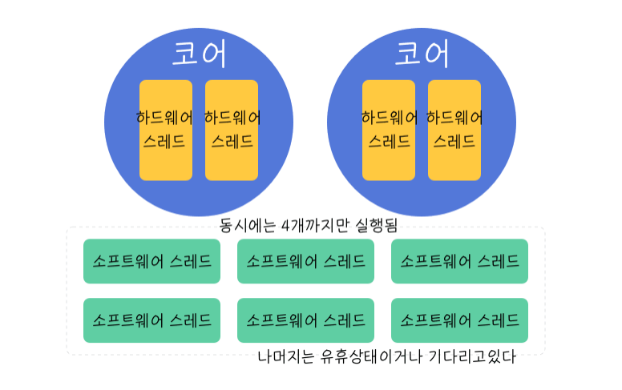

# JAVA_Spring_Core

<details>
<summary>01 객체 지향 설계와 스프링 </summary>
<div markdown="1">

## 자바 진영의 추운 겨울과 스프링의 탄생

### EJB 
Enterprise Java Beans 자바 진영의 겨울 ..EJB를 주요 기술로써 개발할 때 여러가지 힘든 점이 많았다고 함

### Spring
EJB 컨테이너를 대체하며 현재의 표준 기술로 자리잡음

### Hibernate
EJB 엔티티빈 기술을 대체 하며 JPA 새로운 표준 정의
 

## 스프링이란??

### 스프링 프레임워크
핵심기술 : 스프링 DI 컨테이너, AOP, 이벤트 등등..

웹 기술 : 스프링 MVC, 스프링 WebFlux

데이터 접근 기술 : 트랜잭션, JDBC, ORM 지원, XML 지원

### 스프링 부트

스프링을 편리하게 사용할 수 있도록 지원, 최근에는 기본으로 사용

Tomcat 같은 웹 서버 내장, 별도의 웹 서버 설치하지 않아도 됨 

### 스프링의 핵심
스프링은 자바 언어 기반의 프레임워크, 자바 언어의 가장 큰 특징은 객체 지향 언어라는 점
스프링은 객체 지향 언어가 가진 강력한 특징을 살려내는 프레임 워크

## 좋은 객체지향 프로그래밍이란?

### 객체 지향 특징

- 추상화

추상화는 실제 세상을 객체화하는게 아니라 필요한 정보만을 중심으로 간소화 하는 것을 의미 
즉 객체들의 공통적인 속성과 기능을 중심으로 클래스를 만드는 것이 추상화의 예

- 캡슐화

추상화를 통해 객체를 정의 했다면, 객체에 필요한 데이터나 기능을 책임이 있는 객체에 그룹화 시켜주는 것을
캡슐화라고 한다. 응집성과 관련 

- 상속 

상위 클래스의 기능을 하위 클래스가 사용할 수 있는 개념. 중복되는 코드의 재사용성을 위한 개념

- 다형성

객체지향은 객체간 관계를 디자인하는 프로그래밍인데 다형성은 객체간 관계를 유연하게 해주는 특징을 말함
역할과 구현의 분리로 클라이언트는 구현 대상의 내부 구조를 몰라도 되며 내부 구조가 변경되어도 영향을 받지 않으며
대상의 역할(인터페이스)만 알면 된다는 점이 중요하다.

다형성의 본질은 인터페이스를 구현한 객체 인스턴스를 실행 시점에서 유연하게 변경할 수 있다는 점
'클라이언트를 변경하지 않고,' 서버의 구현 기능을 유연하게 변경할 수 있다.

### 스프링과 객체 지향

- 다형성이 가장 중요하다!

- 스프링은 다형성을 극대화해서 이용할 수 있게 도와준다.

- 스프링에서 이야기하는 제어의 역전(IOC), 의존관계 주입(DI)은 다형성을 활용해서 역할과 구현을 편리하게 다룰 수 있도록 지원한다.

- 스프링을 사용하면 마치 레고 블럭 조립하듯이 구현을 편리하게 변경할 수 있다.


## 좋은 객체지향 설계의 5가지 원칙(SOLID)

### SRP : 단일 책임 원칙 (single responsibility principle)
한 클래스는 하나의 책임만 가져야 한다. 하나의 책임이라는 것은 모호하지만
중요한 기준은 변경이다. 변경이 있을 때 파급 효과가 적으면 단일 책임 원칙을 잘 따른 것 

### OCP : 개방 폐쇄 원칙 (Open-Closed principle)
소프트웨어 요소는 확장에는 열려 있으나 변경에는 닫혀 있어야 한다.
다형성으로 구현체를 새로운 것으로 갈아끼는 것이 그 예. but 클라이언트 코드에서 구현 객체를 변경해야 한다면 이는 OCP 원칙을
잘 지키지 못한 예

```java
MemberRepository m = new MemoryMemberRepository(); //기존코드
MemberRepository m = new JdbcMemberReopsitory(); //변경 코드

```
이러한 문제는 어떻게 해결? -> 객체를 생성하고 연관관계를 맺어주는 별도의 조립, 설정자 필요. 스프링은 이러한 객체지향 특징을 지켜주기위해 여러가지 기능 제공

### LSP : 리스코프 치환 원칙 (Liskov substitution principle)

프로그램의 객체는 프로그램의 정확성을 깨뜨리지 않으면서 하위 타입의 인스턴스로 바꿀 수 있어야 한다.
즉 다형성에서 하위 클래스는 인터페이스 규약을 다 지켜야 한다는 것
인터페이스가 구현된 구현체는 규약내에서 신뢰성있는 수행을 해야 한다.

### ISP : 인터페이스 분리 원칙 (Interface segregation principle)

특정 클라이언트를 위한 인터페이스 여러개가 범용 인터페이스 하나보다 낫다.

자동차 인터페이스를 -> 운전 인터페이스, 정비 인터페이스로 분리하면 인터페이스가 명확해지고 대체 가능성이 높아진다.

### DIP : 의존관계 역전 원칙 (Dependency inversion principle)

프로그래머는 추상화에 의존해야지 구체화에 의존하면 안된다. 의존성 주입은 이 원칙을 따르는 방법 중 하나이다

쉽게 이야기해서 구현 클래스에 의존하지 말고 인터페이스에 의존하라는 뜻 구현체에 의존하게 되면 변경이 아주 까다로워 짐 

## 객체 지향 설계와 스프링

스프링은 다음 기술로 다형성 + OCP,DIP를 가능하게 지원한다

- DI
- DI 컨테이너 제공

클라이언트 코드의 변경 없이 기능 확장 가능하게 함 즉 쉽게 부품을 교체하듯이 개발 가능하게 함 


</div>
</details>


<details>
<summary>02 예제 스프링 없이</summary>
<div markdown="1">

## 비즈니스 요구사항
- 회원 가입, 조회
- 회원의 등급은 일반, VIP 두가지
- 자체 DB but 바꿀수도 있음
- 상품 주문할 수 있고 VIP에게는 할인 정책 적용
- 어떤 할인정책을 사용할지 미지수 

## 순수 자바코드의 개발 
MemberService, MemberRepository, OrderService를 인터페이스로 
만들어 다형성을 이용해 변경이 용이하도록 설정함.

다만 DIP와 OCP를 위배하는 부분이 있음 어디에?
```java
 private final MemberRepository memberRepository = new MemoryMemberRepository();
    //private final DiscountPolicy discountPolicy = new FixDiscountPolicy();
    //private final DiscountPolicy discountPolicy = new RateDiscountPolicy();
    //수정하는 과정에서 DIP와 OCP 위반 이거를 어떻게 해결할 수 있을까?

    //인터페이스만 의존하도록 설정했다. but 당연히 구현체가 없으니 널포인트익셉션 발생
    private DiscountPolicy discountPolicy;
    //해결하기 위해 누군가 구현 객체를 꽂아주어야 한다.
```
추상화와 구현체 모두에게 의존한다는 점에서 DIP 위반.

앱의 확장을 위해서 클라이언트 코드를 변경해야 한다는 점에서 OCP위반.


그렇다고 인터페이스에만 의존하도록 설정하면 당연하게도 구현체가 없으니 예외 발생.


해결하기 위해서는 누군가 구현 객체를 설정해주어야 한다. 

## 관심사의 분리

구현체가 다른 인터페이스의 구현체 까지 신경쓴다?

이것은 마치 배우가 직접 다른 배우를 캐스팅하는 셈 다양한 책임을 가지게 된다.

- 관심사를 분리하자
디카프리오는 어떤 여자 주인공이 선택되더라도 똑같이 공연할 수 있어야 한다.
- 공연 기획자가 필요하다
AppConfig 등장 : 구현 객체를 생성하고 연결하는 책임을 가지는 별도의 설정 클래스. 얘가 객체를 생성하고 주입해야 의미가 있는 것. 생성자를 통해 주입한다. 
- MemberServiceImpl은 이제부터 의존관계에 대한 고민은 외부에 맡기고 실행에만 집중하면 된다! -> 관심사의 분리 DIP 성공적 추상에만 의존하도록 했다.

## AppConfig는 구성영역, OrderService등의 클래스는 사용영역

- 관심사의 분리를 통한 의존성 주입의 핵심은 사용영역의 변화가 전혀 일어나지 않는다는 것 
- 구성영역은 당연하게도 변경이 일어남 공연 기획자는 공연에 대한 모든 정보를 알고 있음 

## 좋은 객체 지향 설계의 5가지 원칙의 적용

이 중 세가지가 잘 적용 되었는지 확인해보자

### SRP 단일 책임 원칙
- 한 클래스는 하나의 책임만 가져야 한다.
- 클라이언트 객체가 직접 구현 객체를 생성하고 연결하고 실행하는 다양한 책임을 가지고 있었음 
- 관심사의 분리를 통해서 SRP를 지켜냄 
### DIP 의존관계 역전 원칙 
- 프로그래머는 추상화에 의존해야지 구체화에 의존하면 안된다.
- 의존성 주입은 이 원칙을 따르는 방법 중 하나이다. 
- 새로운 할인 정책을 개발하고 적용하려고 하니 클라이언트 코드도 함께 변경해야 했다. 구현 클래스와 추상 클래스 모두에게 의존했었기 때문
- 그래서 추상화에만 의존하도록 설정했지만 인터페이스만으로는 할 수 있는게 없음 객체를 주입하고 구현체를 정해주는 AppConfig가 필요 의존관계를 주입 하도록 해서 DIP원칙도 깨지지 않도록 함 
### OCP 
- 소프트웨어 요소는 확장에는 열려 있으나 변경에는 닫혀 있어야 한다.
- 소프트 웨어 요소를 새롭게 확장하더라도 사용 영역의 변경은 닫혀있다.
- 다형성과 AppConfig를 통한 관심사의 분리로 가능한 것 

## 본격 스프링의 도입 

### IoC
- 기존 프로그램은 클라이언트 구현 객체가 스스로 필요한 서버 구현 객체를 생성하고 연결하고 실행했다. 즉 구현 객체가 프로그램의 제어 흐름을 스스로 조종했다. 이는 개발자 입장에서 자연스러운 흐름
- 반면에 AppConfig가 등장한 이후에 구현 객체는 자신의 로직을 실행하는 역할만 담당한다. 프로그램의 제어 흐름은 이제 AppConfig가 가져간다. 어떤 구현객체들이 인터페이스으 구현체로 사용될 지 AppConfig가 결정한다는 뜻 
- OrderServiceImpl은 구현체가 뭔지도 모른체 묵묵히 자신의 로직을 실행할 뿐 
- 이렇듯 프로그램의 제어 흐름을 직접 제어하는 것이 아니라 관리하는 것을 제어의 역전이라고 한다.

### 프레임워크 vs 라이브러리
- 프레임워크가 내가 작성한 코드를 제어하고, 대신 실행하면 그것은 프레임워크(JUnit)
- JUnit에서는 실행하기 전에는 beforeEach를 돌린다와 같은 라이프사이클이 있고 정해진 라이프사이클에 따라 나의 코드가 콜백식으로 사용된다. 
- 제어권이 프레임워크에 있음
- 반면에 내가 작성한 코드가 직접 제어의 흐름을 담당한다면 그것은 프레임워크가 아니라 라이브러리다.
### DI
- OrderServiceImpl은 DiscountPolicy 인터페이스에 의존한다. 실제 어떤 구현 객체가 사용될 지 모른다!
- 의존관계는 정적인 클래스 의존관계와, 실행 시점에 결정되는 동적인 객체 의존 관계를 분리해서 생각해야 한다.

### 정적인 클래스 의존관계 
- 클래스가 사용하는 import 코드만 보고 의존관계를 쉽게 판단할 수 있다. 정적인 의존관계는 애플리케이션을 실행하지 않아도 분석할 수 있음.
- but 이러한 클래스 의존관계만으로는 실제 어떤 객체가 OrderServiceImpl에 주입 될지 알 수 없다.

### 동적인 객체 인스턴스 의존 관계
- 애플리케이션 실행시점에 실제 생성된 객체 인스턴스의 참조가 연결된 의존 관계다
- 애플리케이션 실행 시점에 외부에서 실제 구현 객체를 생성하고 클라이언트에 전달해서 클라이언트와 서버의 실제 의존관계가 연결 되는 것을 의존관계 주입이라고 함
- 의존관계 주입을 사용하면 클라이언트 코드를 변경하지 않고, 클라이언트가 호출하는 대상의 타입 인스턴스 변경가능
- 의존관계 주입을 사용하면 정적인 클래스 의존관계를 변경하지 않고 동적인 객체 인스턴스 의존관계를 쉽게 변경가능

### IoC 컨테이너, DI Container
- AppConfig 처럼 객체를 생성하고 관리하면서 의존관계를 연결해 주는 것을 IoC컨테이너 또는 DI컨테이너라고 한다.
- 또는 어셈블러(조립자), 오브젝트 팩토리 등으로 불리기도 함

</div>
</details>

<details>
<summary>03 예제 스프링으로 refactoring</summary>
<div markdown="1">

## 스프링으로 전환하기

### AppConfig 스프링으로 변경

- @Configuration 과 @Bean을 통해서
```java
@Configuration
public class AppConfig {

    @Bean
    private MemberRepository memberRepository() {
        return new MemoryMemberRepository();
    }

    @Bean
    public MemberService memberService() {
        return new MemberServiceImpl(new MemoryMemberRepository());
    }

    @Bean
    public OrderService orderService() {
        return new OrderServiceImpl(memberRepository(), discountPolicy());
    }

    @Bean
    public DiscountPolicy discountPolicy() {
        return new RateDiscountPolicy(); //여기만 갈아끼면 정률 할인정책으로!
    }
}

```

### ApplicationContext
- 스프링을 모든 게 ApplicationContext로 부터 시작한다. 얘가 Bean객체를 관리함  
```java
ApplicationContext applicationContext = new AnnotationConfigApplicationContext(AppConfig.class); //어노테이션 기반 config
```
- 이 코드는 AppConfig에 있는 정보를 바탕으로 Bean 등록하고 객체를 관리하도록 하는 코드 

### 스프링 컨테이너

- ApplicationContext를 스프링 컨테이너라 한다.
- 기존에는 개발자가 AppConfig를 사용해서 직접 객체를 생성하고 DI를 했지만 이제부터는 스프링 컨테이너를 통해서 사용한다.
- 스프링 컨테이너는 @Configuration이 붙은 AppConfig를 설정 정보로 사용한다. 여기서 @Bean이라 적힌 메서드를 모두 호출해서 반환된 객체를 스프링 컨테이너에 등록한다.
- 이렇게 스프링 컨테이너에 등록된 객체를 스프링 빈이라 한다.


- 스프링 빈은 @Bean이 붙은 메서드의 명을 스프링 빈의 이름으로 사용한다 
- 이전에는 개발자가 필요한 객체를 AppConfig를 사용해서 직접 조회했지만 이제부터는 스프링 컨테이너를 통해서 필요한 스프링 빈을 찾아야 한다. 
- ac.getBean()메소드로 가능 
- 스프링 컨테이너를 사용하면 어떤 장점이 있을까?
- 지금까지는 아 다형성만으로 안되는 구나 SRP OCP DIP를 지키기 위해 AppConfig가 필요하구나 근데 이걸 Spring Bean으로 할 수 있네 요정도를 배웠고 이후에는 이걸 사용함으로써 얻을 수 있는 장점을 공부하게 될 것  

### 스프링 컨테이너 생성
- ApplicationContext를 스프링 컨테이너라 한다. 
- ApplicationContext는 인터페이스이다. 구현체는 애노테이션 방식, XML방식 등등..
- 스프링 컨테이너는 XML을 기반으로 만들 수 있고 애노테이션 기반의 자바 설정 클래스로 만들 수 있다. XML은 잘 쓰이지 않는 기술
- 우리가 했던 방식이 애노테이션 기반의 자바 설정 클래스로 스프링 컨테이너를 만든 것이다.
- 스프링 컨테이너를 생성하면 스프링 컨테이너 안의 스프링 빈 저장소에는 빈 이름을 키로 빈 객체를 밸류로 담고 있는 테이블이 존재.
- 스프링 컨테이너는 AppConfig.class를 보고 객체를 빈으로 할당 
- 요약 : 스프링 컨테이너를 생성하고 설정 정보를 참고해서 스프링 빈 등록 의존관계도 설정한다
- 참고 : 스프링은 빈을 생성하고 의존관계를 주입하는 단계가 나누어져 있다. 그런데 이렇게 자바 코드로 스프링 빈을 등록하면 생성자를 호출하면서 의존관계 주입도 한번에 처리된다. 자세한 내용은 의존관계 자동 주입에서..

### 컨테이너에 등록된 모든 빈 조회
- 모든 빈 출력하기 
- ac.getBeanDefinitionNames(); 스프링에 등록된 모든 빈 이름을 조회한다. 배열로 반환
- ac.getBean(); 빈 이름으로 빈 객체(인스턴스)를 조회한다.
- 애플리케이션 빈 출력하기
- 스프링이 내부에서 사용하는 빈은 제외하고 내가 등록한 빈만 출력할 수 있게 하자
- 스프링이 내부에서 사용하는 빈은 getRole()로 구분할 수 있다. 
- ROLE_APPLICATION : 일반적으로 사용자가 정의한 빈
- ROLE_INFRASTRUCTURE : 스프링이 내부에서 사용하는 빈 

### 스프링 빈 조회 - 상속관계
- 부모타입으로 조회하면 자식 타입도 함께 조회한다.
- 그래서 모든 자바 객체의 최고 부모인 Object타입으로 조회하면 모든 스프링 빈을 조회한다. 


### BeanFactory와 ApplicationContext


- BeanFactory
  - 스프링 컨테이너의 최상위 인터페이스
  - 스프링 빈을 관리하고 조회하는 역할 담당
  - 지금까지 우리가 사용했던 대부분의 기능은 (getBean과 같은..) BeanFactory가 제공하는 기능

- ApplicationContext
    - BeanFactory의 기능을 모두 상속 받아서 제공한다.
    - 빈을 관리하고 검색하는 기능을 빈팩토리가 제공해주는데 두르이 차이는 부가기능의 차이이다.
    - 애플리케이션 콘텍스트에 더 많은 부가기능이 있다는 뜻 

- ApplicationContext가 제공하는 여러 부가기능
    - 메세지 소스를 활용한 국제화 기능
      - 한국에서 들어오면 한국어, 영어권에서 들어오면 영어
    - 환경변수
      - 로컬, 개발, 운영등을 구분해서 처리
    - 애플리케이션 이벤트
      - 이벤트를 발행하고 구독하는 모델을 편리하게 지원
    - 편리한 리소스 조회
      - 파일 클래스패스, 외부 등에서 리소스를 편리하게 조회


### 다양한 설정 형식 지원

- 스프링 컨테이너는 다양한 형식의 설정 정보를 받아드릴 수 있게 유연하게 설계되어 있다.
  - 자바 코드, XML, Groovy 등등.. 



### 스프링 빈 설정 메타 정보 - BeanDefinition

- 스프링은 어떻게 이런 다양한 설정 형식을 지원하는가? 그 중심에는 BeanDefenition이라는 추상화가 있다.
- 쉽게 이야기해서 역할과 구현을 개념적으로 나눈 것 
  - XML을 읽어서 BeanDefinition을 만든다.
  - 자바 코드를 읽어서 BeanDefinition을 만든다.
  - 스프링 컨테이너는 자바 코드인지 XML인지 몰라도 된다. 오직 BeanDefinition만 알면 된다. 
- BeanDefinition을 빈 설정 메타 정보라 한다.
- @Bean, <bean>당 각각 하나씩 메타정보가 생성된다. 
    
</div>
</details>

<details>
<summary>04 싱글톤 </summary>
<div markdown="1">

## 싱글톤의 필요성
- 우리가 만들었던 스프링 없는 순수한 DI 컨테이너인 AppConfig는 요청을 할 때 마다 객체를 새로 생성한다.
- 고객 트래픽이 초당 100이 나오면 100개 객체가 생성되고 소멸된다. -> 메모리 낭비가 심함
- 해결 방안은 해당 객체가 딱 1개만 생성되고, 공유하도록 설계하면 된다. -> <U>**싱글톤 패턴***</U>

## 싱글톤 패턴
- 클래스의 인스턴스가 딱 1개만 생성되는 것을 보장하는 디자인 패턴
- 그래서 2개 이상 못하도록 막아야한다. by private 생성자 

```java
package hello.core.singleton;

public class SingletonServiceTest {

    private static final SingletonServiceTest instance = new SingletonServiceTest(); //하나만 만들어서 가지고 있기
    
    private SingletonServiceTest() { //내부에서는 만들 수 있지만 그럴 일 없음 외부에서 생성할 수 없도록 하는 역할
    }

    public static SingletonServiceTest getInstance() {
        return instance;
    }
    
    public void logic() {
        System.out.println("싱글톤 객체 로직 호출");
    }
}

```

- static 영역에 객체 instance를 미리 하나 생성해서 올려둔다.
- 이 객체 인스턴스가 필요하면 오직 getInstance() 메서드를 통해서만 조회할 수 있다.
- 딱 1개의 객체 인스턴스만 존재해야 함으로 생성자를 private으로 막아서 혹시라도 외부에서 new 키워드로 객체 인스턴스가 생성되는 것을 막는다.


- 싱글톤 패턴 문제점
  - 싱글톤 패턴 구현 코드의 양이 많음
  - 의존관계상 클라이언트가 구체 클래스에 의존한다 DIP 위반
  - 클라이언트 구체 클래스에 의존해서 OCP 원칙 위반 가능성 높음
  - 테스트 어려움
  - 내부 속성의 변경 초기화 어려움
  - 자식 클래스 만들기 어려움
  - 유연성 떨어짐
  - 안티 패턴


## 스프링 컨테이너 - 싱글톤 기능

스프링 컨테이너는 싱글톤 패턴의 문제점을 해결하면서, 객체 인스턴스를 싱글톤으로 관리한다. 지금까지 우리가 학습한 스프링 빈이 바로 싱글톤으로 관리되는 빈이다.

- 스프링 컨테이너는 싱글톤 패턴을 적용하지 않아도 객체 인스턴스를 싱글톤으로 관리
  - 컨테이너 생성과정을 생각해보자 컨테이너는 객체를 하나만 생성해서 관리한다.
- 스프링 컨테이너는 싱글톤 컨테이너 역할을 한다. 이렇게 싱글톤 객체를 생성하고 관리하는 기능을 싱글톤 레지스트리라 한다.
- 스프링 컨테이너의 이런 기능 덕분에 싱글톤 패턴의 모든 단점을 해결하면서 객체를 싱글톤으로 유지 가능하다.
  - 지저분한 코드 없음
  - DIP, OCP, 테스트 private 생성자로부터 자유롭게 싱글톤 사용가능
- 참고 : 스프링의 기본 빈 등록 방식은 싱글톤이지만, 싱글톤 방식만 지원하는 것은 아님. 요청할 때 마다 새로운 객체를 생성해서 반환하는 기능도 제공한다. 자세한 내용은 빈 스코프에서!

## 싱글톤 방식의 주의점 

- 싱글톤 패턴이든, 스프링 같은 싱글톤 컨테이너를 사용하든, 객체 인스턴스를 하나만 생성해서 공유하는 싱글톤 방식은 여러 클라이언트가 하나의 같은 객체 인스턴스를 공유하기 때문에 싱글톤 객체는 상태를 유지(stateful)하게 설계하면 안된다.
- 무상태(stateless)로 설계해야한다.
  - 특정 클라이언트에 의존적인 필드가 있으면 안된다.
  - 특정 클라이언트가 값을 변경할 수 있는 필드가 있으면 안된다.
  - 가급적 읽기만 가능해야 한다.
  - 필드 대신에 자바에서 공유되지 않는 지역변수, 파라미터, ThreadLocal등을 사용해야 한다.
- 스프링 빈의 필드에 공유 값을 설정하면 정말 큰 장애가 발생할 수 있다.


### 중요!!

- ThreadA가 사용자 A 코드를 호출하고 ThreadB가 사용자B 코드를 호출한다 가정하자
- StatefulService의 price 필드는 공유되는 필드인데 특정 클라이언트가 값을 변경한다.
- 사용자 A의 주문금액은 10000원이 되어야 하는데 20000원이라는 결과가 나왔다.
- 실무에서 이런 경우를 종종 보는데 이로인해 정말 해결하기 어려운 큰 문제들이 터진다.
- 진짜 공유 필드는 조심해야 한다! 스프링 빈은 항상 무상태로 설계하자 

## Configuration 과 싱글톤 

```java
package hello.core;

import hello.core.discount.DiscountPolicy;
import hello.core.discount.FixDiscountPolicy;
import hello.core.discount.RateDiscountPolicy;
import hello.core.member.MemberRepository;
import hello.core.member.MemberService;
import hello.core.member.MemberServiceImpl;
import hello.core.member.MemoryMemberRepository;
import hello.core.order.OrderService;
import hello.core.order.OrderServiceImpl;
import org.springframework.context.annotation.Bean;
import org.springframework.context.annotation.Configuration;


@Configuration
public class AppConfig {

    @Bean
    public MemberRepository memberRepository() {
        System.out.println("AppConfig.memberRepository");
        return new MemoryMemberRepository();
    }

    @Bean
    public MemberService memberService() {
        System.out.println("AppConfig.memberService");
        return new MemberServiceImpl(memberRepository());
    }

    @Bean
    public OrderService orderService() {
        System.out.println("AppConfig.orderService");
        return new OrderServiceImpl(memberRepository(), discountPolicy());
    }

    @Bean
    public DiscountPolicy discountPolicy() {
        System.out.println("AppConfig.discountPolicy");
        return new RateDiscountPolicy(); //여기만 갈아끼면 정률 할인정책으로!
    }
}

```

- 위의 코드를 보면 memberRepository인스턴스는 OrderService에서도, MemberService에서도 생성되어 여러개의 인스턴스가 존재하는 것처럼 보인다
- 싱글톤 레지스트리 기능을 제공한다고 했는데??
- 테스트를 통해 알아본 결과 싱글톤은 유지되고 있었다.

## Configuration과 바이트코드 조작의 마법

- Configuration 어노테이션이 붙어있는 AppConfig에서 싱글톤을 유지시킨다
- AppConfig도 관리되는 빈 중 하나임. 빈을 뽑아와서 출력해보자
- //bean.getClass() = class hello.core.AppConfig$$EnhancerBySpringCGLIB$$9756aa7e
- 순수한 클래스라면 class hello.core.AppConfig 이렇게 출력되어야 하는 데 CGLIB?
- 이것은 내가 만든 클래스가 아니라 스프링이 CGLIB라는 바이트코드 조작 라이브러리를 사용해서 AppCofnig클래스를 상속받은 임의의 다른 클래스를 만들고, 그 다른 클래스를 스프링 빈으로 등록한 것이다!
- 그 임의의 다른 클래스가 바로 싱글톤이 보장되도록 해준다.
- 있으면 찾아서 반환하고 아니면 등록하고 반환


</div>
</details>


<details>
<summary>05 컴포넌트 스캔</summary>
<div markdown="1">

## 컴포넌트 스캔과 의존관계 자동 주입 시작하기 

- AppConfig의 정보가 수십 수백개가 되면 누락의 여지도 있고 설정정보도 커지고 일일이 등록하기도 귀찮
- 스프링에서는 설정 정보가 없어도 자동으로 스프링 빈을 등록하는 컴포넌트 스캔이라는 기능 제공
- 또한 의존관계도 자동으로 주입하는 @Autowired라는 기능도 제공 

- 컴포넌트 스캔을 사용하려면 먼저 @ComponentScan을 설정정보에 붙여주면 된다.
- 기존의 AppConfig와는 다르게 @Bean으로 등록한 클래스가 하나도 없다!

```java
package hello.core;


import org.springframework.context.annotation.ComponentScan;
import org.springframework.context.annotation.Configuration;
import org.springframework.context.annotation.FilterType;

@Configuration
@ComponentScan(
        excludeFilters = @ComponentScan.Filter(type = FilterType.ANNOTATION, classes = Configuration.class)
)
public class AutoAppConfig {
    
    
}

```

- 컴포넌트 스캔은 이름 그대로 @Component 애노테이션이 붙은 클래스를 스캔해서 스프링 빈으로 등록한다.
- @Configuration과 같은 애노테이션도 스캔의 대상이 되는 이유는 코드 열어보면 얘네도 Component를 가지고 있기 때문 
- 빈으로 등록은 되지만 해당 빈의 의존관계 주입은 어떻게 ?? -> Autowired 타입에 맞는 것을 긁어와서 주입한다 

## 탐색 위치와 기본 스캔 대상 

- 탐색할 패키지의 시작 위치 지정 가능
- 모든 자바 클래스를 다 스캔하면 오래 걸림 그래서 꼭 필요한 위치부터 탐색하도록 지정 가능
```java
@ComponentScan(
        basePackages = "hello.core"
)
```
- 지정하지 않으면 즉 디폴트는 설정 정보 클래스의 패키지가 시작 위치가 된다. 코드 상단에 있는 패키지 말하는 것
- 권장하는 방법은 패키지 위치를 지정하지 않고 설정 정보 클래스의 위치를 프로젝트 최상단에 두는 것! 
- 즉 hello.core에 넣어라 

## 컴포넌트 스캔 기본 대상
- @Component 
- @Controller : MVC 컨트롤러로 인식
- @Service : 특별한 처리 없음 개발자들이 계층 인식을 위한 표시막
- @Repository : 데이터 접근 계층으로 인식 계층의 예외를 스프링 예외로 변환 
- @Configuration : 설정 정보로 인식 싱글톤을 유지하도록 추가 처리 

- 참고 : 사실 애노테이션에는 상속관계라는 것이 없다 그래서 이렇게 애노테이션이 특정 애노테이션을 들고 있는 것을 인식할 수 있는 것은 자바 언어가 지원하는 기능은 아니고 스프링이 지원하는 기능이다.

## 필터
- includeFilters : 스캔 대상을 추가로 지정
- excludeFilters : 스캔 제외 대상 지정

### FilterType 옵션

- ANNOTATION : 기본값, 애노테이션을 인식해서 동작
- ASSIGNABLE_TYPE : 지정한 타입과 자식 타입을 인식해서 동작
- ASPECTJ : AspectJ패턴 사용
- REGEX : 정규표현식
- CUSTOM : TypeFilter라는 인터페이스를 구현해서 처리

- 사실 인클루드 익스클루드 둘다 사용하는 일은 거의 없음 되도록 기본 설정에 맞추어 사용하자

## 중복 등록과 충돌 
- 컴포넌트 스캔에서 같은 빈 이름을 등록하면 어떻게 될까?

- 자동 빈 등록 vs 자동 빈 등록 // 자동 빈 등록이 스캔 말하는거
  - ConflictingBeanDefinitionException 발생
- 수동 빈 등록 vs 자동 빈 등록
  - 오버라이딩 되어서 수동 빈 등록이 우선권을 가진다
  - 근데 이제는 잡기 어려운 버그로 간주하여 스프링 부트로 실행하면 에러를 낸다.
  - application.properties에 오버라이딩 true로 하여 설정할 수 있긴 함 
</div>
</details>

<details>
<summary>06 의존관계 자동 주입</summary>
<div markdown="1">

## 의존관계 자동 주입

### 다양한 의존관계 주입 방법

- 의존관계 주입은 크게 4가지 방법이 있다.
  - 생성자 주입
  - 수정자 주입(setter 주입)
  - 필드 주입
  - 일반 메서드 주입

- 생성자 주입
  - 이름 그대로 생성자를 통해서 의존 관계를 주입 받는 방법이다.
  - 지금까지 우리가 진행했던 방법이 바로 생성자 주입
  - 생성자 호출 시점에 딱 1번만 호출 되는 것이 보장된다.
  - 불변, 필수 의존관계에 사용 (이게 중요)
  - 스프링 빈인데 생성자가 하나라면 @Autowired를 생략해도 자동 주입 된다. 
- 수정자 주입 (Setter 주입)
  - setter라 불리는 필드의 값을 변경하는 수정자 메서드를 통해서 의존관계를 주입하는 방법
  - 특징 
    - 선택, 변경 가능성이 있는 의존관계에 사용
    - 자바빈 프로퍼티 규약의 수정자 메서드 방식을 사용하는 방법이다.
- 필드 주입
  - 이름 그대로 필드에 주입하는 방법
  - 코드도 간결하고 좋은 것 같지만 외부에서 변경이 불가능해서 테스트 하기 힘들다는 단점이 있다.
  - 결론 : 사용하지 마라
- 일반 메서드 주입
  - 결론 얘도 일반적으로 잘 사용하지 않는다. 

- 참고 : 어쩌면 당연한 이야기이지만 의존관계 자동 주입은 스프링 컨테이너가 관리하는 스프링 빈이어야 동작한다. 스프링 빈이 아닌 Member 같은 클래스에서 @Autowired 코드를 적용해도 아무 기능도 동작하지 않는다.

## 옵션 처리 
- 주입할 스프링 빈이 없어도 동작해야 할 때가 있다. 
- 그런데 Autowired만 사용하면 required 옵션의 기본값이 true로 되어 있어서 자동 주입대상이 없으면 오류가 발생한다. 
- 해결할 수 있는 방법에 여러가지가 있다
  - @Autowired(required = false) : 자동 주입할 대상이 없으면 메서드 자체가 호출이 안됨
  - @Nullable : 자동 주입할 대상이 없으면 null이 입력된다.
  - Optional<> : 자동 주입할 대상이 없으면 Optional.empty가 입력된다. 

## 생성자 주입을 선택해라
- 과거에는 수정자 주입과 필드 주입을 많이 사용했지만, 최근에는 스프링을 포함한 대부분의 DI 프레임워크가 생성자 주입을 권장한다 그 이유는 다음과 같다.
- 불변
  - 의존관계를 변경할 일이 없다 오히려 변경하면 안된다.
  - 수정자 주입을 사용하면 세터를 퍼블릭으로 열어두어야 한다. 누군가의 실수로 변경될 수 있음
  - 생성자 주입은 객체를 생성할 때 딱 1번만 호출됨으로 이후에 호출 되는 일이 없다. 따라서 불변하게 설계할 수 있다. 
- 누락
  - 의존 관계 주입이 누락된 상태에서 테스트를 실행하면 NPE
  - 생성자 주입으로 실행하면 Compile Error
  - 그리고 생성자 주입을 사용하면 final 키워드를 사용하여 변경 막을 수 있음 

## 롬복과 최신 트렌드
- 막상 개발을 해보면 대부분이 다 불변이고 그래서 final 키워드를 사용하게 된다. 그런데 생성자도 만들어야 하고, 주입 받은 것을 대입하는 코드도 만들어야 하고 .. 필드 주입처럼 좀 편리하게 사용하는 방법은 없을까? -> 롬복
- 롬복은 getter setter constructor 등을 애노테이션 전처리를 통해 코드를 만들어준다. 그러면서 우리의 코드는 깔끔하게 유지하도록 도와줌 
- @RequiredArgsConstructor : final 이 붙은 필드를 모아 생성자 자동 생성
- 롬복 라이브러리는 스프링을 처음에 시작할 때 의존관계를 추가할 수 도 있다. 

## 조회 빈이 2개 이상일 때 문제
- @Autowired 는 매칭되는 타입의 빈으로 조회한다
- 그런데 매칭되는 빈이 2개 이상이라면? 친절한 오류메세지가 나온다.
- 이때 하위 타입으로 지정할 수 도 있지만 하위 타입으로 지정하는 것은 DIP를 위배하고 유연성이 떨어진다. 
- 그리고 이름만 다르고, 완전히 똑같은 타입의 스프링 빈이 2개 있을 때 해결이 안된다. 

- 해결 방법
  - Autowired 필드 명 매칭
    - @Autowired는 타입 매칭을 시도하고 이때 여러 빈이 있으면 필드 이름, 파라미터 이름 으로 빈이름을 추가 매칭한다.
  - @Qualifier : 추가 구분자를 붙여주는 방법 빈이름을 변경하는 것은 아님 
    - @Qualifier 끼리 매칭
  - @Primary : 우선순위를 정하는 방법

### 애노테이션 직접 만들기
- 컴파일시 타입 체크 오류 체크를 위한 기술 
```java
@Component
//@Primary
//@Qualifier("mainDiscountPolidy") 요렇게 해도 컴파일 오류가 안남 .. 찾기 힘든 오류 
@MainDiscountPolicy //요거는 오류 잡아내고 가시성도 좋음 
```
- 가져다 쓰는 부분에도 우리가 만든 애노테이션 붙여주면 됨
- 애노테이션에는 상속이라는 개념이 없다 여러 애노테이션을 모아서 사용하는 기능은 스프링이 지원해주는 기능이다. 

## 조회한 빈이 모두 필요할 때 List, Map 활용
- 의도적으로 정말 해당 타입의 스프링 빈이 다 필요한 경우도 있다. 
- 예를 들어서 할인 서비스를 제공하는데, 클라이언트가 할인의 종류(rate, fix)를 선택할 수 있다고 가정해보자.
- 스프링을 사용하면 소위말하는 전략 패턴을 매우 간단하게 구현할 수 있다. 

```java
package hello.core.autowired;

import hello.core.AutoAppConfig;
import hello.core.discount.DiscountPolicy;
import hello.core.member.Grade;
import hello.core.member.Member;
import org.assertj.core.api.Assertions;
import org.junit.jupiter.api.Test;
import org.springframework.beans.factory.annotation.Autowired;
import org.springframework.context.annotation.AnnotationConfigApplicationContext;

import java.util.List;
import java.util.Map;

public class AllBeanTest {

    @Test
    void findAllBean() {
        AnnotationConfigApplicationContext ac = new AnnotationConfigApplicationContext(AutoAppConfig.class, DiscountService.class);
        DiscountService discountService = ac.getBean(DiscountService.class);
        System.out.println("discountService = " + discountService);
        int discountA = discountService.discount(new Member(1L, "userA", Grade.VIP), 20000, "fixDiscountPolicy");
        int discountB = discountService.discount(new Member(2L, "userB", Grade.VIP), 20000, "rateDiscountPolicy");

        Assertions.assertThat(discountA).isEqualTo(1000);
        Assertions.assertThat(discountB).isEqualTo(2000);

    }

    static class DiscountService {
        private final Map<String, DiscountPolicy> policyMap;
        private final List<DiscountPolicy> policies;


        @Autowired
        public DiscountService(Map<String, DiscountPolicy> policyMap, List<DiscountPolicy> policies) {
            this.policyMap = policyMap;
            this.policies = policies;
            System.out.println("policyMap = " + policyMap);
            System.out.println("policies = " + policies);


        }

        public int discount(Member member, int price, String discountCode) {

            DiscountPolicy discountPolicy = policyMap.get(discountCode);
            return discountPolicy.discount(member, price);
        }


    }
}

```
- 이런식으로도 다형성 구현할 수 있고 도움되는 경우가 꽤 있다. 

## 자동, 수동의 올바른 실무 운영 기준

- 편리한 자동 기능을 기본으로 사용하자 
  - 결론부터 이야기하면, 스프링이 나오고 시간이 갈 수록 점점 자동을 선호하는 추세다. 스프링은  @Component뿐만 아니라 @Controller 등등 계층에 맞추어 애플리케이션 로직을 자동으로 스캔할 수 있도록 지원한다.
  - 거기에 더해서 최근 스프링 부트는 컴포넌트 스캔을 기본으로 사용하고, 스프링 부트의 다양한 스프링 빈들도 조건이 맞으면 자동으로 등록하도록 설계했다.
  - 설정 정보를 기반으로 애플리케이션을 구성하는 부분과 실제 동작하는 부분을 명확하게 나누는 것이 이상적이지만 개발자 입장에서 스프링 빈을 하나 등록할 때 @Component만 넣어주면 끝나는일을 설정 정보로 처리하는 것은 상당히 번거롭다
- 그러면 수동 빈 등록은 언제??
  - 애플리케이션은 크게 업무 로직과 기술 지원 로직으로 나눌 수 있다.
  - 업무 로직 빈 : 웹을 지원하는 컨트롤러, 핵짐 비즈니스 로직이 있는 서비스, 데이터 계층의 로직을 처리하는 리포지토리 등이 모두 업무 로직이다.
  - 기술 지원 빈 : 기술적인 문제나 공통 관심사를 처리할 때 주로 사용된다. 데이터베이스 연결이나 공통 로그 처리 처럼 업무 로직을 지원하기 위한 하부 기술이나 공통 기술
  - 업무 로직은 숫자도 매우 많고 한번 개발해야 하면 컨트롤러 서비스 리포지토리처럼 어느정도 유사한 패턴이 있다. 이런 경우 자동 기능을 적극 사용하는 것이 좋다.
  - 기술 지원 로직은 업무 로직과 비교해서 그 수가 매우 적고 애플리케이션 전반에 걸쳐서 광범위하게 영향을 미친다.
  - 
</div>
</details>


<details>
<summary>07</summary>
<div markdown="1">


</div>
</details>