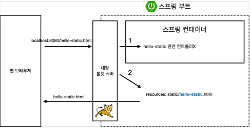
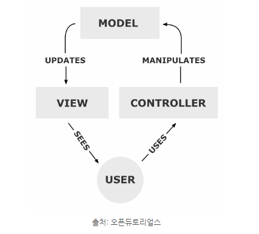
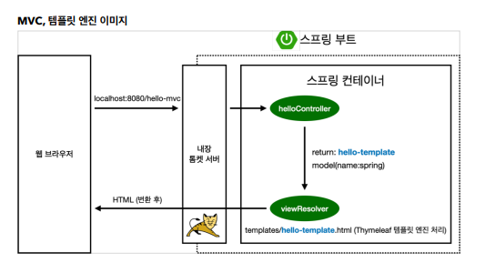
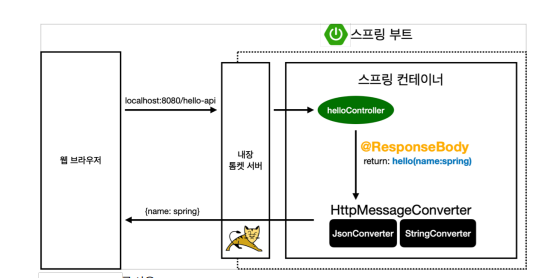
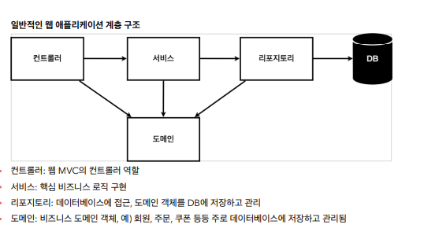
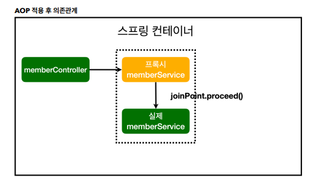

# JAVA_Spring_Lab


<details>
<summary>00 환경설정</summary>
<div markdown="1">

## 프로젝트 생성
### - start.spring.io
여기 사이트에서 프로젝트를 빌드 할 수 있다. 
### - MAVEN vs Gradle ??
전체적인 빌드시스템 혹은 프로젝트 관리 방식을 말한다. 라이브러리를 어떻게 긁어와 관리할 것인지
라이프 사이클을 어떻게 설정하는지의 차이가 정해진다. 현재는 Gradle을 많이 사용하는 추세임 훨 빠르고 최신기술이다.
### - Spring Web, Thymeleaf
각자는 우리가 기본적으로 사용하게 될 라이브러리. 프로젝트를 생성할 때 dependencies를 선택하여 라이브러리를 긁어올 수 있다.
## 라이브러리 살펴보기
우리가 긁어온 라이브러리는 Spring Web, Thymeleaf 하지만 Externel Libraries를 살펴보면 훨씬 많은 양의 라이브러리들이 임포트 되어 있는 것을 확인할 수 있다.
이는 우리가 긁어온 라이브러리들이 구동되기 위해 의존하는 라이브러리들로 Gradle 방식이 의존하는 모든 라이브러리들을 관리하는 모습을 보인다.
## View 환경설정
고객의 요청을 수행하여 화면을 보이는 데에는 3가지 방식이 있다.
### 1. static
적어놓은 html을 별도의 작업 없이 웹서버가 요청한 쪽으로 넘겨준다.
### 2. Template MVC
http 리퀘스트 도착하면 스프링 부트 프로젝트의 내장 서버인 톰캣 서버가 컨트롤러 속 @GetMapping 어노테이션을 뒤지면서 요청한 url이랑 매핑되는 메소드를 찾는다.
이어 해당 메소드가 실행되고 메소드는 View Resolver에게 html 파일 이름과 모델을 보낸다. View Resolver는 템플릿 엔진을 이용, 해당 html 파일에서 모델등의 값과 함께 html 파일을 렌더링하고 요청한 쪽으로 반환하다.
우리의 실습에서 import한 Thymeleaf가 템플릿 엔진임
### 3. API
http 리퀘스트를 받고 메소드를 찾아가지만 @ResponseBody 라는 어노테이션을 사용. 렌더링이나 html 파일을 뿌리는 것이 아닌 Body부를 직접 넘겨주는 방식이다.

## 빌드하고 실행하기
https://dev-gorany.tistory.com/281
</div>
</details>

<details>
<summary>01 스프링 웹 개발 기초</summary>
<div markdown="1">

## 정적 컨텐츠
이전에 00 환경설정에서 설명했던 것처럼 http 요청에 반응하여 html 파일을 그냥 뿌려주는 방식이다. 다만 주의 할 점은 스프링 부트 속 톰 캣 서버에 요청이 오게 되면 바로 resources의 static으로 찾아가지 않고 먼저 컨트롤러를 뒤진다.
컨트롤러를 찾지 못하고 매핑된 메소드를 찾지 못하면 static에서 html파일을 찾는 것이다.
순서가 후위임을 기억하자.





## MVC와 템플릿 엔진
mvc패턴은 디자인 패턴 중 하나를 말한다. Model, View, Controller의 약자로 프로젝트의 구성 요소를 세가지의 역할로 구분한 패턴이다.





사용자가 controller를 조작하면 컨트롤러는 model을 통해서 데이터를 가져오고 그 정보를 바탕으로 시각적인 표현을 담당하는 View를 제어해서 사용자에게 전달함

### Model
애플리케이션의 정보 데이터를 나타낸다. 데이터베이스, 처음의 정의하는 상수, 초기화값, 변수 등을 뜻함
사용자가 편집하길 원하는 모든 데이터를 다룰 수 있어야 하며 뷰나 컨트롤러에 대해서 어떤 정보도 알지 못하게 설계함으로써 객체의 응집성을 지켜야한다.
### View
사용자 인터페이스 요소들을 나타낸다. 즉 데이터 및 객체의 입력, 그리고 보여주는 출력만을 담당
모델이 가지고 있는 정보를 따로 저장하는게 아닌 받아서 화면에 적절한 방식으로 뿌리는 역할만을 수행!
### Controller
데이터와 사용자 인터페이스 요소들을 잇는 다리 역할을 한다. 여러 이벤트들을 처리하는 부분을 뜻한 다는 것
컨트롤러는 둘 사이를 중재하기에 모델이나 뷰등에 대해서 알고 있어야 하는 점이 다른 요소들과 다른 점이다.
### 템플릿, 템플릿 엔진





요청이 들어오면 내장 톰캣 서버에서 컨트롤러의 메소드를 뒤지고 같은 이름으로 매핑된 메소드를 찾는다. ViewResolver에게 메소드의 반환값을 전달하고 ViewResolver는 템플릿 엔진 처리를 마치고 HTML파일을 반환하는 방식
## API
@ResponseBody 어노테이션을 컨트롤러 안에 있는 메소드에 붙여주게 되면 해당메소드는 동작할 때 ViewResolver를 사용하지 않는다.
대신에 HTTP의 Body에 문자 내용을 직접 반환한다.
즉 http 요청에 응답하여 반환하는 response의 바디를 직접 쓰는 것





그림처럼 ViewResolver대신에 HttpMessageConverter가 작동하게 되고 문자의 처리는 String Converter, 객체의 처리는 JsonConverter가 작동하게 된다. 


</div>
</details>

<details>
<summary>02 회원관리 예제 백엔드 개발</summary>
<div markdown="1">

## 비즈니스 요구사항 
데이터 : 회원ID, 이름
기능 : 회원 등록, 조회
아직 데이터 저장소가 선정되지 않음 -> 인터페이스로 만들고 내부의 저장소 우선 사용





## MemberRepository
여기 interface에서 Optional<Member> findById (Long id);
라는 미구현 메소드를 볼 수 있는데 Optional은 널처리에 많이 쓰이는 방식으로 Optional로 감싸면 
널처리가 쉬워진다.
```java
public Optional<Member> findByid(Long id) {
        return Optional.ofNullable(store.get(id));
        }

```
스트림과 람다식을 이용한 findByName
```java
public Optional<Member> findByName(String name) {
    return store.values().stream() //value는 맵의 값들을 콜렉션 형태로 반환 .stream()은 
        .filter(member -> member.getName().equals(name))
        .findAny(); //하나라도 찾으면 
}
```
자바 실무에서 List를 자주쓴다. 인터페이스임을 기억하자!
```java
    @Override
    public List<Member> findAll() {
        return new ArrayList<>(store.values());
    }

```

## Test Case
메인 메소드 계속해서 돌리면서 체크하면 오버헤드 쩐다. 코드를 코드로 검토하자
--> junit이라는 프레임워크 사용 테스트를 간편하게 할 수 있다. 

assert를 이용한 방법
```java
@Test //이게 junit에서 제공하는 거
    public void save() {
        Member member = new Member();
        member.setName("spring");

        repository.save(member);

        Member result = repository.findById(member.getId()).get();
        //System.out.println("result = " + (result == member));
        //Assertions.assertEquals(member, result); 
        assertThat(member).isEqualTo(result); //alt enter -> 스태틱 임포트
    }
```
모든 테스트는 순서가 보장되지 않으니 저장소 같은 곳을 건드릴 때 생각하고 사용하자
여담 : 테스트를 먼저 만들고 구현을 나중에 하는 방식을 테스트 주도 개발, TTD라고 함
//given
//when
//then으로 구분하면 보기 쉬움
```java
    @AfterEach 
    // 메소드 테스트가 끝날때마다 실행되는 콜백 메소드
    //콜백 메소드 : 어떤 이벤트가 발생했거나 특정 시점에 도달했을 때 시스템에서 호출하는 함수!
    public void afterEach() {
        repository.clearStore();
    }
```
## Member Service 
```java
    public Long join(Member member) {
        Optional<Member> result = memberRepository.findByName(member.getName());
        result.ifPresent(m -> { //result는 옵셔널 
            throw new IllegalStateException("이미 존재하는 회원입니다.");
        });
        memberRepository.save(member);
        return member.getId();
    }

```
##Member Service Test
예외가 올바르게 터지는지 확인하는 법 try catch 보다 편한 문법은 assertThrows

```java
        assertThrows(IllegalStateException.class, () -> memberService.join(member2));
        //람다를 실행할 건데 앞의 오류가 터져야함 안터지면 test fail
/*
        try {
            memberService.join(member2);
            fail();
        }
        catch (IllegalStateException e) {
            assertThat(e.getMessage()).isEqualTo("이미 존재하는 회원입니다.");
        }
```

```java
    @BeforeEach
    public void beforeEach() {
        memberRepository = new MemoryMemberRepository();
        memberService = new MemberService(memberRepository);
        //멤버 서비스 입장에서 레포를 직접 만들지 않고 외부에서 받네? -> dependency injection 의존성 주입 di
        
    }
    @AfterEach
    public void afterEach() {
        memberRepository.clearStore();
    }
```
</div>
</details>

<details>
<summary>03 스프링 빈과 의존관계</summary>

## 스프링 빈과 스프링 컨테이너
## 스프링 빈이란 ?
스프링 빈은 스프링 컨테이너에 의해 관리되는 자바 객체(POJO)를 의미한다. 스프링 컨테이너에 스프링 빈이 등록된다라는 표현을 사용하며 스프링 빈은 디폴트로 싱글톤으로써 하나만 저장되어 관리된다.
## 스프링 컨테이너
스프링 컨테이너는 스프링 빈의 생명 주기를 관리하며, 생성된 스프링 빈들에게 추가적인 기능을 제공하는 역할을 한다. IoC와 DI의 원리가 스프링 컨테이너에 적용된다.

개발자는 new 연산자, 인터페이스 호출, 팩토리 호출 방식으로 객체를 생성하고 소멸하지만, 스프링 컨테이너를 사용하면 해당 역할을 대신해 준다. 즉, 제어 흐름을 외부에서 관리하게 된다. 또한, 객체들 간의 의존 관계를 스프링 컨테이너가 런타임 과정에서 알아서 만들어 준다.

## @Autowired
생성자에 사용되는 어노테이션으로 스프링 컨테이너에서 스프링 빈으로써 관리되고 있는 인스턴스화된 객체를 생성자의 입력인자로 주입시킨다.
즉 생성자를 통한 의존성 주입과 스프링 빈이 핵심 키워드임
```java 
    @Autowired
    public MemberController(MemberService memberService) {
        this.memberService = memberService;
    }
```
## 스프링 빈을 생성하는 두가지 방법
### 첫번째 컴포넌트 스캔
어노테이션을 활용하는 방법으로 @Component (혹은 @Controller, @Service 등등..)를 붙임으로써 스프링 빈으로 등록해야할 클래스를 알리는 방식이다.
참고로 Service 등등은 Component인데 조금 더 특수화된 것임

컴포넌트 스캔은 모든 파일을 대상으로 진행되는가? 실행코드가 포함된 패키지 포함 그 하위의 파일들만 스캔한다.

### 두번째 자바코드로
실무에서 자주 쓰이는 방식 컨피규레이션 어노테이션이 붙은 설정 파일을 통해 bean으로 관리할 대상을 지정하는 방법
```java
@Configuration
public class SpringConfig {

    @Bean
    public MemberService memberService() {
        return new MemberService(memberRepository());
    }
    @Bean
    public MemoryMemberRepository memberRepository() {
        return new MemoryMemberRepository();
    }
}
```

## 참고
실무에서는 주로 정형화된 컨트롤러 서비스 리포지토리 같은 코드는 컴포넌트 스캔을 이용한다. 다만 정형화 되지 않거나 상황에 따라 구현 클래스를 변경해야 하면 설정을 통해 스프링 빈으로 등록한다.

바뀔 가능성이 있는게 존재 한다면 Repos나 등등.. 설정에서 다른 걸 bean으로 생성해버리는게 훨씬 간편하다는 뜻 기존에 있던 코드를 바꿀 필요가 음슴

## Dependencies Injection (DI, 의존성 주입)
의존관계를 외부에서 결정하고 주입하는 것 하나의 객체가 다른 객체의 의존성을 제공하는 테크닉이다.
의존성 주입에는 세가지 방식이 존재함

필드 주입 : 필드에서 주입이 되는 것 but 바꿀 수 있는 방법이 없다

세터 주입 : 세터를 통해 주입하는 것 너무 쉽게 변동 가능함으로 문제가 있음 

생성자 주입 : 권장하는 스타일, 생성자를 통해 의존관계가 주입되는 것

</div>
</details>

<details>
<summary>04 회원 관리 예제 - 웹MVC 개발</summary>
<div markdown="1">


</div>
</details>

<details>
<summary>05 스프링 DB 접근 기술</summary>
<div markdown="1">

## H2 database 와 순수 JDBC를 이용한 레포
어플리케이션 프로퍼티 설정하고 그래들 설정해서 프로젝트와 db 꽃고 쿼리 만들어서 새로운 repos 구현 하는 이것 저것 지켜봤다. 
기술이 옛날 것이기에 database사용하는 느낌 정도만 가져가자

다만 우리가 repo를 인터페이스로 만듦으로써 다형성을 챙겨
개방 폐쇄 원칙(OCP : Open-Closed Principle)을 지켰다는 점을 기억하자


개방 폐쇄 원칙은 확장에는 열려 있고 수정 변경에는 닫혀있음을 의미

스프링은 결국 스프링의 DI (Dependencies Injection)등을 이용하여 기존 코드를 전혀 손대지 않고, 설정만으로 구현
클래스를 변경할 수 있다.

## 스프링 통합 테스트
우리가 일전에 했던 테스트는 스프링과 전혀 무관한 순수 자바 코드만의 테스트.

여기 챕터에서는 스프링과 엮은 DB까지의 통합 테스트등을 진행

테스트 클래스에 @SpringBootTest와 @Transactional 어노테이션 두개를 붙여주면 됨 Trancsacional은 테스트케이스에 달리면 테스트가 끝나면 DB에서 처리되었던 쿼리들을
롤백해줌 즉 다음 테스트를 연속적으로 진행할 수 있도록 한다는 것. 롤백은 테스트 달려있는 메소드마다 실행


테스트에 필요한 MemberService 클래스나 repos는 autowired로 그냥 꽃아주면 됨. 제일 편한 방식으로 의존성 주입하면 된다는 뜻 테스트는 가장 편한 방식을 사용하면 된다.

여기에서 보일 것은 DB가 잘 연결되었는지

## Jdbc란?
자바에서 데이터베이스에 접속할 수 있도록 하는 자바 API

## 순수 JDBC
그래들, 앱 프로퍼티 설정후 
순수하게 JDBC관련 코드로 데이터 처리를 설계하는 것을 말함 반복적인 부분이 상당히 있다.


## 스프링 JdbcTemplate (MyBatis와 유사)
순수 Jdbc와 동일한 환경설정내에서 사용되지만 스프링 JdbcTemplate 라이브러리는
JDBC API 에서 본 반복코드를 대부분 제거해준다. 하지만 SQL은 직접 작성

## JPA 
이제 SQL 쿼리조차도 개발자가 쓸 필요 없다. 즉 JPA를 부르면 JPA가
DB에 쿼리날리고 처리하고 한다.

사실 JPA는 자바 진영의 표준 인터페이스다 구현은 여러 업체들이 하는데 우리는
아마 Hibernate를 주로 쓰게 될 것

JPA는 또한 객체와 ORM의 기술이라고 볼 수도 있음
Object Relational Mapping 객체와 관계형 데이터베이스를 매핑한다는 뜻
매핑은 어떻게 하느냐? 어노테이션으로,
@Entity라는 어노테이션이 붙으면 jpa가 관리하는
엔티티로 등록이 된다. 참고로 jpa는 EntityManager기반으로 동작한다. 프로퍼티에 jpa가 설정이 되어있다면 스프링 부트에는 Entity manager가 이미 존재할 것임 
우리는 그거를 Repos에 인젝션만 해주면 된다.

## 스프링 데이터 JPA
인터페이스 만으로 개발 가능 반복 개발해온 기본 CRUD 기능도 스프링 데이터 JPA가 모두 제공

한마디로는 JPA를 더 편하게 사용할 수 있도록 첨가된 기술이라고 보면 될 듯


</div>
</details>

<details>
<summary>06 AOP</summary>
<div markdown="1">

## AOP

### AOP란?

공통관심사항과 핵심관심사항의 분리 

메소드마다 시작 시간을 기록하고 싶다고 해보자 
System.time 머시기를 메소드의 첫부분부분마다 쓸 수도 있겠지만
사실 이는 관심사항의 분리가 명확히 일어나지 않은 케이스 시간측정 로직을 한 군데에 모아놓고
사용한다면 이는 AOP를 적절히 사용한 예.

AOP를 수행하는 클래스는 @Aspect 어노테이션이 붙음과 동시에 스프링 빈으로써 관리되도록 
컴포넌트 스캔 혹은 config에 등록해야함 또한 @Around 어노테이션으로 이 AOP가 어디에 적용되는지 명시해야 함

```java
@Around("execution(* hello.hellospring..*(..))") // hello.spring 패키지 하위에 있는 모든
public Object execute(ProceedingJoinPoint joinPoint) {
    
}
```
### 프록시 생성



AOP를 적용하면 가짜(프록시)를 만들고 진짜의 앞에 세워둔다. 진짜의 호출은
joinPoint.proceed()이후 실제 객체로 넘어간다.

</div>
</details>

<details>
<summary>편리한 단축키</summary>
<div markdown="1">

shift + f6 : 변수이름 같은거 한꺼번에 바꾸기

alt + enter : static도 임포트 가능

crtl + alt + m : 해당 식을 메소드로 추출

crtl + shift + t : 해당클래스의 테스트 클래스 만들기

crtl(command) + alt(option) + v : 함수 표현식만 쓰고 리턴값을 받고 싶을때 사용

</div>
</details>