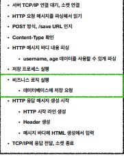
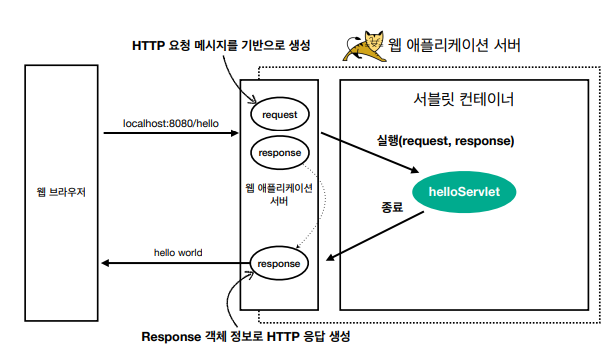
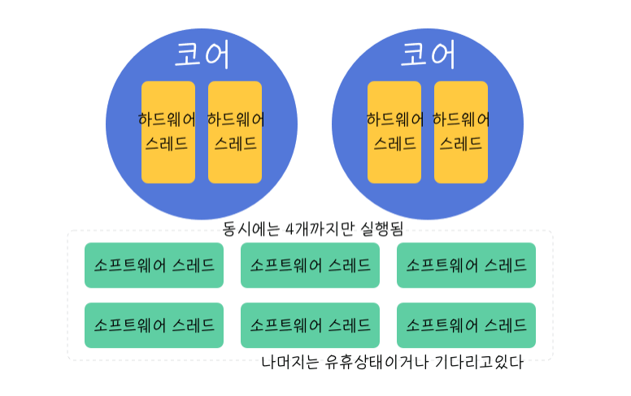
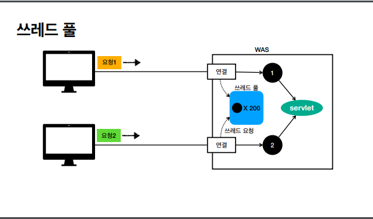
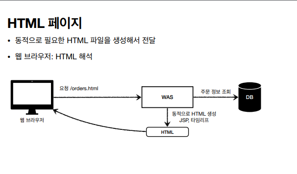
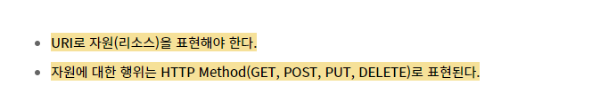
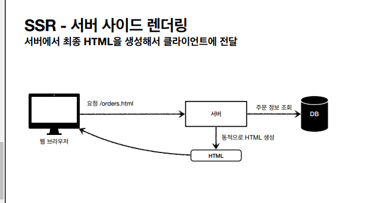
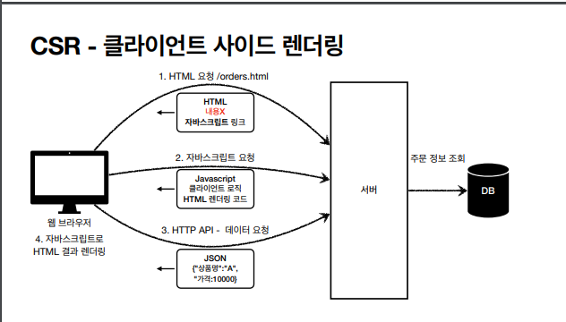
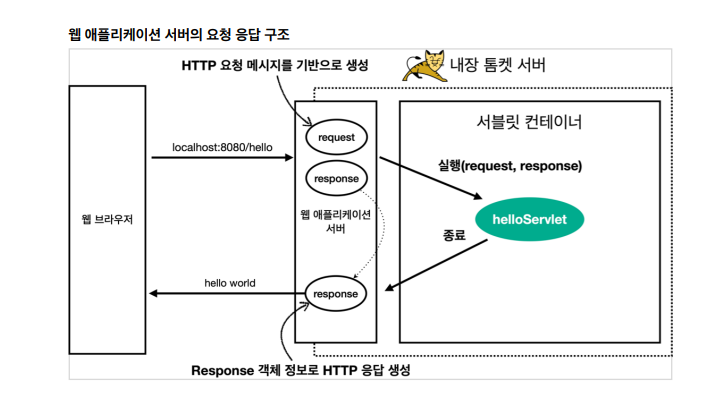

# Spring_MVC_1
스프링 MVC 패턴과 서블릿에 대한 학습 기록입니다.

<details>
<summary>00 웹 어플리케이션에 대한 이해 </summary>
<div markdown="1">

## 웹 서버 (Web Server)

- http 기반 동작
- 정적 리소스 제공, 기타 부가기능
- 정적(파일) HTML, CSS, JS, 이미지, 영상
- NGINX, APACHE

## 웹 애플리케이션 서버(WAS)

- http 기반 동작
- 웹 서버 기능 포함 + 애플리케이션 로직 수행
  - 동적 HTML, HTTP API(JSON)
  - 서블릿, JSP, 스프링 MVC
- 톰캣 제티, Undertow

## 웹 시스템 구성 - WAS, DB

- WAS가 웹서버의 기능 + 알파라면 .. 
- WAS, DB만으로 시스템 구성이 가능하지 않을까?
- WAS는 정적 리소스, 애플리케이션 로직 모두를 제공 가능하니까
- BUT WAS가 너무 많은 역할을 담당하면 서버 과부하 우려..Scalability 없음
- WAS 장애시 오류 화면 조차도 노출 불가능 할 수 있음

## 웹 시스템 구성 - WEB,WAS,DB

- 정적 리소스는 웹서버가 처리
- 웹 서버는 애플리케이션 로직같은 동적 처리가 필요하면 WAS에 요청을 위임
- WAS는 중요한 애플리케이션 로직 처리 전담
- 이렇게 구성하면 효율적인 리소스 관리가 가능하다
  - 정적 리소스의 요청이 많으면 Web 서버만 증설
  - 애플리케이션 리소스가 많이 사용되면 WAS 증설
- 또한 오류처리가 가능해진다. 
  - WAS는 잘 죽고 Web서버는 잘 죽지 않기에 WAS가 죽으면 web server에서 오류 화면 제공등의 오류 처리를 할 수 있다.

## 서블릿 

- HTML Form 데이터 전송으로 POST 요청이 발생했고 그것을 서버가 처리해야 한다고 생각해보자
- 서버에서 처리해야 하는 일은 엄청 많아 .. 



- 하지만 우리가 핵심적으로 하고 싶은 일은 초록색 박스
- 서블릿은 여기에서 우리가 의미 있는 비즈니스 로직에 집중할 수 있도록 나머지 일들을 처리해주는 역할을 한다 (Marshalling unmarshalling 등등)
- 즉 요청 정보를 편리하게 사용할 수 있도록 하고 응답 정보를 편리하게 만들 수 있도록 도와 줌
- HTTP 스펙을 사용하기가 매우 편리해짐 



### 서블릿 컨테이너

- 톰캣처럼 서블릿을 지원하는 WAS를 서블릿 컨테이너라고 함
- 서블릿 컨테이너는 서블릿 객체를 생성, 초기화, 호출, 종료하는 생명주기 관리
- 서블릿 객체슷 <b>싱글톤</b>으로 관리 
  - 고객의 요청이 올 때마다 계속 객체를 생성하는 것이 비효율
  - 싱글톤이니까 공유 변수 사용 주의! 무상태가 좋다 
- 동시 요청을 위한 멀티 쓰레드 처리 지원 

## 동시 요청 - 멀티 쓰레드 

### 쓰레드 

- 애플리케이션 코드를 하나하나 순차적으로 실행하는 것은 쓰레드
- 자바 메인 메서드를 처음 실행하면 main이라는 이름의 쓰레드가 싫애
- 쓰레드가 없다면 자바 애플리케이션 실행이 불가능
- 쓰레드는 한번에 하나의 코드 라인만 수행
- 동시 처리가 필요하면 쓰레드를 추가로 생성

### 하드웨어 스레드와 소프트웨어 스레드의 차이



- 소프트웨어 스레드가 100개 있다고 하더라도 동시에 실행될 수 있는 스레드는 하드웨어 스레드 갯수와 같다. 
- 물리적 스레드가 2코어 4스레드라고 한다면 동시에 네개의 스레드가 실행 가능하다.
- 소프트웨서 스레드가 100개라고 쳐보자 동시에 실행가능한 스레드는 4개이겠지만 소프트웨어에서는 100개를 처리할 수 있도록 스레드를 만들어 놓은 것에 불과하다.
- 이는 운영체제의 스케줄링에 맞추어 컨텍스트 스위칭 비용을 지불하며 처리될 것이다.
- 즉 소프트웨어적 스레드는 단지 접수원의 역할을 하며 실제로는 모든 스레드가 병렬 처리되진 않는다.
- 구글링하다가 얻은 예시 
  - 4코어 8스레드(하드웨어) 라는 것은 상 하권이 나뉜 4세트의 책과 같습니다.
  - 이 4세트를 가지고 도서관에서 100명의 사람에게 빌려 줄 수 있습니다. 비록 한번에 읽을 수 있는 사람은 8사람(소프트웨어 스레드) 밖에 없지만요


### 요청 마다 쓰레드를 생성하면
- 장점
  - 동시 요청 처리가능
  - 리소스가 허용할 때 가지 처리가능
  - 하나의 쓰레드가 지연 되어도, 나머지 쓰레드는 정상 동작한다.
- 단점
  - 쓰레드는 생성 비용이 매우 비쌈
  - 고객의 요청이 올 때 마다 쓰레드를 생성하면 응답 속도가 늦어진다.
  - 컨텍스트 스위칭 비용이 발생
  - 생성에 제한이 없기에 서버 임계치를 넘겨 서버를 죽일 수도 있다.

### 쓰레드 풀



- 쓰레드 풀 : 요청 마다 쓰레드를 생성하는 것의 단점을 보완한다.
  - 특징 
    - 필요한 쓰레드를 쓰레드 풀에 보관하고 관리한다.
    - 쓰레드 풀에 생성 가능한 쓰레드의 최대치를 관리한다. 톰캣은 최대 200개가 디폴트(변경가능)
  - 사용
    - 쓰레드가 필요하면 이미 생성되어 있는 쓰레드를 쓰레드 풀에서 꺼내서 사용
    - 사용을 종료하면 쓰레드 반납
    - 쓰레드가 모두 사용중이어서 풀에 없으면?
      - 대기하도록 하거나
      - 거절 하도록 설정 가능
    - 장점
      - 쓰레드가 미리 생성되어 있으므로, 쓰레드를 생성하고 종료하는 비용(CPU)이 절약, 응답 시간 빠름
      - 너무 많은 요청이 들어와도 안전하게 처리 가능

### WAS의 주요 튜닝 포인트

- WAS의 주요 튜닝 포인트는 최대 쓰레드 수이다.
- 이 값이 너무 낮다면
  - 동시 요청 많을 때 서버 리소스는 여유롭지만 클라이언트는 느린 사용자 경험
- 이 값이 높다면
  - CPU, 메모리 리소스 임계점 초과로 서버 다운
- 적정 숫자 어케 찾음?
  - 아파치 ab, 제이미터, nGrinder 등의 툴로 실제 상황과 유사한 테스트를 진행해보자

### WAS의 멀티 쓰레드 지원
- 멀티 쓰레드에 대한 부분은 WAS가 처리
- 개발자가 멀티 쓰레드 관련 코드를 신경쓰지 않아도 됨
- 개발자는 마치 싱글 쓰레드 프로그래밍을 하듯이 편리하게 소스 코드를 개발
- 싱글톤은 주의해야 해!

## HTML, HTTP API, CSR, SSR

### 정적 리소스 
- 고정된 HTML 파일, CSS, JS, 이미지, 영상 등을 제공
- 주로 웹 브라우저가 요청을 하고 웹 서버가 보관 하고 있는 리소스를 반환

### 동적 HTML 페이지
- 동적으로 필요한 HTML 파일을 생성해서 전달하는 방식
- 웹 브라우저는 HTML을 해석한다.



- WAS가 HTML파일을 렌더링하여 반환 

### HTTP API

- HTML이 아니라 데이터를 전달
- 주로 JSON 형식 사용
- 다양한 시스템에서 호출
- 웹브라우저는 HTML등의 파일을 기대하고 있을 텐데 데이터만 받으면 화면을 어떻게 보여줄까?
  - UI화면은 클라이언트가 처리하고 끼워 넣을 데이터만 받는 것임
- 보통 웹 브라우저에서 자바스크립트를 통한 HTTP API 호출
- React,vue.js 같은 웹 클라이언트

### 여기서 잠깐 API, HTTP API, REST API 정리

- API
  - 애플리케이션에서 사용할 수 있도록 운영체제나 프로그래밍 언어가 제공하는 기능을 제어할 수 있게 만든 인터페이스를 뜻한다.
  - 즉 애플리케이션이 어떤 프로그램이 제공하는 기능을 사용할 수 있게 만든 매개체이다.
- HTTP API
  - HTTP를 사용하여 프로그램끼리 소통하는 API를 말한다. 보통 우리가 흔히 보는 OPEN API와 같은 대부분 API는 HTTP라는 통신 규칙으로 소통하는 API이다.
- REST API 
  - Representational State Transfer
  - 자원의 표현으로 상태를 전달하는 것 
  - URI로 자원을 표현하는 데에 집중하고 자원의 상태(행위)에 대한 정의는 HTTP 메소드로 하는 것이 중심 규칙
  - HTTP API와 REST API는 사실 거의 같은 의미로 사용하고 있다
- RESTful 하게 설계하는 것은 두가지 중심 규칙을 기반으로




### SSR - 서버 사이드 렌더링

- 서버에서 최종 HTML을 생성해서 클라이언트에 전달



### CSR - 클라이언트 사이드 렌더링



</div>
</details>

<details>
<summary> 01 서블릿 실습 </summary>
<div markdown="1">

## Hello 서블릿
- 서블릿이란 Dynamic Web Page를 만들 때 사용되는 자바 기반의 웹 어플리케이션 프로그래밍 기술 (req, resp marshalling, unmarshalling)
  - 우리가 housekeep work(잡일)에서 벗어나 서비스 로직에 집중할 수 있도록 도우는 기술
- 스프링 부트 환경에서 서블릿을 등록하고 사용해보자
- 참고
  - 서블릿은 톰캣 같은 웹 애플리케이션 서버를 직접 설치하고 그 위에서 서블릿 코드를 클래스 파일로 빌드해서 올린 다음, 톰캣 서버를 실행하면 된다. 
  - 하지만 이 과정은 매우 번거롭
  - 스프링 부트는 톰캣 서버를 내장하고 있음으로 톰캣 서버 설치 없이 편리하게 서블릿 코드를 실행할 수 있다.

### 스프링 부트 서블릿 환경 구성

- @ServletComponentScan
  - 스프링 부트는 서블릿을 직접 등록해서 사용할 수 있도록 @ServletComponentScan을 지원
  - 다음과 같이 추가하자 

```java
@ServletComponentScan // 서블릿 자동 등록. 하위 패키지의 컴포넌트 스캔해서 서블릿으로 등록한다
@SpringBootApplication
public class ServletApplication {

	public static void main(String[] args) {
		SpringApplication.run(ServletApplication.class, args);
	}

}

```

### 서블릿 등록하기

```java 

@WebServlet(name = "helloServlet", urlPatterns = "/hello")
public class HelloServlet extends HttpServlet {

    //서블릿이 호출되면 service메소드가 실행된다.
    //웹브라우저가 만든 http메세지가 Servlet에 의해 parsing, request객체와 response객체를 서블릿에 던진다.
    @Override
    protected void service(HttpServletRequest request, HttpServletResponse response) throws ServletException, IOException {

        System.out.println("HelloServlet.service");
        System.out.println("request = " + request);
        System.out.println("response = " + response);
        String username = request.getParameter("username"); //http메세지에서 query parameter를 쏙 빼서 읽는다. ../hello?username=kim 이라고 요청이 오면 여기에선 kim을 반환해줄 것임
        System.out.println("username = " + username);

        //응답 보내보기
        response.setContentType("text/plain"); //단순 문자를 보낸다.
        response.setCharacterEncoding("utf-8"); //인코딩 정보 알려주기
        response.getWriter().write("hello " + username); //http message body에 write한다.
    }
}
```

- @WebServlet 서블릿 애노테이션
  - name : 서블릿 이름
  - urlPatterns : URL 매핑 
  - HTTP 요청을 통해 매핑된 URL이 호출되면서 서블릿 컨테이너는 service 메소드 실행
  



</div>
</details>
