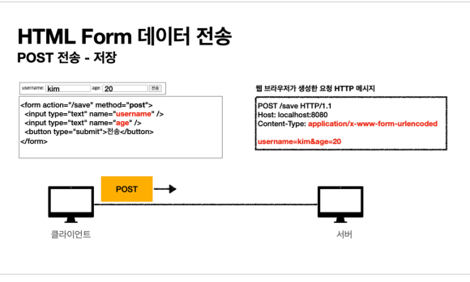
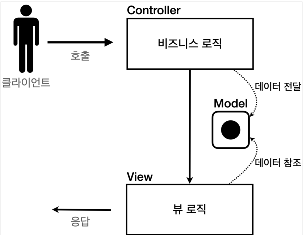
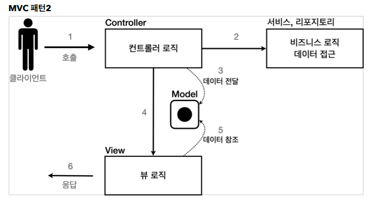

# Spring_MVC_1
스프링 MVC 패턴과 서블릿에 대한 학습 기록입니다.

<details>
<summary>00 웹 어플리케이션에 대한 이해 </summary>
<div markdown="1">

## 웹 서버 (Web Server)

- http 기반 동작
- 정적 리소스 제공, 기타 부가기능
- 정적(파일) HTML, CSS, JS, 이미지, 영상
- NGINX, APACHE

## 웹 애플리케이션 서버(WAS)

- http 기반 동작
- 웹 서버 기능 포함 + 애플리케이션 로직 수행
  - 동적 HTML, HTTP API(JSON)
  - 서블릿, JSP, 스프링 MVC
- 톰캣 제티, Undertow

## 웹 시스템 구성 - WAS, DB

- WAS가 웹서버의 기능 + 알파라면 .. 
- WAS, DB만으로 시스템 구성이 가능하지 않을까?
- WAS는 정적 리소스, 애플리케이션 로직 모두를 제공 가능하니까
- BUT WAS가 너무 많은 역할을 담당하면 서버 과부하 우려..Scalability 없음
- WAS 장애시 오류 화면 조차도 노출 불가능 할 수 있음

## 웹 시스템 구성 - WEB,WAS,DB

- 정적 리소스는 웹서버가 처리
- 웹 서버는 애플리케이션 로직같은 동적 처리가 필요하면 WAS에 요청을 위임
- WAS는 중요한 애플리케이션 로직 처리 전담
- 이렇게 구성하면 효율적인 리소스 관리가 가능하다
  - 정적 리소스의 요청이 많으면 Web 서버만 증설
  - 애플리케이션 리소스가 많이 사용되면 WAS 증설
- 또한 오류처리가 가능해진다. 
  - WAS는 잘 죽고 Web서버는 잘 죽지 않기에 WAS가 죽으면 web server에서 오류 화면 제공등의 오류 처리를 할 수 있다.

## 서블릿 

- HTML Form 데이터 전송으로 POST 요청이 발생했고 그것을 서버가 처리해야 한다고 생각해보자
- 서버에서 처리해야 하는 일은 엄청 많아 .. 


- 하지만 우리가 핵심적으로 하고 싶은 일은 초록색 박스
- 서블릿은 여기에서 우리가 의미 있는 비즈니스 로직에 집중할 수 있도록 나머지 일들을 처리해주는 역할을 한다 (Marshalling unmarshalling 등등)
- 즉 요청 정보를 편리하게 사용할 수 있도록 하고 응답 정보를 편리하게 만들 수 있도록 도와 줌
- HTTP 스펙을 사용하기가 매우 편리해짐 


### 서블릿 컨테이너

- 톰캣처럼 서블릿을 지원하는 WAS를 서블릿 컨테이너라고 함
- 서블릿 컨테이너는 서블릿 객체를 생성, 초기화, 호출, 종료하는 생명주기 관리
- 서블릿 객체슷 <b>싱글톤</b>으로 관리 
  - 고객의 요청이 올 때마다 계속 객체를 생성하는 것이 비효율
  - 싱글톤이니까 공유 변수 사용 주의! 무상태가 좋다 
- 동시 요청을 위한 멀티 쓰레드 처리 지원 

## 동시 요청 - 멀티 쓰레드 

### 쓰레드 

- 애플리케이션 코드를 하나하나 순차적으로 실행하는 것은 쓰레드
- 자바 메인 메서드를 처음 실행하면 main이라는 이름의 쓰레드가 싫애
- 쓰레드가 없다면 자바 애플리케이션 실행이 불가능
- 쓰레드는 한번에 하나의 코드 라인만 수행
- 동시 처리가 필요하면 쓰레드를 추가로 생성

### 하드웨어 스레드와 소프트웨어 스레드의 차이


- 소프트웨어 스레드가 100개 있다고 하더라도 동시에 실행될 수 있는 스레드는 하드웨어 스레드 갯수와 같다. 
- 물리적 스레드가 2코어 4스레드라고 한다면 동시에 네개의 스레드가 실행 가능하다.
- 소프트웨서 스레드가 100개라고 쳐보자 동시에 실행가능한 스레드는 4개이겠지만 소프트웨어에서는 100개를 처리할 수 있도록 스레드를 만들어 놓은 것에 불과하다.
- 이는 운영체제의 스케줄링에 맞추어 컨텍스트 스위칭 비용을 지불하며 처리될 것이다.
- 즉 소프트웨어적 스레드는 단지 접수원의 역할을 하며 실제로는 모든 스레드가 병렬 처리되진 않는다.
- 구글링하다가 얻은 예시 
  - 4코어 8스레드(하드웨어) 라는 것은 상 하권이 나뉜 4세트의 책과 같습니다.
  - 이 4세트를 가지고 도서관에서 100명의 사람에게 빌려 줄 수 있습니다. 비록 한번에 읽을 수 있는 사람은 8사람(소프트웨어 스레드) 밖에 없지만요


### 요청 마다 쓰레드를 생성하면
- 장점
  - 동시 요청 처리가능
  - 리소스가 허용할 때 가지 처리가능
  - 하나의 쓰레드가 지연 되어도, 나머지 쓰레드는 정상 동작한다.
- 단점
  - 쓰레드는 생성 비용이 매우 비쌈
  - 고객의 요청이 올 때 마다 쓰레드를 생성하면 응답 속도가 늦어진다.
  - 컨텍스트 스위칭 비용이 발생
  - 생성에 제한이 없기에 서버 임계치를 넘겨 서버를 죽일 수도 있다.

### 쓰레드 풀


- 쓰레드 풀 : 요청 마다 쓰레드를 생성하는 것의 단점을 보완한다.
  - 특징 
    - 필요한 쓰레드를 쓰레드 풀에 보관하고 관리한다.
    - 쓰레드 풀에 생성 가능한 쓰레드의 최대치를 관리한다. 톰캣은 최대 200개가 디폴트(변경가능)
  - 사용
    - 쓰레드가 필요하면 이미 생성되어 있는 쓰레드를 쓰레드 풀에서 꺼내서 사용
    - 사용을 종료하면 쓰레드 반납
    - 쓰레드가 모두 사용중이어서 풀에 없으면?
      - 대기하도록 하거나
      - 거절 하도록 설정 가능
    - 장점
      - 쓰레드가 미리 생성되어 있으므로, 쓰레드를 생성하고 종료하는 비용(CPU)이 절약, 응답 시간 빠름
      - 너무 많은 요청이 들어와도 안전하게 처리 가능

### WAS의 주요 튜닝 포인트

- WAS의 주요 튜닝 포인트는 최대 쓰레드 수이다.
- 이 값이 너무 낮다면
  - 동시 요청 많을 때 서버 리소스는 여유롭지만 클라이언트는 느린 사용자 경험
- 이 값이 높다면
  - CPU, 메모리 리소스 임계점 초과로 서버 다운
- 적정 숫자 어케 찾음?
  - 아파치 ab, 제이미터, nGrinder 등의 툴로 실제 상황과 유사한 테스트를 진행해보자

### WAS의 멀티 쓰레드 지원
- 멀티 쓰레드에 대한 부분은 WAS가 처리
- 개발자가 멀티 쓰레드 관련 코드를 신경쓰지 않아도 됨
- 개발자는 마치 싱글 쓰레드 프로그래밍을 하듯이 편리하게 소스 코드를 개발
- 싱글톤은 주의해야 해!

## HTML, HTTP API, CSR, SSR

### 정적 리소스 
- 고정된 HTML 파일, CSS, JS, 이미지, 영상 등을 제공
- 주로 웹 브라우저가 요청을 하고 웹 서버가 보관 하고 있는 리소스를 반환

### 동적 HTML 페이지
- 동적으로 필요한 HTML 파일을 생성해서 전달하는 방식
- 웹 브라우저는 HTML을 해석한다.


- WAS가 HTML파일을 렌더링하여 반환 

### HTTP API

- HTML이 아니라 데이터를 전달
- 주로 JSON 형식 사용
- 다양한 시스템에서 호출
- 웹브라우저는 HTML등의 파일을 기대하고 있을 텐데 데이터만 받으면 화면을 어떻게 보여줄까?
  - UI화면은 클라이언트가 처리하고 끼워 넣을 데이터만 받는 것임
- 보통 웹 브라우저에서 자바스크립트를 통한 HTTP API 호출
- React,vue.js 같은 웹 클라이언트

### 여기서 잠깐 API, HTTP API, REST API 정리

- API
  - 애플리케이션에서 사용할 수 있도록 운영체제나 프로그래밍 언어가 제공하는 기능을 제어할 수 있게 만든 인터페이스를 뜻한다.
  - 즉 애플리케이션이 어떤 프로그램이 제공하는 기능을 사용할 수 있게 만든 매개체이다.
- HTTP API
  - HTTP를 사용하여 프로그램끼리 소통하는 API를 말한다. 보통 우리가 흔히 보는 OPEN API와 같은 대부분 API는 HTTP라는 통신 규칙으로 소통하는 API이다.
- REST API 
  - Representational State Transfer
  - 자원의 표현으로 상태를 전달하는 것 
  - URI로 자원을 표현하는 데에 집중하고 자원의 상태(행위)에 대한 정의는 HTTP 메소드로 하는 것이 중심 규칙
  - HTTP API와 REST API는 사실 거의 같은 의미로 사용하고 있다
- RESTful 하게 설계하는 것은 두가지 중심 규칙을 기반으로


### SSR - 서버 사이드 렌더링

- 서버에서 최종 HTML을 생성해서 클라이언트에 전달


### CSR - 클라이언트 사이드 렌더링


</div>
</details>

<details>
<summary> 01 서블릿 실습 </summary>
<div markdown="1">

## Hello 서블릿
- 서블릿이란 요청이 들어왔을 때 request를 parsing하고 response를 주조해주는 기술 (req, resp marshalling, unmarshalling)
  - housekeep work(잡일)를 대신 해줌으로써 서비스 로직에 집중할 수 있도록 함
- 스프링 부트 환경에서 서블릿을 등록하고 사용해보자
- 참고
  - 서블릿은 톰캣 같은 웹 애플리케이션 서버를 직접 설치하고 그 위에서 서블릿 코드를 클래스 파일로 빌드해서 올린 다음, 톰캣 서버를 실행하면 된다. 
  - 하지만 이 과정은 매우 번거롭
  - 스프링 부트는 톰캣 서버를 내장하고 있음으로 톰캣 서버 설치 없이 편리하게 서블릿 코드를 실행할 수 있다.

### 스프링 부트 서블릿 환경 구성

- @ServletComponentScan
  - 스프링 부트는 서블릿을 직접 등록해서 사용할 수 있도록 @ServletComponentScan을 지원
  - 다음과 같이 추가하자 

```java
@ServletComponentScan // 서블릿 자동 등록. 하위 패키지의 컴포넌트 스캔해서 서블릿으로 등록한다
@SpringBootApplication
public class ServletApplication {

	public static void main(String[] args) {
		SpringApplication.run(ServletApplication.class, args);
	}

}

```

### 서블릿 등록하기

```java 

@WebServlet(name = "helloServlet", urlPatterns = "/hello")
public class HelloServlet extends HttpServlet {

    //서블릿이 호출되면 service메소드가 실행된다.
    //웹브라우저가 만든 http메세지가 Servlet에 의해 parsing, request객체와 response객체를 서블릿에 던진다.
    @Override
    protected void service(HttpServletRequest request, HttpServletResponse response) throws ServletException, IOException {

        System.out.println("HelloServlet.service");
        System.out.println("request = " + request);
        System.out.println("response = " + response);
        String username = request.getParameter("username"); //http메세지에서 query parameter를 쏙 빼서 읽는다. ../hello?username=kim 이라고 요청이 오면 여기에선 kim을 반환해줄 것임
        System.out.println("username = " + username);

        //응답 보내보기
        response.setContentType("text/plain"); //단순 문자를 보낸다.
        response.setCharacterEncoding("utf-8"); //인코딩 정보 알려주기
        response.getWriter().write("hello " + username); //http message body에 write한다.
    }
}
```

- @WebServlet 서블릿 애노테이션
  - name : 서블릿 이름
  - urlPatterns : URL 매핑 
  - HTTP 요청을 통해 매핑된 URL이 호출되면서 서블릿 컨테이너는 service 메소드 실행
  


### Http Servlet Request Handling
- Http 요청 메시지를 개발자가 직접 파싱해서 사용해도 되지만, 매우 불편.
- 서블릿은 HTTP 요청 메시지를 편리하게 사용할 수 있도록 개발자 대신에 HTTP 요청 메시지를 파싱한다. 
- /basic/request/RequestHeaderServlet에서 어떤 것들을 추출할 수 있는지 작성해보았음 

### Http 요청 데이터
- 위에서 해본 것은 request에 대한 다양한 정보를 뽑아본 것임 
- 다만 이번에 살펴 볼 것은 보내는 '데이터'를 파싱하는 과정
- Http 요청 메시지를 통해 클라이언트에서 서버로 '데이터'를 전달하는 방법은 다음 3가지 방법을 벗어나지 않는다.

#### GET - 쿼리 파라미터
- /url?username=hello&age=20
- 메시지 바디 없이, URL의 쿼리 파라미터에 데이터를 포함해서 전달
- 검색, 필터, 페이징등에서 많이 사용하는 방식
- 구글에 Hello를 검색했을 때 URL을 살펴보면 쿼리파라미터를 이용한 것을 볼 수 있음
#### POST - HTML Form
- content-type:application/x-www-form-urlencoded
- 메시지 바디에 쿼리 파라미터 형식으로 전달 username=hello&age=20
- 예) 회원 가입, 상품 주문, HTML Form 사용
- 회원가입 같은 경우 우리가 정해진 form에 입력해서 확인 버튼을 누른다. 
- 확인 버튼을 누르면 form에 맞추어 적힌 것을 쿼리파라미터 형식으로 바뀌는데 이를 메시지 바디에 실어 보내는 것이 POST 방식

#### HTTP message body에 데이터를 직접 담아서 요청
- REST API에서 주로 사용. JSON, XML, TEXT
- 데이터 형식은 주로 JSON을 사용한다.
- POST, PUT, PATCH


### HTTP 요청 데이터 GET 쿼리 파라미터
- 쿼리 파라미터는 URL에 다음과 같이 ?를 시작으로 보낼 수 있다. 추가 파라미터는 &로 구분된다.
- http://localhost:8080/request-param?username=hello&age=20
- 다음은 쿼리파라미터 조회
```java
package hello.servlet.basic.request;

import javax.servlet.ServletException;
import javax.servlet.annotation.WebServlet;
import javax.servlet.http.HttpServlet;
import javax.servlet.http.HttpServletRequest;
import javax.servlet.http.HttpServletResponse;
import java.io.IOException;

/*
1. 파라미터 전송 기능
 */

@WebServlet(name = "requestParamServlet", urlPatterns = "/request-param")
public class RequestParamServlet extends HttpServlet {
    @Override
    protected void service(HttpServletRequest request, HttpServletResponse response) throws ServletException, IOException {
        System.out.println("[전체 파라미터 조회] - start");
        request.getParameterNames().asIterator().forEachRemaining(paramName -> System.out.println(paramName + "=" + request.getParameter(paramName)));

        System.out.println("[전체 파라미터 조회] - end");
        System.out.println();

        System.out.println("[단일 파라미터 조회] - start");
        String username = request.getParameter("username"); //키값넣어서 해당키에 해당하는 값 잡아온다. 단일 조회!
        String age = request.getParameter("age"); //키값넣어서 해당키에 해당하는 값 잡아온다. 단일 조회!

        System.out.println("username = " + username);
        System.out.println("age = " + age);
        System.out.println("[단일 파라미터 조회] - end");

        //?username=hello&username=hello2 이런 경우가 있다
        //이럴 경우 단일 조회하면 앞쪽에 있는 게 걸려 넘어옴 뒤에 있는 것도 보고 싶다면 이름이 같은 복수 파라미터 조회!
        System.out.println("[이름이 같은 복수 파라미터 조회] - start");
        String[] usernames = request.getParameterValues("username"); //getParameterValues -> 얘는 배열 반환! for each로 찍어볼 수 있다.
        for (String name : usernames) {
            System.out.println("name = " + name);
        }

        System.out.println("[이름이 같은 복수 파라미터 조회] - end");

    }
}

```

- 복수 파라미터에서 단일 파라미터 조회
- 위의 주석에도 써있지만 이름은 하나인데 값이 중복일 수 있다. 이럴 경우에는 getParameter가 아닌 getParameterValues를 사용해야 함
- getParameter를 사용하면 맨 앞에 걸려있는 것 하나만 가져온다.
- 근데 참고로 이렇게 중복으로 설계하는 경우는 많지 않기에 실상 가장 많이 사용되는 것은 getParameter라고 볼 수 있음
- getParameter는 키값을 넘겨주면 value(우리가 원하는 데이터)를 가져온다! 

### HTTP 요청 데이터 - POST HTML Form
- content-type: application/x-www-form-urlencoded
  - GET방식과는 다르게 content-type이 필요 -> 메시지 바디가 있기 때문
- 메시지 바디에 쿼리 파라미터 형식으로 데이터를 전달한다! 
- html form 에 입력한 것이 쿼리형태로 주조되어 메시지 바디에 써진 후에 전송되는 것!  (입력한 정보가 메시지 바디에 쓰인 후에 전송된다)
- 서블릿에서 꺼낼때는 위의 GET방식의 데이터를 꺼낼때와 구분없이 꺼낼 수 있다. 쿼리 파라미터 조회 메서드를 그대로 사용한다.
- cf) html을 굳이 만들어서 테스트 할 필요없이 postman 사용할 수 있다.
```html
<!DOCTYPE html>
<html>
<head>
    <meta charset="UTF-8">
    <title>Title</title>
</head>
<body>
<!-- 전송 버튼이 눌리면 입력된 것을 포스트 방식의 메시지로 주조하여(message body에 쿼리를 쓴다) /request-param url로 요청한다!
     꺼낼 때는 똑같이 request.getParameter로 꺼낼 수 있다. -->
<form action="/request-param" method="post"> 
    username: <input type="text" name="username" />
    age: <input type="text" name="age" />
    <button type="submit">전송</button>
</form>
</body>
</html>
```

### HTTP 요청 데이터 - API 메시지 바디 - 단순 텍스트 
- 앞서 배운 GET-쿼리파라미터 방식과 POST form데이터를 사용하는 방식은 웹브라우저에서 일반적으로 html을 사용할 때 사용하는 방식임
- 이번 방식은 message body에 데이터를 직접 실어 보내는 방식이다.
  - 서버와 서버가 통신할때, 안드로이드같은 앱에서 웹서버에 요청할 때, javascript를 사용한 요청을 할 때 API방식을 주로 사용한다.
  - HTTP API에서 주로 사용하는 방식임 
  - 데이터 형식은 주로 JSON을 사용한다 (de facto standard)
- 다음은 JSON이 아닌 단순 텍스트 메시지를 HTTP 메시지 바디에 담아서 전송하고 읽어보는 과정

```java
package hello.servlet.basic.request;

import org.springframework.util.StreamUtils;

import javax.servlet.ServletException;
import javax.servlet.ServletInputStream;
import javax.servlet.annotation.WebServlet;
import javax.servlet.http.HttpServlet;
import javax.servlet.http.HttpServletRequest;
import javax.servlet.http.HttpServletResponse;
import java.io.IOException;
import java.nio.charset.StandardCharsets;

@WebServlet(name = "requestBodyStringServlet", urlPatterns = "/request-body-string")
public class RequestBodyStringServlet extends HttpServlet {
    @Override
    protected void service(HttpServletRequest request, HttpServletResponse response) throws ServletException, IOException {

        //API 방식에서 데이터를 꺼내는 방법은 아래와 같다.
        ServletInputStream inputStream = request.getInputStream(); //API방식에서 message body의 내용을 byte code형태로 얻는다.
        String messageBody = StreamUtils.copyToString(inputStream, StandardCharsets.UTF_8);//byte code를 String으로 copy하는데 encoding 정보는 UTF_8 (byte를 문자로, 문자를 byte로 바꿀 때는 encoding정보를 알려주어야 함!

        System.out.println("messageBody = " + messageBody);
        response.getWriter().write("ok");

    }
}
```
- http 메시지 바디의 데이터를 InputStream메소드를 이용해 Byte code로 꺼내올 수 있음
- copyTo를 이용해 캐스팅하고 클라이언트가 던진 메시지 바디를 읽어올 수 있는 것을 볼 수 있음 
- 다만 해당 방법은 json이 아닌 Text/plain을 꺼내온 것 이어 json전송, 데이터 추출과정을 살펴보자 

### HTTP 요청 데이터 - API 메시지 바디 - JSON
- POST http://localhost:8080/request-body-json
- content-type: application/json 
  - json은 또 다른 데이터 형식이지만 결국 메시지 바디를 추출해보면 똑같이 추출할 수 있음

- 메시지 바디에서 읽어온 json 내용을 기반으로 객체를 만들기 위해 클래스 생성
```java
package hello.servlet.basic;

import lombok.Getter;
import lombok.Setter;

@Getter
@Setter
public class HelloData {

  private String username;
  private int age;

}
```
- json데이터를 파싱하여 객체를 만드는 서블릿
```java
package hello.servlet.basic.request;

import com.fasterxml.jackson.databind.ObjectMapper;
import hello.servlet.basic.HelloData;
import org.springframework.util.StreamUtils;

import javax.servlet.ServletException;
import javax.servlet.ServletInputStream;
import javax.servlet.annotation.WebServlet;
import javax.servlet.http.HttpServlet;
import javax.servlet.http.HttpServletRequest;
import javax.servlet.http.HttpServletResponse;
import java.io.IOException;
import java.nio.charset.StandardCharsets;

@WebServlet(name = "RequestBodyJsonServlet", urlPatterns = "/request-body-json")
public class RequestBodyJsonServlet extends HttpServlet {

    private ObjectMapper objectMapper = new ObjectMapper();

    @Override

    protected void service(HttpServletRequest request, HttpServletResponse response) throws ServletException, IOException {

        ServletInputStream inputStream = request.getInputStream();
        String messageBody = StreamUtils.copyToString(inputStream, StandardCharsets.UTF_8);
        System.out.println("messageBody = " + messageBody);
        // {"username": "hello", "age": 20} 이렇게 메시지 바디를 채워넣고 content-type을 json으로 설정하여 보내도 위의 방식으로 출력해도
        // 그냥 문자열이 출력된다. json도 문자기 때문!
        // json data를 HelloData객체로 만들고 싶으면 jackson library 임포트 하고 object mapping을 해야함
        HelloData helloData = objectMapper.readValue(messageBody, HelloData.class);
        System.out.println("helloData.getUsername() = " + helloData.getUsername());
        System.out.println("helloData.getAge() = " + helloData.getAge());

        response.getWriter().write("ok");

    }
}
```
- json도 또 다른 데이터 형식일 뿐이다. 
  - 단순 텍스트형식의 메시지 바디를 읽을 때 처럼 inputStream으로 메시지 바디를 통째로 읽어온다.
  - 그 후에 objectMapper를 통해 객체를 생성해내는 것을 볼 수 있다.
  - 다만 궁금한 점은.. 단순 텍스트로 해도 동작이 되는데 왜 굳이 json형식이라는 것이 필요할까?
    - json이 경량화 되어있고 서로 다른 언어들간에 데이터를 주고받을 수 있도록 만들어졌기 떄문..

### HTTP Response 사용법

- status, 헤더, redirection, 쿠키 등등을 설정할 수 있으며 제공되는 편의 메소드를 사용할 수도 있다.
```java
package hello.servlet.basic.response;

import javax.servlet.ServletException;
import javax.servlet.annotation.WebServlet;
import javax.servlet.http.Cookie;
import javax.servlet.http.HttpServlet;
import javax.servlet.http.HttpServletRequest;
import javax.servlet.http.HttpServletResponse;
import java.io.IOException;
import java.io.PrintWriter;

@WebServlet(name = "responseHeaderServlet", urlPatterns = "/reponse-header")
public class ResponseHeaderServlet extends HttpServlet {

    @Override
    protected void service(HttpServletRequest request, HttpServletResponse response) throws ServletException, IOException {
        //[status-line] 응답의 첫번째 라인
        response.setStatus(HttpServletResponse.SC_OK); //200 성공

        //[response-header] 이렇게 일일이 넣을 수 있지만 편의 메서드가 있다. 아래 참고
/*
        response.setHeader("Content-Type", "text/plain;charset=utf-8");
        response.setHeader("Cache-Control", "no-cache, no-store, must-revalidate");
        response.setHeader("Pragma", "no-cache");
        response.setHeader("my-header", "hello"); //내가 만든 임의의 헤더
*/

        //편의 메서드 사용
        content(response);
        cookie(response);
        redirect(response);

        //[message body]
        PrintWriter writer = response.getWriter();
        writer.write("ok");

    }

    //편의 메소드들 주석 처리를 주석 안된 부분을 다 써야 되는 것을 주석 처리 되지 않은 부분으로 간편하게 만들 수 있다.
    private void content(HttpServletResponse response) {
        //Content-Type: text/plain;charset=utf-8
        //Content-Length: 2
        //response.setHeader("Content-Type", "text/plain;charset=utf-8");
        response.setContentType("text/plain");
        response.setCharacterEncoding("utf-8");
        //response.setContentLength(2); //(생략시 자동 생성)
    }
    private void cookie(HttpServletResponse response) {
        //Set-Cookie: myCookie=good; Max-Age=600;
        //response.setHeader("Set-Cookie", "myCookie=good; Max-Age=600");
        Cookie cookie = new Cookie("myCookie", "good");
        cookie.setMaxAge(600); //600초
        response.addCookie(cookie);
    }
    private void redirect(HttpServletResponse response) throws IOException {
        //Status Code 302
        //Location: /basic/hello-form.html
        //response.setStatus(HttpServletResponse.SC_FOUND); //302
        //response.setHeader("Location", "/basic/hello-form.html");
        response.sendRedirect("/basic/hello-form.html"); //해당 url로 리다이렉트
    }
}

```

### HTTP 응답 데이터 - 단순 텍스트, HTML

- HTTP 응답 메시지는 주로 다음 내용중 하나를 담아서 전달
  - 단순 텍스트 응답
    - writer.println
  - HTML 응답 
  - HTTP API - MessageBody JSON 응답
- HTML 응답: 이런식으로 써야 한다.. 이럴꺼면 다른 점이 뭐야? -> 받았을 때 어떤 형식인지 알아야 클라이언트든 서버든 파싱을 올바르게 한다
```java
package hello.servlet.basic.response;

import javax.servlet.ServletException;
import javax.servlet.annotation.WebServlet;
import javax.servlet.http.HttpServlet;
import javax.servlet.http.HttpServletRequest;
import javax.servlet.http.HttpServletResponse;
import java.io.IOException;
import java.io.PrintWriter;

@WebServlet(name = "responseHtmlServlet", urlPatterns = "/response-html")
public class ResponseHtmlServlet extends HttpServlet {

    @Override
    protected void service(HttpServletRequest request, HttpServletResponse response) throws ServletException, IOException {

        //Content-Type: text/html;charset=utf-8
        response.setContentType("text/html");
        response.setCharacterEncoding("utf-8");

        PrintWriter writer = response.getWriter();
        writer.println("<html>");
        writer.println("<body>");
        writer.println("    <div>안녕?</div>");
        writer.println("</body>");
        writer.println("</html>");

    }
}

```

- json 으로 응답
```java
package hello.servlet.basic.response;

import com.fasterxml.jackson.databind.ObjectMapper;
import hello.servlet.basic.HelloData;

import javax.servlet.ServletException;
import javax.servlet.annotation.WebServlet;
import javax.servlet.http.HttpServlet;
import javax.servlet.http.HttpServletRequest;
import javax.servlet.http.HttpServletResponse;
import java.io.IOException;
import java.io.PrintWriter;

@WebServlet(name = "responseJsonServlet", urlPatterns = "/response-json")
public class ResponseJsonServlet extends HttpServlet {

    ObjectMapper objectMapper = new ObjectMapper();
    @Override
    protected void service(HttpServletRequest request, HttpServletResponse response) throws ServletException, IOException {
        //Content-Type: application/json
        response.setContentType("application/json");
        response.setCharacterEncoding("utf-8");

        HelloData helloData = new HelloData();
        helloData.setUsername("kim");
        helloData.setAge(20);

        //{"username":"kim", "age":20}
        String result = objectMapper.writeValueAsString(helloData);
        PrintWriter writer = response.getWriter();
        writer.println(result);
    }
}

```

</div>
</details>

<details>
<summary>02 서블릿, JSP, MVC 패턴  </summary>
<div markdown="1">

### 회원 관리 웹 어플리케이션 요구사항

- 회원 정보
```java
package hello.servlet.domain.member;

import lombok.Getter;
import lombok.Setter;

@Getter
@Setter
public class Member {

    private Long id;
    private String username;
    private int age;

    public Member() {
    }

    public Member(String username, int age) {
        this.username = username;
        this.age = age;
    }
}

```
- 회원 저장소
```java
package hello.servlet.domain.member;

import java.util.ArrayList;
import java.util.HashMap;
import java.util.List;
import java.util.Map;

public class MemberRepository {
    //동시성 문제가 고려되어 있지 않음, 실무에서는 ConcurrentHashMap, AtomicLong을 고려해야함
    private static Map<Long, Member> store = new HashMap<>();
    private static long sequence = 0L;

    private static final MemberRepository instance = new MemberRepository();

    public static MemberRepository getInstance() {
        return instance;
    }
    private MemberRepository() {
    }

    public Member save(Member member) {
        member.setId(++sequence);
        store.put(member.getId(), member);
        return member;
    }

    public Member findById(Long id) {
        return store.get(id);
    }
    public List<Member> findAll() {
        return new ArrayList<>(store.values());
    }
    public void clearStore() {
        store.clear();
    }
}

```

### 서블릿으로 회원 관리 웹 애플리케이션 만들기

- 각 url 요청에 대응하는 서블릿을 만들어 보았다. (save, members 등등..)
- 다음은 그 중 하나인 회원 저장 
```java
package hello.servlet.web.servlet;

import hello.servlet.domain.member.Member;
import hello.servlet.domain.member.MemberRepository;

import javax.servlet.ServletException;
import javax.servlet.annotation.WebServlet;
import javax.servlet.http.HttpServlet;
import javax.servlet.http.HttpServletRequest;
import javax.servlet.http.HttpServletResponse;
import java.io.IOException;
import java.io.PrintWriter;

@WebServlet(name = "memberSaveServlet", urlPatterns = "/servlet/members/save")
public class MemberSaveServlet extends HttpServlet {

  private MemberRepository memberRepository = MemberRepository.getInstance();

  @Override
  protected void service(HttpServletRequest request, HttpServletResponse response) throws ServletException, IOException {
    System.out.println("MemberSaveServlet.service");
    String username = request.getParameter("username"); //Form방식이든 GET의 쿼리파라미터든 꺼낼 수 있다.
    int age = Integer.parseInt(request.getParameter("age"));

    Member member = new Member(username, age);
    memberRepository.save(member);

    response.setContentType("text/html");
    response.setCharacterEncoding("utf-8");
    PrintWriter w = response.getWriter();
    //동적 html이라 볼 수 있다.
    w.write("<html>\n" +
            "<head>\n" +
            " <meta charset=\"UTF-8\">\n" +
            "</head>\n" +
            "<body>\n" +
            "성공\n" +
            "<ul>\n" +
            " <li>id="+member.getId()+"</li>\n" +
            " <li>username="+member.getUsername()+"</li>\n" +
            " <li>age="+member.getAge()+"</li>\n" +
            "</ul>\n" +
            "<a href=\"/index.html\">메인</a>\n" +
            "</body>\n" +
            "</html>");
  }
}

 
```
- url 요청이 들어왔을 때 req를 파싱하고 response를 동적 html로써 보내는 것을 확인할 수 있음

### 템플릿 엔진으로..
- 지금까지 서블릿과 자바 코드만으로 HTML을 만들어 봄
- 원하는 HTML을 동적으로 만들어 response를 줄 수 있지만 write로 일일이 쓰는 것은 매우 비효율적
- 자바 코드 안에 HTML을 넣는 것보다 HTML에 자바 코드를 넣는 것이 더욱 편리할 것
- 이것이 템플릿 엔진의 등장 배경
- 템플릿 엔진을 사용하면 HTML 문서에서 필요한 곳만 코드를 적용해서 동적으로 변경 가능하다.
- 템플릿 엔진에는 JSP, Thymeleaf, Freemarker 등등이 있다
- JSP로 동일한 작업을 해볼 것이지만 JSP는 거의 사장되어 가는 추세고 Thymeleaf가 스프링과 잘 통합되기에 자주 사용되는 템플릿 엔진이라는 점을 기억하자

### JSP
- jsp를 사용하려면 gradle을 통해 라이브러리를 추가해야 한다. 강의 노트를 참고
- 회원 저장을 JSP로 구현해보자 다음과 같이 html파일과 java코드를 한 파일에 섞는다.
```html
<%@ page import="hello.servlet.domain.member.MemberRepository" %>
<%@ page import="hello.servlet.domain.member.Member" %>
<%@ page contentType="text/html;charset=UTF-8" language="java" %>
<%
     // request, response 사용 가능
     MemberRepository memberRepository = MemberRepository.getInstance();
     System.out.println("save.jsp");
     String username = request.getParameter("username");
     int age = Integer.parseInt(request.getParameter("age"));
     Member member = new Member(username, age);
     System.out.println("member = " + member);
     memberRepository.save(member);
%>
<html>
<head>
 <meta charset="UTF-8">
</head>
<body>
성공
<ul>
 <li>id=<%=member.getId()%></li>
 <li>username=<%=member.getUsername()%></li>
 <li>age=<%=member.getAge()%></li>
</ul>
<a href="/index.html">메인</a>
</body>
</html>
```
- 서블릿으로 개발할 때는 뷰화면을 위한 HTML을 만드는 작업이 자바 코드에 섞여서 지저분하고 복잡했지만 JSP를 사용한 덕분에 뷰를 생성하는 HTML작업을 깔끔히 가져가고 중간중간 동적으로 변경이 필요한 부분은 자바 코드를 적용할 수 있었다.
- 다만 이렇게 하면 JAVA 코드, HTML 등등 다양한 코드가 모두 jsp로써 노출되는데 이는 유지보수의 어려움이 있다
- 이에 등장한 것이 MVC 패턴 
  - 비즈니스 로직은 서블릿 처럼 다른 곳에서 처리, JSP는 목적에 맞게 HTML로 화면을 그리는 일에 집중
- 서블릿(자바 코드 복잡) -> jsp(유지보수 힘듬) -> MVC로 넘어오게 된 것 

### MVC 패턴 개요
- 너무 많은 역할
  - 하나의 서블릿이나 JSP만으로 비즈니스 로직과 뷰 렌더링까지 모두 처리하게 되면 너무 많은 역할을 하게 되고 유지보수 어려워짐
- 변경의 라이프 사이클
  - 사실 이게 정말 중요, 비즈니스 로직과 뷰 렌더링 사이의 변경의 라이프 사이클이 다르기에 분리가 절실하다
  - 변경의 라이프 사이클이 다른 부분을 하나의 코드로 관리하는 것은 좋지 않음! 
- 기능 특화
  - 특히 jsp같은 뷰 템플릿은 화면을 렌더링 하는데 최적화 되어 있기 때문에 이 부분의 업무만 담당하는 것이 효과적

- Model View Controller
  - MVC 패턴은 지금까지 학습한 것 처럼 하나의 서블릿이나 JSP로 처리하던 것을 컨트롤러와 뷰라는 영역으로 서로 역할을 나눈 것을 말함. 
  - 웹 애플리케이션은 보통 이 MVC 패턴을 사용한다.
- Controller
  - Http 요청을 받아서 파라미터를 검증하고 비즈니스 로직을 실행한다. 그리고 뷰에 전달할 결과 데이터를 조회해서 모델에 담는다.
- Model
  - 뷰에 출력할 데이터를 담아둔다. 뷰가 필요한 데이터를 모두 모델에 담아서 전달해주는 덕분에 뷰는 비즈니스 로직이나 데이터 접근을 몰라도 됨
- View
  - 모델에 담겨있는 데이터를 사용해서 화면을 그리는 일에 집중 


- 참고 
  - 컨트롤러에 비즈니스 로직을 둘 수도 있지만 이렇게 되면 컨트롤러가 너무 많은 역할을 담당
  - 그래서 일반적으로 비즈니스 로직은 서비스라는 계층을 별도로 만들어서 처리
  - 그리고 컨트롤러는 비즈니스 로직이 있는 서비스를 호출하는 역할을 담당

### MVC 패턴 적용

- 서블릿을 컨트롤러로 사용하고 jsp를 뷰로 사용해서 mvc를 적용
- model은 HttpServletRequest객체를 사용한다. (얘 내부에 저장소가 있음 object타입으로)
- mvc패턴 적용한 예 중 회원 등록 부분만 살펴보자

```java
package hello.servlet.web.servlet.servletmvc;

import javax.servlet.RequestDispatcher;
import javax.servlet.ServletException;
import javax.servlet.annotation.WebServlet;
import javax.servlet.http.HttpServlet;
import javax.servlet.http.HttpServletRequest;
import javax.servlet.http.HttpServletResponse;
import java.io.IOException;

//Controller역할
@WebServlet(name = "mvcMemberFormServlet", urlPatterns ="/servlet-mvc/members/new-form" )
public class MvcMemberFormServlet extends HttpServlet {

    //Controller로 요청이 들어오면 jsp로 넘어가준다.
    @Override
    protected void service(HttpServletRequest request, HttpServletResponse response) throws ServletException, IOException {
        String viewPath = "/WEB-INF/views/new-form.jsp";
        RequestDispatcher dispatcher = request.getRequestDispatcher(viewPath);//경로 이동
        //redirect는 다시 요청을 받고 처리하는 반면(URL 바뀜) dispatcher는 서버안에서 내부적으로 바꿔치기(URL 바뀌지 않음)
        dispatcher.forward(request, response); //jsp로 전환
    }
}

```
- dispatcher.forward(): 다른 서블릿이나 jsp로 이동할 수 있는 기능
  - redirect는 실제 클라이언트에 응답이 나갔다가 클라이언트가 redirect경로로 다시 요청
  - forward는 서버 내부에서 일어나는 호출이기에 클라이언트가 전혀 인지하지 못함! 

```html
<%@ page contentType="text/html;charset=UTF-8" language="java" %>
<html>
<head>
 <meta charset="UTF-8">
 <title>Title</title>
</head>
<body>
<!-- 상대경로 사용, [현재 URL이 속한 계층 경로 + /save] -->
<form action="save" method="post">
 username: <input type="text" name="username" />
 age: <input type="text" name="age" />
 <button type="submit">전송</button>
</form>
</body>
</html>
```
- /WEB-INF
  - 해당 경로안의 jsp는 외부에서 직접 호출할 수 없음 (url로 찍어서 요청 못한다는 것) 
  - 이렇게 만든 이유는 항상 컨트롤러를 통해서 jsp가 호출되기 바라기 때문 (MVC)

- MVC 덕분에 컨트롤러 로직과 뷰 로직을 확실하게 분리한 것을 확인할 수 있다. 
- 만약 이후에 화면 수정이 필요하다면 뷰 로직만 변경하면 됨 

### MVC 패턴의 한계
- MVC 패턴을 적용함으로써 컨트롤러의 역할과 뷰를 렌더링 하는 역할을 명확하게 구분할 수는 있었음
  - 서블릿 response에 일일이 write할 필요도 없고
  - jsp에 몽땅 때려넣을 필요도 없다
- 다만 컨트롤러는 중복이 많고 필요하지 않는 코드들도 많이 보인다.

- 포워드 중복
  - View로 이동하는 코드가 항상 중복 호출됨 -> 물론 이 부분을 메소드로 추출하여 util 클래스화 시킬 수도 있지만 어쨋든 메소드도 항상 직접 호출해야 함

```java
RequestDispatcher dispatcher = request.getRequestDispatcher(viewPath);
dispatcher.forward(request, response);
```

- 사용하지 않는 코드
  - 우리의 코드에서 특히 response는 사용되지 않고 있다
  - jsp로 뿌려버리기 때문

- 기능이 복잡해질 수록 컨트롤러에서 공통으로 처리해야 하는 부분은 점점 더 증가할 것이다.
- 단순히 공통 기능을 메서드로 뽑으면 될 것 같지만 결과적으로 항상 메서드를 호출해야 하고 실수로 호출하지 않으면 문제가 될 것임
- 또한 호출 그 자체도 중복이다.
- 이러한 중복문제를 해결하기 위한 공통 기능이 필요하다 -> Front Controller 패턴
  - 수문장 역할을 하는 애들이 공통 처리를 한다
  - 스프링 MVC의 핵심도 이 프론트 컨트롤러이다! 


</div>
</details>
