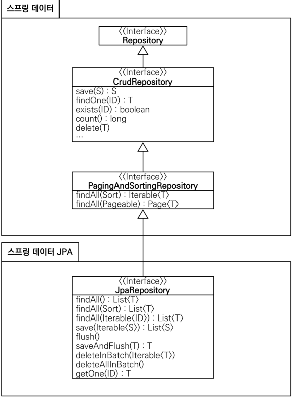

## 실전 스프링 데이터 JPA

<details>
<summary>Section 02 예제 도메인 모델</summary></summary>
<div markdown="1">

### 예제 도메인 모델
- 
- 

</div>
</details>


<details>
<summary>Section 03 공통 인터페이스 기능</summary></summary>
<div markdown="1">

### 순수 jpa 기반 리포지토리를 살펴보자
- 회원 기본 CRUD

```java
package study.datajpa.repository;

import jakarta.persistence.EntityManager;
import jakarta.persistence.PersistenceContext;
import org.springframework.stereotype.Repository;
import study.datajpa.entity.Member;

import javax.swing.text.html.Option;
import java.util.List;
import java.util.Optional;

@Repository
public class MemberJpaRepository {

    @PersistenceContext
    private EntityManager em;

    public Member save(Member member) {
        em.persist(member);
        return member;
    }

    public void delete(Member member) {
        em.remove(member);
    }

    public List<Member> findAll() {
        return em.createQuery("select m from Member m", Member.class)
                .getResultList();
    }

    public Optional<Member> findById(Long id) {
        Member member = em.find(Member.class, id);
        return Optional.ofNullable(member);
    }

    public long count() {
        return em.createQuery("select count(m) from Member m", Long.class).getSingleResult();
    }
    public Member find(Long id) {
        return em.find(Member.class, id);
    }
}

```

- Team 기본 CRUD

```java
package study.datajpa.repository;

import jakarta.persistence.EntityManager;
import jakarta.persistence.PersistenceContext;
import org.springframework.stereotype.Repository;
import study.datajpa.entity.Team;

import java.util.List;
import java.util.Optional;

@Repository
public class TeamRepository {

    @PersistenceContext
    private EntityManager em;

    public Team save(Team team) {
        em.persist(team);
        return team;
    }

    public void delete(Team team) {
        em.remove(team);
    }

    public List<Team> findAll() {
        return em.createQuery("select t from Team t", Team.class)
                .getResultList();
    }

    public Optional<Team> findById(Long id) {
        Team team = em.find(Team.class, id);
        return Optional.ofNullable(team);
    }

    public long count() {
        return em.createQuery("select count(t) from Team t", Long.class)
                .getSingleResult();
    }

}

```
- CRUD가 반복적으로 진행되고 있는 것을 알 수 있다.
- 제네릭을 사용하면 재사용성을 늘릴 수 있을지도!?
- Spring 데이터 jpa에서는 공통 인터페이스를 통해서 boilerplate한 코드를 삭제할 수 있도록 도와준다.

### Spring Data JPA 공통 인터페이스 

- Spring Data JPA를 사용하면 인터페이스를 사용하는 것만으로 CRUD 공통 인터페이스를 사용가능 하다. 어떻게 그것이 가능할까!?
- 실제로 인터페이스를 사용할 때 class를 찍어보자
  - memberRepository.getClass() class com.sun.proxy.$ProxyXXX
- 스프링 jpa가 구현체를 생성하고 프록시로 제공하는 것을 확인할 수 있다

### Spring Data JPA 공통 인터페이스 적용
- 공통 인터페이스를 적용해보자

```java
    @Test
    public void basicCRUD() throws Exception {

        //given
        Member member1 = new Member("member1");
        Member member2 = new Member("member2");
        memberRepository.save(member1);
        memberRepository.save(member2);
        //단건 조회 검증
        Member findMember1 = memberRepository.findById(member1.getId()).get();
        Member findMember2 = memberRepository.findById(member2.getId()).get();
        assertThat(findMember1).isEqualTo(member1);
        assertThat(findMember2).isEqualTo(member2);

        //리스트 조회 검증
        List<Member> all = memberRepository.findAll();
        assertThat(all.size()).isEqualTo(2);

        //count 검증
        long count = memberRepository.count();
        assertThat(count).isEqualTo(2);

        //삭제 검증
        memberRepository.delete(member1);
        memberRepository.delete(member2);
        long deletedCount = memberRepository.count();
        assertThat(deletedCount).isEqualTo(0);

    }

```
- Spring Data JPA로 똑같이 적용을 해보아도 이미 구현되어 있는 기능들이라 별 다른 수정 없이 사용 가능한 것을 확인할 수 있다.

### 공통 인터페이스 분석
- 


</div>
</details>


<details>
<summary>Section 04 Query Method 기능</summary></summary>
<div markdown="1">

### 스프링 데이터 JPA가 제공하는 마법 같은 기능
- 메서드 이름으로 쿼리 생성
- 메서드 이름으로 JPA Named Query 호출
- @Query 어노테이션을 사용해서 리파지토리 인터페이스에 쿼리 직접 정의

### 메서드 이름으로 쿼리 생성
- 메서드 이름을 분석해서 JPQL 쿼리가 작성되고 실행된다.
- 이름과 나이를 기준으로 회원을 조회하는 다음의 순수 JPA 리포지토리 코드를 보자

```java

    public List<Member> findByUsernameAndAgeGreaterThan(String username, int age) {
        return em.createQuery("select m from Member m where m.username = :username and m.age > :age")
                .setParameter("username", username)
                .setParameter("age", age)
                .getResultList();
    }
```
- 쿼리를 작성하고 실행시키도록 코드를 짠 것을 볼 수 있다 
- 다음으로 스프링 데이터 jpa에서 같은 기능을 구현한 코드를 보자

```java
   List<Member> findByUsernameAndAgeGreaterThan(String username, int age);

```
- 끝이다.. 이름만 규약에 맞게 원형을 인터페이스에 정의하면 스프링 데이터 jpa가 메서드 이름에 맞는 쿼리를 작성하고 실행하도록 해주는 것
- 스프링 데이터 jpa는 공통 인터페이스를 구현해주는 장점도 있지만 이것처럼 특정 도메인 종속적인 기능도 얼마든지 이용할 수 있는 것이다.

### 쿼리 메서드 필터 조건
- https://docs.spring.io/spring-data/jpa/docs/current/reference/html/#jpa.query-methods.query-creation

### 스프링 데이터가 제공하는 쿼리 메서드 기능
- 조회: find...By, read...By, query...By, get...By 
- https://docs.spring.io/spring-data/jpa/docs/current/reference/html/#repositories.query-methods.query-creation
- 예) findHelloBy처럼 ...에 식별하기 위한 내용이 들어가도 된다. 
- COUNT: count...By 반환타입 long
- EXISTS: exists…By 반환타입 boolean
- 삭제: delete…By, remove…By 반환타입 long
- DISTINCT: findDistinct, findMemberDistinctBy
- LIMIT: findFirst3, findFirst, findTop, findTop3

### JPA NamedQuery
- JPA의 NamedQuery를 스프링 데이터 JPA에서 호출 할 수 있음
- 먼저 순수 JPA의 Named query 사용 모습
- 엔티티에 Named 쿼리 작성
```java
@NamedQuery(
        name="Member.findByUsername",
        query="select m from Member m where m.username = :username"
)
public class Member {
  ...
}
```
- JPA를 직접 사용해서 Named 쿼리 호출
```java

    public List<Member> findByUsername(String username) {
                return em.createNamedQuery("Member.findByUsername", Member.class)
                        .setParameter("username", username)
                        .getResultList();
    }
```
- Named 쿼리를 이용해 쿼리에 이름을 부여, 재사용성을 높였다. 
- 또한 Named 쿼리가 정적 쿼리라는 특성을 이용 컴파일 타임에 쿼리의 정합성을 체크할 수 있도록 했다 (중요한 장점)
- 이렇게 정의된 named 쿼리는 스프링 데이터 jpa에서 특정 메서드에서 실행될 쿼리로 설정할 수 있다
- 스프링 데이터 jpa로 named 쿼리 호출
```java
@Query(name = "Member.findByUsername")
List<Member> findByUsername(@Param("username") String username);

```
- @Query를 통해 named 쿼리를 지정해주는 모습이다
- 사실 @Query어노테이션이 없어도 named 쿼리가 실행된다. 그 이유는 스프링 데이터 jpa에서는 findByUsername이라는 메서드를 실행할 때 먼저 Member.findByUsername이라는 named 쿼리를 찾아보기 때문
- namedQuery가 존재하지 않는다면 메서드 이름으로 쿼리가 생성될 것이기 때문에 사실 @Query가 필요 없는 것이다.
- 여쨋든 named 쿼리를 이용하면 쿼리에 이름을 부여해 재사용성을 높임과 동시에 정적 컴파일이 가능하다는 큰 장점이 있고 스프링 데이터 jpa에서도 사용할 수 있는 것을 확인했다
- 그럼에도 불구하고 실무에선 namedQuery를 직접 등록해서 사용하는 일은 드물다.
- 쿼리를 엔티티단에서 정의해야 하는 것도 그렇고 관심사의 분리가 명확하지 않은 것 때문이다.
- 그렇다면 주로 사용되는 방법은 무엇이냐?
- 바로 다음에 공부할 @Query를 사용해서 리파지토리 메서드에 쿼리를 직접 정의하는 것은 namedQuery의 장점을 모두 가지면서 NamedQuery의 단점이 없기에 자주 사용된다.

</div>
</details>
