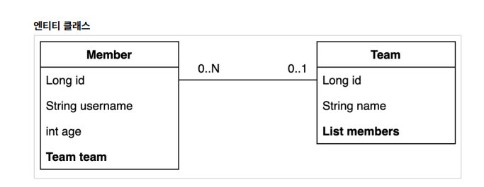
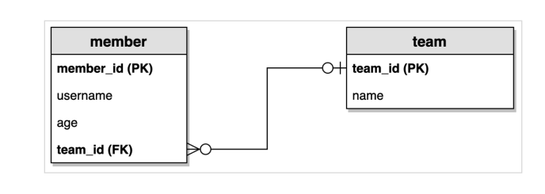

## 실전 스프링 데이터 JPA

<details>
<summary>Section 02 예제 도메인 모델</summary></summary>
<div markdown="1">

### 예제 도메인 모델
- 
- 

</div>
</details>


<details>
<summary>Section 03 공통 인터페이스 기능</summary></summary>
<div markdown="1">

### 순수 jpa 기반 리포지토리를 살펴보자
- 회원 기본 CRUD

```java
package study.datajpa.repository;

import jakarta.persistence.EntityManager;
import jakarta.persistence.PersistenceContext;
import org.springframework.stereotype.Repository;
import study.datajpa.entity.Member;

import javax.swing.text.html.Option;
import java.util.List;
import java.util.Optional;

@Repository
public class MemberJpaRepository {

    @PersistenceContext
    private EntityManager em;

    public Member save(Member member) {
        em.persist(member);
        return member;
    }

    public void delete(Member member) {
        em.remove(member);
    }

    public List<Member> findAll() {
        return em.createQuery("select m from Member m", Member.class)
                .getResultList();
    }

    public Optional<Member> findById(Long id) {
        Member member = em.find(Member.class, id);
        return Optional.ofNullable(member);
    }

    public long count() {
        return em.createQuery("select count(m) from Member m", Long.class).getSingleResult();
    }
    public Member find(Long id) {
        return em.find(Member.class, id);
    }
}

```

- Team 기본 CRUD

```java
package study.datajpa.repository;

import jakarta.persistence.EntityManager;
import jakarta.persistence.PersistenceContext;
import org.springframework.stereotype.Repository;
import study.datajpa.entity.Team;

import java.util.List;
import java.util.Optional;

@Repository
public class TeamRepository {

    @PersistenceContext
    private EntityManager em;

    public Team save(Team team) {
        em.persist(team);
        return team;
    }

    public void delete(Team team) {
        em.remove(team);
    }

    public List<Team> findAll() {
        return em.createQuery("select t from Team t", Team.class)
                .getResultList();
    }

    public Optional<Team> findById(Long id) {
        Team team = em.find(Team.class, id);
        return Optional.ofNullable(team);
    }

    public long count() {
        return em.createQuery("select count(t) from Team t", Long.class)
                .getSingleResult();
    }

}

```
- CRUD가 반복적으로 진행되고 있는 것을 알 수 있다.
- 제네릭을 사용하면 재사용성을 늘릴 수 있을지도!?
- Spring 데이터 jpa에서는 공통 인터페이스를 통해서 boilerplate한 코드를 삭제할 수 있도록 도와준다.

### Spring Data JPA 공통 인터페이스 

- Spring Data JPA를 사용하면 인터페이스를 사용하는 것만으로 CRUD 공통 인터페이스를 사용가능 하다. 어떻게 그것이 가능할까!?
- 실제로 인터페이스를 사용할 때 class를 찍어보자
  - memberRepository.getClass() class com.sun.proxy.$ProxyXXX
- 스프링 jpa가 구현체를 생성하고 프록시로 제공하는 것을 확인할 수 있다

### Spring Data JPA 공통 인터페이스 적용
- 공통 인터페이스를 적용해보자

```java
    @Test
    public void basicCRUD() throws Exception {

        //given
        Member member1 = new Member("member1");
        Member member2 = new Member("member2");
        memberRepository.save(member1);
        memberRepository.save(member2);
        //단건 조회 검증
        Member findMember1 = memberRepository.findById(member1.getId()).get();
        Member findMember2 = memberRepository.findById(member2.getId()).get();
        assertThat(findMember1).isEqualTo(member1);
        assertThat(findMember2).isEqualTo(member2);

        //리스트 조회 검증
        List<Member> all = memberRepository.findAll();
        assertThat(all.size()).isEqualTo(2);

        //count 검증
        long count = memberRepository.count();
        assertThat(count).isEqualTo(2);

        //삭제 검증
        memberRepository.delete(member1);
        memberRepository.delete(member2);
        long deletedCount = memberRepository.count();
        assertThat(deletedCount).isEqualTo(0);

    }

```
- Spring Data JPA로 똑같이 적용을 해보아도 이미 구현되어 있는 기능들이라 별 다른 수정 없이 사용 가능한 것을 확인할 수 있다.

</div>
</details>