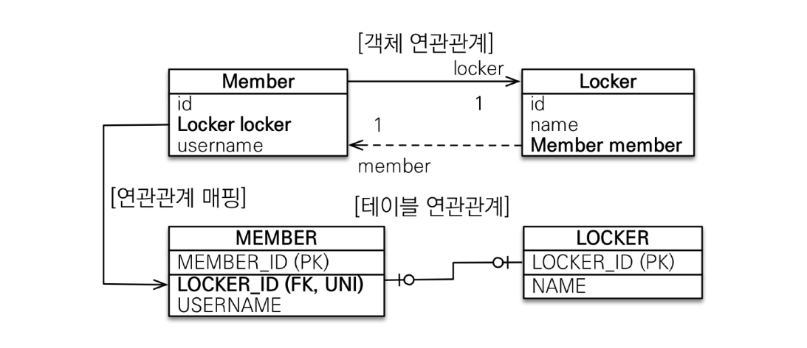

<details>
<summary>01. 영속성 컨텍스트 </summary>
<div markdown="1">

### 영속성 컨텍스트
- 엔티티를 영구 저장하는 환경

### 엔티티의 생명주기
- 비영속
  - (new/transient) 영속성 컨텍스트와 전혀 관계가 없는 새로운 상태
- 영속
  - 영속성 컨텍스트에 관리되는 상태
- 준영속
  - 영속성 컨텍스트에 저장되었다가 분리된 상태
- 삭제
  - 삭제된 상태 
  - em.remove(member) 객체 자체를 삭제


### 영속성 컨텍스트를 사용하여 얻는 이점
- 강의에서도 얘기했지만 항상 어떤 것과 어떤 것을 매핑하는 중간계층의 컨텍스트를 사용할 경우 크게 두 가지의 이점을 얻을 수 있다
1. buffered 작업
2. 캐시 이용
- 영속성 컨텍스트 역시 RDB와 객체 엔티티간의 매핑으로써 다음의 이점을 얻을 수 있다
  - 1차 캐시 
    - em.persist로 객체를 영속화 할 경우 em.find할 때 1차 캐시에서 조회할 수 있다.
    - DB connection과 반복되는 쿼리 작업을 을 줄일 수 있다.
    - 만약 em.find를 한경우 cache miss가 나면 DB에서 꺼내와서 1차 캐시에 객체를 담아 둔다.
  - 동일성 보장
    - Member a = em.find(Member.class, 1L);
    - Member b = em.find(Member.class, 1L);
    - a == b가 성립한다. 
    - 어려운 말로 1차 캐시로 반복 가능한 읽기 등급의 트랜잭션 격리 수준을 데이터베이스가 아닌 애플리케이션 차원에서 제공한다고 표현할 수 있다
  - 쓰기 지연
    - 트랜잭션을 지원하는 쓰기 지연
    - em.persist는 객체를 영속화 할 뿐 sql을 실행시키지 않는다.
    - 커밋하는 순간 데이터가 영구화 된다.
    - flush: 데이터베이스에 sql 저장소에 있는 쿼리들을 실행시켜 영속성 컨텍스트와 DB의 내용을 동기화
      - 다만 flush 후 커밋하지 않으면 트랜잭션 단위 roll back이 가능한 상태이다.
    
  - 변경 감지
    - 이전 실전편에서 데이터를 수정할 경우 memberA.setUsername("h");와 같이 수정하고 따로 persist 할 필요가 없는 것을 보았었다
    - 이와 같은 과정이 가능한 것은 영속성 컨텍스트에 엔티티와 스냅샷을 비교하는 과정이 있기 때문 
    
  - 지연 로딩
- 
</div>
</details>


<details>
<summary>02. 엔티티 매핑 </summary>
<div markdown="1">

### @Entitiy
- @Entity가 붙은 클래스는 jpa가 관리, 엔티티라 한다.
- 테이블과 객체를 매핑할 클래스에 @Entity를 붙여주면 된다.
- 어노테이션을 사용하기 위해서 기본 생성자 필수!(접근 제어는 public 혹은 protected)
- final 클래스, enum, interface, inner 클래스는 사용 불가
- 저장할 필드에 final 사용 X

### 데이터베이스 스키마 자동 생성
- DDL을 애플리케이션 실행 시점에 자동 생성
- propertiy 파일에 DDL 행동의 속성을 설정할 수 있는데 create, create-drop, update, validate, none과 같은 속성들이 있다 
- 운영 장비에는 절대 create, create-drop, update를 사용하지 말자 (전부 지워버리는 수가 있다)
- 개발 초기 단계는 create 또는 update
- 많은 개발자들이 모여서 사용하는 테스트 서버는 update 또는 validate
- 스테이징과 운영 서버는 validate 또는 none을 사용하자

### 필드와 컬럼 매핑
### @Column
  - name: 필드와 매핑할 테이블의 컬럼 이름
  - insertable, updatable: 등록, 변경 가능 여부
  - nullable: 컬럼에 유니크 제약조건을 걸 때 사용
  - columnDefinition: 데이터베이스 컬럼 정보를 직접 줄 수 있다. 
    - ex) varchar(100) default ‘EMPTY'
  - length: 문자 길이 제약 조건
  - precision, scale: bigDecimal 타입에서 사용 floating number의 정밀도와 scale 지정
### @Enumerated
  - 자바 enum 타입을 매핑할 때 사용
  - 두가지 ORDINAL과 STRING 이쓴ㄴ데 항상 STRING을 사용하도록 하자 
### @Temporal
  - 날짜 타입을 매핑할 떄 사용
  - but 충분히 높은 버젼의 hibernate을 사용하고 있다면 LocalDate, LocalDateTime을 @Temporal없이 사용 가능
### @Lob
  - 데이터베이스 BLOB, CLOB 타입과 매핑
  - 지정할 수 있는 속성 없음
  - 매핑하는 필드 타입이 문자면 CLOB 매핑, 나머지는 BLOB 매핑
### @Transient
  - 필드 매핑 X
  - 데이터베이스에 저장 X

### 기본 키 매핑 어노테이션

### @Id
- PK임을 알림
### @GeneratedValue
- 키를 자동 생성 하도록 설정
- Strategies
  - IDENTITY: 데이터베이스에 위임
    - DB에 넣을 때 null로 주고 DB에서 키를 알아서 생성하도록 위임한다
    - 다만 persist 시점에 영속성 컨텍스트에서 관리하기 위해 SQL을 flush시점이 아니더라도 persist 시점에 바로 푸쉬한다.  
    - 버퍼의 장점을 누리지 못하지만 생각보다 cardinal한 성능저하는 일어나지 않음
  - SEQUENCE: 데이터베이스 시퀀스 오브젝트 사용
    - 오라클에서 많이 사용
    - jpa가 시퀀스 값을 db로 부터 가져와서 메모리에 저장한다. 
    - 데이터 베이스에 call next value 쿼리를 보내어 시퀀스 오브젝트의 값을 가져온다
    - 시퀀스 값은 db에서 미리 정의 되어 있는 것이 IDENTITY와의 차이점 (가져온 후에 영속성 컨텍스트에 저장하는 것도 차이점)
    - 시퀀스 제네레이터는 커스텀 가능
      - 특히 주의 깊게 볼 속성은 allocationSize
      - allocationSize = 50(default)으로 하면 DB에서 시퀀스를 가져올 때 50개를 가져와서 로컬 메모리에 저장할 수 있다
      - 1번 할때마다 네트워크를 타면 부담스러우니 allocationSize이용하면 성능 최적화를 이룰 수 있다
      - 이론적으로는 사이즈가 크면 클수록 좋지만 웹서버를 내리는 시점에 id 값의 구멍이 생길 수 있다 (굳이 구멍 생겨도 문제는 없지만)
  - TABLE: 키 생성용 테이블 사용, 모든 DB에서 사용
    - 테이블을 직접사용하다 보니 락도 걸릴 수 있고 성능이 떨어질 수 있음
    - 잘 사용되는 매핑 전략은 아님
  - AUTO: 방언에 따라 자동 지정, default
- 결론은 뭘쓰냐!? 
  - 기본 키는 null이면 안되고 유일해야 하고 변하면 안된다.(서비스의 요소를 pk로 끌어오지 말자)
  - 권장: Long형 + 대체키 + 키 생성전략 사용(AUTO_INCREMENT나 SEQUENCE 전략 사용)
- 

</div>
</details>


<details>
<summary>03. 연관관계 매핑 </summary>
<div markdown="1">

### 데이터 중심 연관관계 모델링
- 회원과 팀이 있고 회원과 팀이 다대일 관계를 맺는 경우를 생각해보자
- 회원 엔티티에 teamId 속성을 두어 객체 간의 연관관계를 맺었다면 이는 객체를 테이블에 맞추어 모델링 한 것
  - 참조 대신에 외래 키를 그대로 사용한 것이다. (실제로 테이블이 이러한 구성)
  - 이는 객체 지향적인 방법은 아니다. 
- 객체를 테이블에 맞추어 데이터 중심으로 모델링 하면, 협력 관계를 만들 수 없다. 
  - 테이블은 외래 키로 조인을 사용해서 연관된 테이블을 찾겠지만 객체는 참조를 이용해서 연관된 객체를 찾아야 하기 때문
  - 테이블과 객체 사이에는 이런 큰 간격이 있다

### 객체 지향 모델링
- 회원과 팀이 있고 회원과 팀이 다대일 관계를 맺는 경우 Member 클래스의 필드에 Team 필드가 존재한다면 Member객체는 참조값을 이용해 연관관계를 맺게 된다.
- 객체 지향적으로 모델링 하면 객체의 참조와 테이블의 외래키를 매핑하게 되는 것이다.
- 결국 jpa가 연관관계 매핑에서 객체와 테이블의 간극을 매핑하는 것

### 단방향 연관관계와 양방향 연관관계
### 단방향

- 멤버는 팀의 참조값을 가지고 있어 연관관계를 맺지만 팀은 Member로 향하는 연관관계를 가지고 있지 않다. 

### 양방향 

- 멤버에서 팀으로의 연관관계뿐만 아니라 역방향 연관관계 역시 가지고 있다 

### 객체와 테이블이 관계를 맺는 차이
- 객체와 테이블간의 연관관계를 맺는 차이를 이해해야 jpa에서 연관관계를 매핑하는 블랙박스를 이해할 수 있다.
- 객체의 양방향 관계는 사실 양방향 관계가 아니라 서로 다른 단방향 관계 2개다 (단방향에서 역방향을 추가해준 것일 뿐)
- 반면 테이블은 외래 키 하나로 두 테이블의 연관관계를 관리하는데 이는 양방향 연관관계이다.(양쪽으로 모두 join 가능)
- 따라서 테이블은 두 테이블 중 하나로 외래키를 관리해야 한다. 
- 외래키를 가지고 있는 쪽은 연관관계의 주인이 되는데 객체의 연관관계를 매핑하려면 이러한 특성에 주목해야 함 

### 연관관계의 주인
- 객체의 두 관계 중 하나를 연관관계의 주인으로 지정해야 한다.
- 연관관계의 주인만이 외래 키를 관리
- 주인이 아닌쪽은 읽기만 가능
- 주인은 mappedBy 속성 사용X
- 주인이 아니면 mappedBy 속성으로 주인 지정
- 객체에서 연관관계의 주인은 외래키가 있는 곳으로 설정해야 함 (de facto standard)

### 양방향 매핑 시 가장 많이 하는 실수

- 연관관계의 주인이 아닌 1쪽 엔티티에만 추가를 해준 후에 member 테이블의 TEAM_ID를 살펴보면 null로 지정되어 있다.
- 연관 관계의 주인은 연관 관계를 갖는 두 객체 사이에서 조회,저장,수정,삭제를 모두 할 수 있지만 연관관계의 주인이 아니면 조회만 가능하다. 
  ### 왜??
    - 멤버에서 팀을 바꾸든지 팀에서 멤버를 바꾸든지 객체 입장에서는 두 방법 다 맞는 방법이긴 하다
    - 하지만 객체에서 이렇게 양방향 연관 관계의 관리 포인트가 두 곳일 때는 테이블과 매핑을 담당하는 JPA에게 혼란을 주게 됨
    - 그렇기 때문에 두 객체 사이의 연관 관계의 주인을 정해서 관리 포인트를 한 곳으로 좁혀 주는 것이 mappedBy인 것! 
  ### 그렇다면 연관관계의 주인만 제어하면 되나?
  - 데이터베이스만 생각했을 때는 맞겠지만 객체를 생각해보면 둘 다 변경해주는 것이 좋다. 두 참조를 사용하는 순수한 두 객체의 데이터 동기화를 위한 것임

### 다음을 권장한다
- 단방향 매핑만으로도 사실 연관관계 매핑은 완료 된 것
- 양방향 매핑은 반대 방향으로 조회(객체 그래프 탐색) 기능이 추가 된 것 뿐
- 단방향 매핑을 잘 수행하는 것이 중요하고 양방향은 필요할 때 추가해도 된다.
- 사실 단방향이 깔끔하다.
  - 문맥상으로도 주문서를 보고 주문에 관한 정보를 찾는 것이 일반적
  - 즉 중간 테이블을 통해 쿼리를 시작하는 것이 일반적이지 멤버에서 getOrders하는 것은 설계 오류라고 볼 수 있을 정도
  - 관심사를 끊어내는 것이 더 깔끔하고 simple하다!


</div>
</details>


<details>
<summary>04. 다양한 연관관계 매핑 </summary>
<div markdown="1">

### 다대일 단방향
- 가장 많이 사용하는 연관관계


### 다대일 양방향
- 외래 키가 있는 쪽이 연관관계의 주인
- 양쪽을 서로 참조하도록 개발


### 일대다 단방향
- 일이 연관관계의 주인
- 테이블은 항상 다 쪽에 외래 키가 있음
- 객체와 테이블의 차이 때문에 반대편 테이블의 외래 키를 관리하는 특이한 구조
- @JoinColumn을 꼭 사용해야 함. 그렇지 않으면 조인 테이블 방식을 사용함(중간에 테이블을 하나 추가)

- 일대다 단방향 매핑의 단점
  - 엔티티가 관리하는 외래 키가 매핑된 테이블이 아닌 다른 테이블에 있음
  - 연관관계 관리를 위해 추가로 UPDATE SQL이 실행된다.
- 일대다 단방향 매핑보다는 다대일 양방향 매핑을 사용하자! 

### 일대다 양방향

- 이런 매핑은 공식적으로 존재하지 않음 -> 야매로 해결한 것
- @JoinColumn(insertable = false, updatable = false)
- 읽기 전용 필드를 사용해서 양방향 처럼 사용하는 방법
- 역시나.. 다대일 양방향을 사용하자

### 일대일: 주 테이블에 외래 키 단방향
- 일대일 관계는 그 반대도 일대일
- 주 테이블이나 대상 테이블 중에 외래 키 선택 가능(주 테이블은 주로 접근하는 테이블쯤으로 이해하자)
- 외래 키에 데이터베이스 유니크 제약조건 추가()


### 일대일: 주 테이블에 외래 키 양방향
- 다대일 양방향 매핑처럼 외래 키가 있는 곳이 연관관계의 주인
- 반대편은 mappedBy 적용


### 일대일: 대상 테이블에 외래 키 단방향
- 단방향 관계는 JPA 지원 X
- 양방향 관계는 지원 

### 일대일: 대상 테이블에 외래키 양방향


### 일대일 정리
- 주 테이블에 외래키
  - 주 객체가 대상 객체의 참조를 가지는 것 처럼 주 테이블에 외래키를 두고 대상 테이블을 찾음
  - 객체지향 개발자 선호
  - JPA 매핑 편리
  - 장점: 주 테이블만 조회해도 대상 테이블에 데이터가 있는지 확인 가능
  - 단점: 값이 없으면 외래 키에 null을 허용하게 된다.
- 대상 테이블에 외래 키 
  - 대상 테이블에 외래 키가 존재
  - 전통적인 데이터베이스 개발자 선호
  - 장점: 주 테이블과 대상 테이블을 일대일에서 일대다 관계로 변경할 때 테이블 구조 유지
  - 단점: 프록시 기능의 한계로 지연 로딩으로 설정해도 항상 즉시 로딩됨
    - 코드 상에서 멤버 엔티티에서 락커를 액세스 할 경우 멤버 객체를 로딩할 때 멤버 테이블의 FK에 락커가 있는지 없는지만 판단하면 된다.
    - 있으면 프록시 객체를 넣어주고 없으면 null을 넣음
    - 나중에 진짜 락커 필드에 액세스 할 때 쿼리가 나가며 지연로딩이된다.
    - 그런데 대상 테이블에 외래 키를 저장한다면 JPA가 멤버의 락커를 조회하는 상황에서 DB의 멤버 테이블만 조회해서는 모른다
    - 어차피 락커 테이블을 찾아가서 멤버가 있는지 확인해 봐야 알 수 있는 것
    - 어차피 쿼리가 나간다는 이야기는 프록시를 만들 필요가 없다는 이야기.

### 다대다
- 관계형 데이터베이스는 정규화된 테이블 2개로 다대다 관계를 표현할 수 없음
- 연결 테이블을 추가해서 일대다, 다대일 관계로 풀어내야 함
- 객체는 컬렉션을 이용한 다대다 관계를 맺을 수 있지만 테이블은 불가능!

### jpa 제공 @ManyToMany를 이용한 다대다는 사용을 권장하지 않는다(쓰지마라!)
- @ManyToMany 어노테이션과 @JoinTable로 연결 테이블을 지정하여 사용할 수 있지만 연결 테이블에 다른 데이터가 비집고 들어갈 수 없다
- 확장에 닫힌다

### 다대다 한계 극복
- 연결 테이블 용 엔티티를 추가 (연결 테이블을 엔티티로 승격)
</div>
</details>


<details>
<summary>05. 고급 매핑 </summary>
<div markdown="1">

### 상속관계 매핑
- 관계형 데이터베이스는 상속 관계 없음
- 슈퍼 타입과 서브 타입 관계라는 모델링 기법이 객체 상속과 유사하긴 함
- 상속관계 매핑: 객체의 상속 구조와 DB의 슈퍼타입 서브타입 관계를 매핑
- 슈퍼타입 서브타입 논리 모델을 실제 물리 모델로 구현하는 방법
  - 조인 전략
  - 단일 테이블 전략
  - 구현 클래스마다 테이블 전략

### 조인 전략

- 아이템을 상속하는 클래스의 테이블과 조인하는 전략
- 장점
  - 테이블이 정규화된다.
  - 외래 키 참조 무결성 제약조건 활용 가능
  - 저장공간 효율화
- 단점 
  - 조회시 조인을 많이 사용, 성능 저하
  - 조회 쿼리가 복잡
  - 데이터 저장시 INSERT SQL 두번 호출

### 단일 테이블 전략

- 상속하는 클래스의 모든 컬럼을 하나의 테이블에 다 때려 넣고 타입에 맞는 컬럼만 뽑아 쓰는 전략
- 장점
  - 조인이 필요 없음으로 조회 성능 빠름
  - 조회 쿼리 단순
- 단점 
  - 자식 엔티티가 매핑한 컬럼은 모두 null이 허용된다
  - 단일 테이블에 모든 것을 저장함으로 테이블이 커질 수 있고 상황에 따라서 조회 성능이 오히려 더 느려질 수도 있다

### 구현 클래스마다 테이블 전략

- 부모 클래스에서 필요한 컬럼을 하위 클래스에 모두 재정의 하는 것 
- 이건 걍 쓰지마라
- 장점 
  - 서브 타입을 명확하게 구분해서 처리할 때 효과적
  - not null 제약조건 사용 가능
- 단점
  - 여러 자식 테이블을 함께 조회할 때 성능이 느림(UNION SQL 필요)
  - 자식 테이블을 통합해서 쿼리하기 어려움

### @MappedSuperclass
- 공통 매핑 정보가 필요할 때 사용할 수 있다
- 테이블이 생성되는 것이 아니라 속성만을 상속하도록 하는 기능
- 부모 클래스를 상속 받는 자식 클래스에 매핑 정보만 제공
- 추상 클래스 권장
- 테이블과 관계 없고, 단순히 엔티티가 공통으로 사용하는 매핑 정보를 모으는 역할


</div>
</details>


<details>
<summary>06. 프록시와 연관관계 관리 </summary>
<div markdown="1">

### 프록시
- Member를 조회할 때 Team도 함께 조회해야 할까?
- Team과 관련된 필드를 조회하지 않는다면 불 필요 없음
- 그럼에도 member를 find 할 때 Team을 가져온다면 불필요하다고 볼 수 있음
- 이를 위해 나온 개념이 프록시
- 데이터베이스 조회를 미루는 가짜 엔티티 객체를 조회할 수 있는거시다

### 프록시 특징
- 실제 클래스를 상속 받아서 만들어짐
- 실제 클래스와 겉 모양이 같다
- 사용하는 입장에서는 진짜 객체인지 프록시 객체인지 구분하지 않고 사용 가능
- 프록시 객체는 실제 객체의 참조를 보관
- 프록시 객체를 호출하면 프록시 객체는 실제 객체의 메소드 호출
- 
- 
- 프록시 객체는 처음 사용할 때 한 번만 초기화
- 프록시 객체를 초기화 할 때 프록시 객체가 실제 엔티티로 바뀌는 것이 아님 target 필드가 실제 엔티티의 참조값으로 초기화 되는 것
- 프록시 객체는 원본 엔티티를 상속받음 따라서 타입 체크 시 주의해야 함
  - 프록시 클래스는 hibernateProxy블라블라. 엔티티 클래스와 다르기에 타입 체크 시 명심해야 한다
  - '=='을 사용하지 말고 instanceof를 사용해랑
- 영속성 컨텍스트에 찾는 엔티티가 이미 있으면 em.getReference()를 호출해도 실제 엔티티 반환
  - 반대로 프록시가 이미 영속성 컨텍스트내에 존재할 경우 em.find를 해도 프록시가 반환된다.
  - jpa는 같은 트랜잭션 내에서 a == a를 보장하기 위해 꽤나 노력하는 듯
  - 이를 위한 빌드업인가 싶다. 
- 영속성 컨텍스트의 도움을 받을 수 없는 준영속 상태일 때 프록시를 초기화하고자 하면 문제 발생! 
  - 프록시도 영속성 컨텍스트에서 관리되고 있어야 lazyInit의 이점을 누릴 수 있다. 
  - LazyInitializationException이 떠지면 오늘의 강의를 떠올리자! 

### 지연 로딩
- 연관관계에서 지연 로딩 LAZY를 사용하면 Member를 조회할 때 Team객체를 프록시 객체로 설정할 수 있다

### 즉시 로딩
- EAGER를 사용하면 Member를 조회할 때 Team 객체를 즉시 조회하여 load한다.

### 프록시와 즉시 로딩 주의
- 실무에선 지연 로딩으로 쳐발쳐발하자
- 즉시 로딩을 적용하면 예상하지 못한 SQL이 발생할 수 있다
- 즉시 로딩은 JPQL에서 N+1 문제를 일으킨다!
  - 하나의 쿼리가 N개의 쿼리를 추가로 만들어낼 수 있다는 것
- ManyToOne, OneToOne은 기본이 즉시 로딩임으로 명시적으로 LAZY로 설정하자
- ToMany는 기본이 지연 로딩이다
- 이론적으로는 자주 사용되면 즉시 로딩을 사용하고 가끔 사용하면 지연 로딩이 좋지만 무조건 지연 로딩을 사용하고 자주 사용되는 부분에 대해서는 페치 조인과 같은 해결책을 사용하도록 하자

### 영속성 전이: CASCADE
- 특정 엔티티를 영속 상태로 만들 때 연관된 엔티티도 함께 영속 상태로 만들고 싶은 경우 사용
- 영속성 전이는 연관관계를 매핑하는 것과 아무런 관련이 없다
- 엔티티를 영속화할 때 연관된 엔티티도 함께 영속화 하는 편리함을 제공할 뿐

### CASCADE의 종류
- ALL: 모두 적용
- PERSIST: 영속 적용
- REMOVE: 삭제 적용

### 고아 객체
- 부모 엔티티와 연관관계가 끊어진 자식 엔티티를 얘기하는 것
- 고아 객체 제거는 orphanRemoval = true로 가능하다
- 
- 위와 같이 부모가 자식을 버리고 orphanremoval이 걸려 있다면 DELETE 쿼리가 자동으로 나간다.

### 주의 사항
- 고아 객체든 CASCADE든 특정 엔티티가 개인 소유할 경우, 그리고 parent와 child의 라이프 사이클이 유사한 경우 사용하는 것이 좋다.
- 상태 전이의 propagation을 충분히 고려해야 한다는 뜻!
- 다른 곳에서 child를 또 소유하고 있다면 갑자기 사라지는 불상사 발생 가능..

### 영속성 전이 + 고아 객체, 생명주기
- CascadeType.ALL + orphanRemoval=true
- 두 옵션을 모두 활성화 하면 부모 엔티티를 통해서 자식의 생명 주기를 관리할 수 있음
- CascadeType.REMOVE 와 orphanRemoval=true는 다르다
  - cascade는 부모 엔티티 삭제 -> 자식 엔티티 삭제
  - orphanRemoval=true는 고아객체 자동 삭제


</div>
</details>

<details>
<summary>07. 값 타입 </summary>
<div markdown="1">

### JPA의 데이터 타입 분류

- 엔티티 타입
  - @Entity로 정의하는 객체
  - 데이터가 변해도 '식별자'로 지속해서 추적 가능
  - ex) 회원 엔티티의 키나 나이 값을 변경해도 식별자로 인식 가능! 
- 값 타입
  - int, Integer, String처럼 단순히 값으로 사용하는 자바 기본 타입이나 객체
  - 식별자가 없고 값만 있음으로 추적 불가!
  - int a = 10;, int b =a 인 경우 a의 값을 변경해도 b의 값은 바뀌지 않는다. 값! 이기 때문

### 값 타입 분류
- 값 타입은 다시 다음으로 구분된다.
  - 기본값 타입
    - 자바 기본 타입(primitive)
      - int, double 등등
    - Wrapper class
    - String 
  - 임베디드 타입 (복합 값 타입)
  - 컬렉션 값 타입

### 기본 값 타입
- 생명주기를 엔티티에 의존
  - 회원을 삭제하면 이름, 나이 필드도 함께 삭제된다.
- 값 타입은 공유하면 안된다. (공유 되지도 않고)
  - 회원 이름을 변경했는데 다른 회원의 이름도 함께 변경되면 안됨
  - primitive 타입은 항상 값을 복사하기 때문에 다른 객체로의 side effect가 없긴 하다.
  - Wrapper 클래스는 참조를 사용하기에 주의를 해야 할 것 같지만 공유가 가능함에도 변경을 할 수 있는 방법이 없기에 side effect의 여지가 없음

### 임베디드 타입
- 새로운 값 타입을 직접 정의한 것
- 주로 기본 값 타입을 모아서 만들어서 복합 값 타입이라고도 함
- spoot-taxi 프로젝트 Location으로 미리 경험해 본 바 있다 (위도,경도)

### 임베디드 타입 사용 법
- @Embeddable: 값 타입을 정의하는 곳에 표시
- @Embedded: 값 타입을 사용하는 곳에 표시
- 기본 생성자 필수
- 한 곳에만 어노테이션 붙여도 사용 가능할 텐데 양쪽에 쓰는 것을 권장!

### 임베디드 타입의 장점
- 재사용 
- 높은 응집도 
- 객체 지향적 설계 (추가적인 메서드 필요할 때 관심사 분리 잘 할 수 있다.)
- 값 타입이기에 엔티티의 생명주기에 의존할 수 있다.

### 임베디드 타입과 테이블 매핑
- 임베디드 타입은 엔티티의 값일 뿐!
- 테이블에는 컬럼이 모두 매핑되지만 엔티티레벨에서 객체를 사용할 수 있도록 하는 것
- 객체와 테이블을 세밀하게 매핑하는 것을 가능하게 한다.

### 임베디드 타입과 연관관계
- 
- Address (임베디드) 타입은 ZipCode (임베디드)를 가질 수 있다.
- 그런데 임베디드 타입인 PhoneNumber에서 엔티티를 참조하고 있는 경우는 어떻게 될까?
  - 별다른 조치 없이 임베디드 안에 엔티티를 쓸 수 있다. (외래키 그냥 가지고 있게 됨)

### @AttributeOverride
- 한 엔티티에서 같은 값 타입을 사용하면?
- ex) Address homeAddress, Address workAddress
  - 이런 경우 컬럼 명이 중복된다.
  - 오류 터짐
- AttributeOverrides, @AttributeOverride를 사용해서 컬럼 명 속성을 재정의 하면 같은 값 타입을 엔티티내에서 여러개 사용할 수 잇다

### 임베디드 타입과 null
- 임베디드 타입의 값 자체가 null이면 매핑한 컬럼 값은 모두 null이 된다. 

### 값 타입 공유 참조
- 임베디드 타입 같은 값 타입을 여러 엔티티에서 공유하면 위험함
- 회원1의 주소를 수정했는데 회원2의 주소가 수정되는 사이드 이펙트가 발생 가능하다!
- 따라서 값 타입의 실제 인스턴스를 공유하는 것은 위험 (주소값이 공유되면 안된다!)
- 대신 값(인스턴스)를 복사해서 사용해야 한다

### 객체 타입의 한계
- 위와 같이 인스턴스의 주소값이 공유되는 것을 막을 수 있는 방법이 없을까?
- 객체 타입은 참조 값을 직접 대입하는 것을 막을 방법이 없다.. 객체의 공유 참조는 피할 수 없는 것

### 불변 객체
- 참조를 막을 수는 없지만 객체 타입을 수정할 수 없도록 만들면 부작용을 차단 가능하다!
- 따라서 값 타입은 설계 시에 불변 객체로 설계해야 함 (생성 시점 이후 절대 값을 변경할 수 없는 객체!)
- 불변 객체로 설계하는 방법은 여러가지가 있지만 간단한 방법은 생성자로만 값을 설정하고 setter를 만들지 않은 형태
- 참고로 Integer, String은 자바가 제공하는 대표적인 불변 객체이다.

### 값 타입의 비교
- 값 타입: 인스턴스가 달라도 그 안에 값이 같으면 같은 것으로 봐야 한다.
- 하지만 클래스 간의 == 비교는 주소 값을 비교.. false가 나올 것이 자명하다
- 비교에는 동일성 (identity)비교와 동등성(equivalence) 비교가 있는데 값 타입에서는 동등성 비교를 해야 하는 것이다!
- 값 타입은 equals 메서드를 이용한 동등성 비교를 해야 한다!
- 값 타입의 equals 메서드를 적절히 재정의 하여 사용하장

### 값 타입 컬렉션
- 값 타입을 하나 이상 저장할 때 값 타입 컬렉션을 사용한다
- @ElemnetCollection(값 타입 컬렉션임을 알린다), @CollectionTable(생성될 테이블에 대한 정보를 알린다) 사용
- 데이터베이스는 컬렉션을 같은 테이블에 저장할 수 없기에 컬렉션을 저장하기 위한 별도의 테이블이 필요하다

### 값 타입 컬렉션 저장
- 멤버가 favoriteFood라는 String 값 타입 컬렉션을 가지고 있는 경우를 생각해보자
- 컬렉션에 값 타입을 추가할 때는 다음의 코드로 충분하다
```java
  member.getFavoriteFoods().add("치킨");
```
- 유의 깊게 봐야 할 점이 있는데 값 타입 컬렉션 매핑을 담당하는 테이블에 별도의 작업 없이 CascadeType.ALL이 걸려있는 것 처럼 동작한 다는 것이다.

### 값 타입 조회
- 값 타입 컬렉션을 포함하고 있는 member를 조회할 경우 값 타입에 대한 조회는 지연 로딩 전략이 디폴트이다.
- 멤버를 조회해도 값 타입 관련한 추가 쿼리가 없는 것을 예제로 확인했다
- 값 타입 컬렉션은 영속성 전이 + 고아 객체 기능을 필수로 가진다고 볼 수 있다

### 값 타입 컬렉션의 제약사항
- 값 타입은 엔티티와 다르게 식별자 개념이 없다.
- 값은 변경하면 추적이 어렵다.
- 값 타입 컬렉션에 변경 사항이 발생하면, 주인 엔티티와 연관된 모든 데이터를 삭제하고, 값 타입 컬렉션에 있는 현재 값을 모두 다시 저장한다. 
- 값 타입 컬렉션을 매핑하는 테이블은 모든 컬럼을 묶어서 기본 키를 구성해야 함
- 이쯤 되면 이상함을 눈치 채고 쓰지 말아야 한다. 전부 지우고 다시 쓰다니...

### 값 타입 컬렉션 대안
- 실무에서는 상황에 따라 값 타입 컬렉션 대신에 일대다 관계를 고려하라
- 일대다 관계를 위한 엔티티를 만들고 여기에서 값 타입을 사용
- 영속성 전이, 고아 객체 제거를 통해 값 타입 컬렉션 처럼 사용 가능하다
  - 영속성 전이와 고아 객체 제거를 함께 사용할 경우 부모 엔티티가 자식 엔티티의 생명주기를 관리할 수 있다고 저번 강의에서 배운바 있다.


</div>
</details>


<details>
<summary>08. 객체지향 쿼리 언어 </summary>
<div markdown="1">

### JPA 제공, 다양한 쿼리 방법
- JPQL
- JPA Criteria
- QueryDSL
- 네이티브 SQL
- JDBC API 직접 사용, MyBatis, SpringJdbcTemplate 사용

### JPQL
- JPA를 사용하면 엔티티 객체를 중심으로 개발하게 된다.
- 문제는 검색 쿼리
- 검색을 할 때도 테이블이 아닌 객체를 대상으로 검색 가능하게 하는 것이 JPQL
- 원래 DB는 SQL을 소비한다. 
- 그렇다면 JPQL은 모든 DB 데이터를 객체로 변환해서 검색을 가능하게 하는가?? NO! 종국에는 JPQL이 SQL로 번역되어 실행된다
- JPQL은 SQL 문법과 유사

- jpql은 동적 쿼리를 만들어 내기 어렵다는 단점이 있다(분기로 나누어 쿼리 스트링을 잘라내고 덧붙이고 할 수는 있지만 번거롭다)
- 동적인 쿼리를 쉽게 생성하기 위해 아래의 criteria와 queryDSL 방법이 있다

### Criteria

- 문자가 아닌 자바코드로 JPQL을 작성할 수 있다
- JPA 공식 기능이지만 너무 복잡하고 실용성이 없어 범용되지 않는 분위기 인듯
- 이대신에 QueryDSL을 사용하는 것이 권장된다.

### QueryDSL
- 문자가 아닌 자바 코드로 JPQL을 작성할 수 있다는 점에서 Criteria와 동일
- JPQL 빌더 역할을 하는 것
- 자바 코드로 이루어짐으로 컴파일 시점에 문법 오류를 찾을 수 있고 동적 쿼리를 작성하기 편하다!
- 사용 권장!

### Native SQL
- JPA가 제공하는 SQL을 직접 사용하는 기능
- JPQL로 해결할 수 없는 특정 데이터베이스에 의존적인 기능이 필요한 경우 사용된다. (ex 오라클 CONNECT BY)


### JPQL 문법과 기능
- JPQL은 객체지향 쿼리 언어다.
- 따라서 테이블을 대상으로 쿼리 하는 것이 아니라 엔티티 객체를 대상으로 쿼리한다.
- JPQL은 SQL을 추상화해서 특정데이터베이스 SQL에 의존하지 않는다.
- JPQL은 결국 SQL로 변환된다.
- 
- 집합과 정렬 같은 SQL ANSI 표준 function을 지원한다.

### JPQL 문법

- 엔티티와 속성은 대소문자 구분 O
- JPQL 키워드는 대소문자 구분 X
- 엔티티 이름 사용! (테이블 이름 아님)

### TypeQuery와 Query
- TypeQuery: 반환 타입이 명확할 때 사용
- 
- Query: 반환 타입이 명확하지 않을 때 사용
- 
- 참고로 query를 저렇게 초기화하고 쓰기보다는 em.create**하고 메서드의 체인으로 이어나가는 것이 일반적

### 결과 조회 API
- query.getResultList(): 결과가 하나 이상일 때 리스트 반환
  - 결과가 없으면 빈 리스트를 반환함으로 null에 대한 고민은 할 필요 X
- query.getSingleResult(): 결과가 정확히 하나일 때 단일 객체 반환
  - 결과가 없으면: NoResultException
  - 결과가 둘 이상이면: NonUniqueResultException
  - 이걸 try catch로 감싸기는 조금...
  - 스프링 데이터 jpa에서는 try catch로 감싼 버전의 메서드가 있는데 그걸 쓰는듯? (없으면 null을 주도록 설정되어 있다고 함)

### 파라미터(검색 조건) 바인딩
- 이름 기준 

- 위치 기준

- 위치 기준은 쓰지 마라 


</div>
</details>
