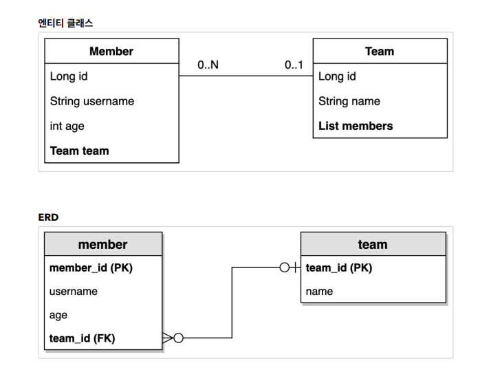

<details>
<summary>Section 01 Proj Config </summary></summary>
<div markdown="1">

### build.gradle
```groovy
plugins {
	id 'java'
	id 'org.springframework.boot' version '3.0.0'
	id 'io.spring.dependency-management' version '1.1.0'
}

group = 'study'
version = '0.0.1-SNAPSHOT'
sourceCompatibility = '17'

configurations {
	compileOnly {
		extendsFrom annotationProcessor
	}
}

repositories {
	mavenCentral()
}

dependencies {
	implementation 'org.springframework.boot:spring-boot-starter-data-jpa'
	implementation 'org.springframework.boot:spring-boot-starter-web'
	compileOnly 'org.projectlombok:lombok'
	runtimeOnly 'com.h2database:h2'
	annotationProcessor 'org.projectlombok:lombok'
	testImplementation 'org.springframework.boot:spring-boot-starter-test'

	// Querydsl 추가
	implementation 'com.querydsl:querydsl-jpa:5.0.0:jakarta'
	annotationProcessor "com.querydsl:querydsl-apt:${dependencyManagement.importedProperties['querydsl.version']}:jakarta"
	annotationProcessor "jakarta.annotation:jakarta.annotation-api"
	annotationProcessor "jakarta.persistence:jakarta.persistence-api"

}

tasks.named('test') {
	useJUnitPlatform()
}
```
</div>
</details>


<details>
<summary>Section 02 domain model</summary></summary>
<div markdown="1">




</div>
</details>


<details>
<summary>Section 03 Querydsl 기본 문법</summary></summary>
<div markdown="1">

### JPQL 사용 예시
```java
    @Test
    public void startJPQL() throws Exception {
        Member findMember = em.createQuery("select m from Member m where m.username = :username", Member.class)
                .setParameter("username", "member1")
                .getSingleResult();
        assertThat(findMember.getUsername()).isEqualTo("member1");
     }
```

### Querydsl 사용 예시

```java
     @Test
     public void startQuerydsl() throws Exception {

         JPAQueryFactory queryFactory = new JPAQueryFactory(em);
         QMember m = new QMember("m");

         Member findMember = queryFactory
                 .select(m)
                 .from(m)
                 .where(m.username.eq("member1"))
                 .fetchOne();

         assertThat(findMember.getUsername()).isEqualTo("member1");

      }
```
- JPQL 실행 시점 오류, Querydsl 컴파일 오류
- JPQL 파라미터 바인딩 직접, Querydsl 파라미터 바인딩 자동처리
- JPAQueryFactory를 필드로 제공하면 동시성 문제는 어떻게 될까? 
  - 동시성 문제는 JPAQueryFactory를 생성할 때 제공하는 EntityManager에 달려있다.
  - 스프링 프레임워크는 여러 쓰레드에서 동시에 같은 EntityManager에 접근해도, 트랜잭션 마다 별도의 영속성 컨텍스트를 제공하기 때문에, 동시성 문제는 걱정하지 않아도 된다.

</div>
</details>