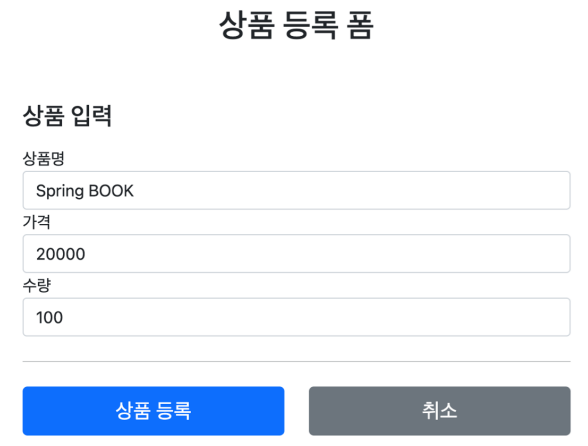

# SpringMVC1 
<details>
<summary>Section 07 스프링 MVC 웹 실습</summary>
<div markdown="1">

## 요구사항 분석
- 상품을 관리할 수 있는 간단한 서비스를 만들어보자
- 상품 도메인 모델
  - 상품 ID
  - 상품명
  - 가격 
  - 수량
- 상품 관리 기능
  - 상품 목록
  - 상품 상세
  - 상품 등록
  - 상품 수정

- 
- 
- 
- 
- 다음은 서비스 제공 흐름
- 

## 상품 도메인 개발

### Item 도메인
```java
package hello.itemservice.domain.item;

import lombok.Data;
import lombok.Getter;
import lombok.Setter;

@Data
public class Item {

    private Long id;
    private String itemName;
    private Integer price;
    private Integer quantity;

    public Item() {

    }

    public Item(String itemName, Integer price, Integer quantity) {
        this.itemName = itemName;
        this.price = price;
        this.quantity = quantity;
    }
}

```

### ItemRepository - 상품 저장소

```java
package hello.itemservice.domain.item;

import org.springframework.stereotype.Repository;

import java.util.ArrayList;
import java.util.HashMap;
import java.util.List;
import java.util.Map;

@Repository
public class ItemRepository {

    private static final Map<Long, Item> store = new HashMap<>();
    private static long sequence = 0L;

    public Item save(Item item) {
        item.setId(++sequence);
        store.put(item.getId(), item);
        return item;
    }

    public Item findById(Long id) {
        return store.get(id);
    }
    public List<Item> findAll() {
        return new ArrayList<>(store.values());
    }

    public void update(Long itemId, Item updateParam) {
        Item findItem = findById(itemId);
        findItem.setItemName(updateParam.getItemName());
        findItem.setPrice(updateParam.getPrice());
        findItem.setQuantity(updateParam.getQuantity());
    }

    public void clearStore() {
        store.clear();
    }


}

```

### 상품 목록 - 타임리프
- 전달받은 html의 뷰 템플릿을 개발하고 컨트롤러와 매핑해보자

### 컨트롤러 개발
```java
package hello.itemservice.web.item.basic;
import hello.itemservice.domain.item.Item;
import hello.itemservice.domain.item.ItemRepository;
import lombok.RequiredArgsConstructor;
import org.springframework.stereotype.Controller;
import org.springframework.ui.Model;
import org.springframework.web.bind.annotation.*;
import javax.annotation.PostConstruct;
import java.util.List;
@Controller
@RequestMapping("/basic/items")
@RequiredArgsConstructor
public class BasicItemController {
    private final ItemRepository itemRepository;
    @GetMapping
    public String items(Model model) {
        List<Item> items = itemRepository.findAll();
        model.addAttribute("items", items);
        return "basic/items";
    }
    /**
     * 테스트용 데이터 추가
     */
    @PostConstruct
    public void init() {
        itemRepository.save(new Item("testA", 10000, 10));
        itemRepository.save(new Item("testB", 20000, 20));
    }
}
```
- 컨트롤러 로직은 itemRepository에 모든 상품을 조회한 다음에 모델에 다믄다. 그리고 뷰 템플릿을 호출한다.

### 뷰템플릿 items.html

```html
<!DOCTYPE HTML>
<html xmlns:th="http://www.thymeleaf.org">
<head>
    <meta charset="utf-8">
    <link href="../css/bootstrap.min.css"
          th:href="@{/css/bootstrap.min.css}" rel="stylesheet">
</head>
<body>
<div class="container" style="max-width: 600px">
    <div class="py-5 text-center">
        <h2>상품 목록</h2>
    </div>
    <div class="row">
        <div class="col">
            <button class="btn btn-primary float-end"
                    onclick="location.href='addForm.html'"
                    th:onclick="|location.href='@{/basic/items/add}'|"
                    type="button">상품 등록</button>
        </div>
    </div>
    <hr class="my-4">
    <div>
        <table class="table">
            <thead>
            <tr>
                <th>ID</th>
                <th>상품명</th>
                <th>가격</th>
                <th>수량</th>
            </tr>
            </thead>
            <tbody>
            <tr th:each="item : ${items}">
                <td><a href="item.html" th:href="@{/basic/items/{itemId}
(itemId=${item.id})}" th:text="${item.id}">회원id</a></td>
                <td><a href="item.html" th:href="@{|/basic/items/${item.id}|}"
                       th:text="${item.itemName}">상품명</a></td>
                <td th:text="${item.price}">10000</td>
                <td th:text="${item.quantity}">10</td>
            </tr>
            </tbody>
        </table>
    </div>
</div> <!-- /container -->
</body>
</html>
```
- 타임리프를 사용하여 동적 렌더링이 되도록 설정했다.
- 타임리프에 대해 간단히 알아보자
### 타임리브 간단한 사용법
- 먼저 타임리프 사용선언 필요
  - ```html <html xmlns:th="http://www.thymeleaf.org">```
- 속성 변경 - th:href
  - ```html th:href="@{/css/bootstrap.min.css}"```
  - href="value1"을 th:href="value2"의 값으로 변경한다. 
  - 타임리프 뷰 템플릿을 거치게 되면 원래 값을 th:xxx값으로 변경한다. 
  - 만약 값이 없다면 새로 생성
  - HTML을 그대로 볼때는 href 속성이 사용되고 뷰 템플릿을 거치면 th:href의 값이 href로 대체되면서 동적으로 변경되는 것
  - 대부분의 HTML속성에 적용 가능하다
- URL 링크 표현식 - @{...}
  - ```html th:href="@{/css/bootstrap.min.css}"```
  - 타임리프는 URL 링크를 사용하는 경우 @{...}를 사용한다. 
  - 이것을 URL 링크 표현식이라 한다.
  - URL 링크 표현식을 사용하면 서블릿 컨텍스트를 자동으로 포함한다. 
- 폼으로 이동 - 속성 변경 th:onclick
  - ```html onclick="location.href='addForm.html'"```
  - ```html th:onclick="|location.href='@{/basic/items/add}'|"```
  - 여기에 사용된 것은 리터럴 대체 문법
  - 리터럴 대체는 다음처럼 사용한다 |...|
  - 타임리프에서 문자와 표현식 등은 분리되어 있기 때문에 더해서 사용해야 한다.
    - ```html <span th:text="'Welcome to our application, ' + ${user.name} + '!'">```
  - 다음과 같이 리터럴 대체 문법을 사용하면 더하기 없이 편리하게 사용할 수 있다.
    - ```html <span th:text="|Welcome to our application, ${user.name}!|">```
  - 우리는 결과를 다음과 같이 만들어야 하는데
    - ```html location.href='/basic/items/add'```
  - 그냥 사용하면 문자와 표현식을 각각 따로 더해서 사용해야 함으로 복잡
  - 리터럴 대체 문법을 사용하면 다음과 같이 편리하게 사용할 수 있다.
    - ```html th:onclick="|location.href='@{/basic/items/add}'|"```
- 반복 출력 - th:each
  - ```html <tr th:each="item : ${items}">```
  - 반복은 th:each를 사용한다. 
  - 이렇게 하면 모델에 포함된 items 컬렉션 데이터가 item 변수에 하나씩 포함되고 반복문 안에서 item 변수를 사용할 수 있다.
  - 컬렉션의 size만큼 ```html <tr>..</tr> ```이 하위 태그를 포함해서 생성된다. 
- 변수 표현식 - ${...}
  - ```html <td th:text="${item.price}">10000</td>```
  - 모델에 포함된 값이나, 타임리프 변수로 선언한 값을 조회 가능
  - 프로퍼티 접근법을 내부적으로 사용한다. (item.getPrice)
- 내용 변경 - th:text
  - ```html <td th:text="${item.price}">10000</td>```
  - 내용의 값을 th:text의 값으로 변경한다. 
  - 여기서는 10000을 item.price의 값으로 변경 

### 타임리프 참고
- 타임리프는 순수 HTML 파일을 웹 브라우저에서 열어도 내용을 확인할 수 있고, 서버를 통해 뷰 템플릿을 거치면 동적으로 변경된 결과를 확인할 수 있다.
- 이렇게 순수 HTML을 그대로 유지하면서 뷰 템플릿도 사용할 수 있는 타임리프의 특징을 내츄럴 템플릿이라 한다.


## 상품 상세

### 상품 상세 컨트롤러
```java
@GetMapping("/{itemId}")
public String item(@PathVariable Long itemId, Model model) {
 Item item = itemRepository.findById(itemId);
 model.addAttribute("item", item);
 return "basic/item";
}
```
- PathVariable로 넘어온 상품 ID로 상품을 조회하고 모델에 담은 후 뷰 템플릿 호출

### 상품 상세 뷰

```html
<!DOCTYPE HTML>
<html xmlns:th="http://www.thymeleaf.org">
<head>
    <meta charset="utf-8">
    <link href="../css/bootstrap.min.css"
          th:href="@{/css/bootstrap.min.css}" rel="stylesheet">
    <style>
 .container {
 max-width: 560px;
 }
 </style>
</head>
<body>
<div class="container">
    <div class="py-5 text-center">
        <h2>상품 상세</h2>
    </div>
    <div>
        <label for="itemId">상품 ID</label>
        <input type="text" id="itemId" name="itemId" class="form-control"
               value="1" th:value="${item.id}" readonly>
    </div>
    <div>
        <label for="itemName">상품명</label>
        <input type="text" id="itemName" name="itemName" class="form-control"
               value="상품A" th:value="${item.itemName}" readonly>
    </div>
    <div>
        <label for="price">가격</label>
        <input type="text" id="price" name="price" class="form-control"
               value="10000" th:value="${item.price}" readonly>
    </div>
    <div>
        <label for="quantity">수량</label>
        <input type="text" id="quantity" name="quantity" class="form-control"
               value="10" th:value="${item.quantity}" readonly>
    </div>
    <hr class="my-4">
    <div class="row">
        <div class="col">
            <button class="w-100 btn btn-primary btn-lg"
                    onclick="location.href='editForm.html'"
                    th:onclick="|location.href='@{/basic/items/{itemId}/
edit(itemId=${item.id})}'|" type="button">상품 수정</button>
        </div>
        <div class="col">
            <button class="w-100 btn btn-secondary btn-lg"
                    onclick="location.href='items.html'"
                    th:onclick="|location.href='@{/basic/items}'|"
                    type="button">목록으로</button>
        </div>
    </div>
</div> <!-- /container -->
</body>
</html>
```
- 속성 변경 - th:value
  - th:value="${item.id}"
  - 모델에 있는 item 정보를 획득하고 프로퍼티 접근법으로 출력한다. ( item.getId() )
  - value 속성을 th:value 속성으로 변경한다.
- 상품수정 링크
  - th:onclick="|location.href='@{/basic/items/{itemId}/edit(itemId=${item.id})}'|"
- 목록으로 링크
  - th:onclick="|location.href='@{/basic/items}'|"

## 상품 등록 폼

### Controller에 상품 등록 폼 추가

```java
@GetMapping("/add")
public String addForm() {
 return "basic/addForm";
}
```

### 상품 등록 폼 뷰
```html
<!DOCTYPE HTML>
<html xmlns:th="http://www.thymeleaf.org">
<head>
    <meta charset="utf-8">
    <link href="../css/bootstrap.min.css"
          th:href="@{/css/bootstrap.min.css}" rel="stylesheet">
    <style>
 .container {
 max-width: 560px;
 }
 </style>
</head>
<body>
<div class="container">
    <div class="py-5 text-center">
        <h2>상품 등록 폼</h2>
    </div>
    <h4 class="mb-3">상품 입력</h4>
    <form action="item.html" th:action method="post">
        <div>
            <label for="itemName">상품명</label>
            <input type="text" id="itemName" name="itemName" class="formcontrol" placeholder="이름을 입력하세요">
        </div>
        <div>
            <label for="price">가격</label>
            <input type="text" id="price" name="price" class="form-control"
                   placeholder="가격을 입력하세요">
        </div>
        <div>
            <label for="quantity">수량</label>
            <input type="text" id="quantity" name="quantity" class="formcontrol" placeholder="수량을 입력하세요">
        </div>
        <hr class="my-4">
        <div class="row">
            <div class="col">
                <button class="w-100 btn btn-primary btn-lg" type="submit">상품
                    등록</button>
            </div>
            <div class="col">
                <button class="w-100 btn btn-secondary btn-lg"
                        onclick="location.href='items.html'"
                        th:onclick="|location.href='@{/basic/items}'|"
                        type="button">취소</button>
            </div>
        </div>
    </form>
</div> <!-- /container -->
</body>
</html>
```
- 속성 변경 - th:action
  - th:action
  - HTML form에서 action 에 값이 없으면 현재 URL에 데이터를 전송한다.
  - 상품 등록 폼의 URL과 실제 상품 등록을 처리하는 URL을 똑같이 맞추고 HTTP 메서드로 두 기능을
  - 구분한다.
  - 상품 등록 폼: GET /basic/items/add
  - 상품 등록 처리: POST /basic/items/add
  - 이렇게 하면 하나의 URL로 등록 폼과, 등록 처리를 깔끔하게 처리할 수 있다.
- 취소
  - 취소시 상품 목록으로 이동한다.
  - th:onclick="|location.href='@{/basic/items}'|"

## 상품 등록 처리 
- 이제 상품 등록 폼에서 전달된 데이터로 실제 상품을 등록 처리해보자
### V1
```java 
    public String addItemV1(@RequestParam String itemName,
                            @RequestParam Integer price,
                            @RequestParam Integer quantity,
                            Model model) {

        Item item = new Item(itemName, price, quantity);
        itemRepository.save(item);
        model.addAttribute("item", item);
        return "basic/item";
    }
```
- RequestParam으로 받은 파라미터를 기반으로 Item 객체 생성
- 저장 후 저장된 item을 모델에 담아서 뷰에 전달
- 여기서는 상품 상세에서 사용한 item.html 뷰 템플릿을 그대로 재활용하는데 이런 방식은 나중에 PRG로 바꿀 것

### V2

```java
    public String addItemV2(@ModelAttribute("item") Item item, Model model) {

        itemRepository.save(item);
//        model.addAttribute("item", item); // 자동으로 추가된다 by @ModelAttribute
        return "basic/item";
    }
```
- @ModelAttribute로 요청 파라미터 처리
- @ModelAttribute를 사용하면 Model에 지정한 객체가 자동으로 넣어짐을 기억하자 
- model.addAttribute("item", item)이 주석 처리 되어있어도 잘 동작함을 확인할 수 있다

```java

    public String addItemV3(@ModelAttribute Item item, Model model) {

        // Item -> item으로 모델 이름을 가정한다
        // HelloData -> helloData
        itemRepository.save(item);
//        model.addAttribute("item", item); // 자동으로 추가된다 by @ModelAttribute
        return "basic/item";
    }
```
- @ModelAttribute의 이름 생략한 버젼
- 이렇게 지정하지 않으면 클래스의 첫글자만 소문자로 변경해서 등록한다.

### V4

```java
    public String addItemV4(Item item) {

        // Item -> item으로 모델 이름을 가정한다
        // HelloData -> helloData
        itemRepository.save(item);
//        model.addAttribute("item", item); // 자동으로 추가된다 by @ModelAttribute
        return "basic/item";
    }
```
- ModelAttribute 전체 생략 버전 좀 과할지도?

## 상품 수정

### 상품 수정 폼 컨트롤러 

```java
@GetMapping("/{itemId}/edit")
public String editForm(@PathVariable Long itemId, Model model) {
        Item item = itemRepository.findById(itemId);
        model.addAttribute("item", item);
        return "basic/editForm";
}
```
- 수정에 필요한 정보를 조회하고 수정용 폼 뷰를 호출한다.

### 상품 수정 폼 뷰

```html
<!DOCTYPE HTML>
<html xmlns:th="http://www.thymeleaf.org">
<head>
    <meta charset="utf-8">
    <link href="../css/bootstrap.min.css"
          th:href="@{/css/bootstrap.min.css}" rel="stylesheet">
    <style>
 .container {
 max-width: 560px;
 }
 </style>
</head>
<body>
<div class="container">
    <div class="py-5 text-center">
        <h2>상품 수정 폼</h2>
    </div>
    <form action="item.html" th:action method="post">
        <div>
            <label for="id">상품 ID</label>
            <input type="text" id="id" name="id" class="form-control" value="1"
                   th:value="${item.id}" readonly>
        </div>
        <div>
            <label for="itemName">상품명</label>
            <input type="text" id="itemName" name="itemName" class="formcontrol" value="상품A" th:value="${item.itemName}">
        </div>
        <div>
            <label for="price">가격</label>
            <input type="text" id="price" name="price" class="form-control"
                   th:value="${item.price}">
        </div>
        <div>
            <label for="quantity">수량</label>
            <input type="text" id="quantity" name="quantity" class="formcontrol" th:value="${item.quantity}">
        </div>
        <hr class="my-4">
        <div class="row">
            <div class="col">
                <button class="w-100 btn btn-primary btn-lg" type="submit">저장
                </button>
            </div>
            <div class="col">
                <button class="w-100 btn btn-secondary btn-lg"
                        onclick="location.href='item.html'"
                        th:onclick="|location.href='@{/basic/items/{itemId}(itemId=${item.id})}'|"
                        type="button">취소</button>
            </div>
        </div>
    </form>
</div> <!-- /container -->
</body>
</html>
```

### 상품 수정 개발
```java
@PostMapping("/{itemId}/edit")
public String edit(@PathVariable Long itemId, @ModelAttribute Item item) {
        itemRepository.update(itemId, item);
        return "redirect:/basic/items/{itemId}";
}
```
- 상품 수정은 상품 등록과 전체 프로세스가 유사하지만 redirect에서 차이를 가진다.
- 상품 수정은 마지막에 뷰 템플릿을 호출하는 대신에 상품 상세 화면으로 이동하도록 리다이렉트를 호출한다.
## PRG
- 사실 지금까지 진행한 상품 등록 처리 컨트롤러는 심각한 문제가 있다. 
- 상품 등록을 완료하고 웹 브라우저의 새로고침 버튼을 클릭해보면 마지막 요청이 POST임으로 상품이 계속해서 중복 등록되는 것을 확인할 수 있다.
- 
- 
- 이러한 문제를 해결하기 위해 PRG 패턴을 사용한다
- 
- 웹 브라우저의 새로 고침은 마지막에 서버에 전송한 데이터를 다시 전송한다.
- 새로 고침 문제를 해결하려면 상품 저장 후에 뷰 템플릿으로 이동하는 것이 아니라 상품 상세 화면으로 리다이렉트를 호출해주면 되는 것
- 마지막에 호출한 내용은 GET이 된다.

### RedirectAttributes
- 상품을 저장하고 상품 상세 화면으로 redirect 한 것 까지는 좋았다
- 하지만 고객 입장에서 저장이 된 것인지 안 된 것인지 확신이 들지 않는다.
- 저장되었습니다라는 메시지를 보여달라는 요구사항을 해결해보자
  - 템플릿에서 쿼리 파라미터를 조회하고 if 문을 걸어 해결하면 된다!
```html
<div class="container">
    <div class="py-5 text-center">
        <h2>상품 상세</h2>
    </div>
    <!-- 추가 -->
    <h2 th:if="${param.status}" th:text="'저장 완료!'"></h2>
```

</div>
</details>

# SpringMVC2

<details>
<summary>Section 02 스프링 통합과 폼</summary>
<div markdown="1">

## 프로젝트 설정
- 스프링 MVC 1편에서 마지막에 완성했던 상품 관리 프로젝트 위에 스프링이 지원하는 다양한 기능을 붙여가며 MVC를 학습할 것임

## 입력 폼 처리
- 타임리프가 제공하는 입력 폼 기능을 적용하여 기존 프로젝트의 폼 코드를 타임리프가 지원하는 기능으로 바꾸어 보자
- ```th:object``` : 커맨드 객체를 지정한다.
- ```*{...}``` : 선택 변수식, th:object에서 선택한 객체에 접근한다.
- ```th:filed``` : HTML 태그의 id, name, value 속성을 자동으로 처리해준다.
  - 렌더링 전 : ```<input type="text" th:field="*{itemName}" />```
  - 렌더링 후 : ```<input type="text" id="itemName" name="itemName" th:value="*{itemName}" />```

### 등록 폼
- th:object를 적용하려면 먼저 해당 오브젝트 정보를 넘겨주어야 한다.
- 등록 폼이기 때문에 데이터가 비어있는 빈 오브젝트를 만들어서 뷰에 전달하자

```java
@GetMapping("/add")
public String addForm(Model model) {
        model.addAttribute("item", new Item());
        return "form/addForm";
}
```

```html

<form action="item.html" th:action th:object="${item}" method="post">
  <div>
    <label for="itemName">상품명</label>
    <input type="text" id="itemName" th:field="*{itemName}" class="formcontrol" placeholder="이름을 입력하세요">
  </div>
  <div>
    <label for="price">가격</label>
    <input type="text" id="price" th:field="*{price}" class="form-control"
           placeholder="가격을 입력하세요">
  </div>
  <div>
    <label for="quantity">수량</label>
    <input type="text" id="quantity" th:field="*{quantity}" class="formcontrol" placeholder="수량을 입력하세요">
  </div>

```

- ```th:object="${item}"``` 
  - form에서 사용할 객체를 지정한다.
  - 선택 변수식을 적용할 수 있다.
- ```th:field="*{itemName}"```
  - 선택 변수식을 사용한 모습 ``` ${item.itemName}```과 같은 효과
  - 앞서 object를 선택했기에 선택 변수식을 적용할 수 있는 것 
  - field는 id, name, value 속성을 모두 자동으로 만들어준다.

### 수정 폼
- 같은 흐름으로 ```th:field```를 이용, id, name, value를 묵시적으로 적용하고 선택변수식을 통해 편리성 높임

### 정리
- th:object, th:field 덕분에 폼을 개발할 때 약간의 편리함을 얻었다.
- 하지만 이것의 진짜 위력은 뒤에 설명할 검증에서 나타난다.
- 이후 검증 부분에서 확인해보자

## 요구사항 추가
- 타임리프를 사용해서 폼에서 체크박스, 라디오 버튼, 셀렉트 박스를 편리하게 사용하는 방법을 학습해보자
- 기존 상품 서비스에서 다음 요구사항이 추가되었다.
  - 판매여부
  - 상품 종류
  - 배송 방식
- 

## 체크박스 - 단일1

#### 체크박스 추가
```html
<hr class="my-4">
<!-- single checkbox -->
<div>판매 여부</div>
<div>
 <div class="form-check">
 <input type="checkbox" id="open" name="open" class="form-check-input">
 <label for="open" class="form-check-label">판매 오픈</label>
 </div>
</div>

```

- 상품이 등록되는 곳에 로그를 남겨 확인해보면
  - 체크박스를 체크했다면 HTML form에서 open=on이라는 값이 넘어간다. 
  - on 이라는 문자는 스프링 타입 컨버터에 의하여 true 타입으로 변환된 후 우리가 true를 받을 수 있는 것이다.
- 하지만 체크 박스를 선택하지 않은 경우 HTML form을 살펴보면 open이라는 필드 자체가 서버로 전송되지 않는다.
- 
- 바디를 보면 open의 이름도 전송되지 않는 것을 확인할 수 있다. 
- 서버에서 따라서 open을 찍어보면 값이 null인 것을 확인할 수 있다. 

### HTML checkbox 태생적 한계
- HTML 체크 박스는 선택이 안되면 클라이언트에서 서버로 값 자체를 보내지 않는다.
- 수정의 경우에는 상황에 따라서 이 방식이 문제가 될 수 있다.
- 사용자가 의도적으로 체크되어 있던 값을 체크를 해제해도 아무 값이 넘어가지 않기 때문에 서버 구현에 따라서는 값이 오지 않은 것으로 판단해서 값을 변경하지 않을 수도 있는 것이다.
### 스프링 MVC의 해결책
- 이런 문제를 해결하기 위해 스프링 MVC는 약간의 트릭을 하용하는데, 히든 필드를 이용하는 것이다.
- ```_open```처럼 기존 체크 박스 이름 앞에 언더스코어를 붙여서 전송하면 체크를 해제했다고 인식할 수 있다. 
- 히든 필드는 항상 전송되기에 다음과 같은 판단이 가능하다.
  - 체크 박스 체크: open이 전송된 경우임. open에 있는 값을 사용
  - 체크 박스 미체크: open이 없고 _open만 있는 것을 확인, false로 값을 채움 

## 체크 박스 - 단일 2
- 개발할 때마다 단일 1에서 했던 것 처럼 히든 필드를 추가하는 것은 번거롭다
- 타임리프가 제공하는 폼 기능을 사용하면 이런 부분을 자동으로 처리할 수 있다.

#### 타임리프 - 체크 박스 코드 추가
```html
<!-- single checkbox -->
<div>판매 여부</div>
<div>
 <div class="form-check">
 <input type="checkbox" id="open" th:field="*{open}" class="form-checkinput">
 <label for="open" class="form-check-label">판매 오픈</label>
 </div>
</div>
```
- 체크 박스의 기존 코드를 제거하고 타임리프가 제공하는 체크 박스 코드로 변경하자
- 타임리프를 사용하면 체크 박스의 히든 필드와 관련된 부분도 함께 해결해준다. 
- HTML 생성 결과를 보면 히든 필드 부분이 자동으로 생성되어 있다.

#### 상품 상세에 체크 박스 추가
```html
<hr class="my-4">
<!-- single checkbox -->
<div>판매 여부</div>
<div>
 <div class="form-check">
 <input type="checkbox" id="open" th:field="${item.open}" class="formcheck-input" disabled>
 <label for="open" class="form-check-label">판매 오픈</label>
 </div>
</div>
```
- HTML 생성 결과
```html
<hr class="my-4">
<!-- single checkbox -->
<div class="form-check">
 <input type="checkbox" id="open" class="form-check-input" disabled
name="open" value="true"
 checked="checked">
 <label for="open" class="form-check-label">판매 오픈</label>
</div>
```
- 체크 박스에서 판매 여부를 선택해서 저장하면 조회시에는 checked 속성이 추가된 것을 확인할 수 있다
- 이런 부분은 원래 개발자가 value를 까보고 checked를 true로 넣거나 false로 넣는 분기문을 거치도록 설계해야 함
- 하지만 타임 리프의 th:field를 사용하면 값이 true인 경우 자동으로 checked 처리를 해준다.


## 체크 박스 - 멀티

- 등록 지역
  - 서울 부산 제주
  - 체크 박스로 다중 선택할 수 있다.

#### ModelAttribute 특별한 사용법
```java
@ModelAttribute("regions")
public Map<String, String> regions() {
 Map<String, String> regions = new LinkedHashMap<>();
 regions.put("SEOUL", "서울");
 regions.put("BUSAN", "부산");
 regions.put("JEJU", "제주");
 return regions;
}

```
- 등록 폼, 상세 화면, 수정 폼에서 모두 서울 부산 제주라는 체크 박스를 반복해서 보여주어야 한다.
- 이렇게 각각의 컨트롤러에서 공통으로 사용되는 모델이 있는 경우 위 처럼 별도로 분리하여 @ModelAttribute를 적용하면 모든 컨트롤러에서 모델에 담기게 된다.
- 물론 안쓰는 컨트롤러에서도 모델에 담기겠지만 우려할만한 성능차이는 없음으로 반복되는 코드를 줄이고 싶다면 위의 방법을 고려하자

#### addForm.html - 추가
```html

<!-- multi checkbox -->
<div>
 <div>등록 지역</div>
 <div th:each="region : ${regions}" class="form-check form-check-inline">
 <input type="checkbox" th:field="*{regions}" th:value="${region.key}"
class="form-check-input">
 <label th:for="${#ids.prev('regions')}"
 th:text="${region.value}" class="form-check-label">서울</label>
 </div>
</div>
```

- ```th:for="${#ids.prev('regions')}"```
  - 멀티 체크 박스는 같은 이름의 여러 체크박스를 만들 수 있다. 
  - 그런데 문제는 이렇게 반복해서 HTML 태그를 생성할 때 생성된 HTML 태그 속성에서 name은 같아도 되지만 id는 모두 달라야 한다는 것이다.
  - 따라서 타임리프는 체크박스를 each 루프 안에서 반복할 때 임의로 1,2,3 숫자를 뒤에 붙여준다.

#### 타임리프 HTML 생성 결과

```html
<!-- multi checkbox -->
<div>
 <div>등록 지역</div>
 <div class="form-check form-check-inline">
 <input type="checkbox" value="SEOUL" class="form-check-input"
id="regions1" name="regions">
 <input type="hidden" name="_regions" value="on"/>
 <label for="regions1"
 class="form-check-label">서울</label>
 </div>
 <div class="form-check form-check-inline">
 <input type="checkbox" value="BUSAN" class="form-check-input"
id="regions2" name="regions">
 <input type="hidden" name="_regions" value="on"/>
 <label for="regions2"
 class="form-check-label">부산</label>
 </div>
 <div class="form-check form-check-inline">
 <input type="checkbox" value="JEJU" class="form-check-input"
id="regions3" name="regions">
 <input type="hidden" name="_regions" value="on"/>
 <label for="regions3"
 class="form-check-label">제주</label>
 </div>
</div>
<!-- -->
```
- ```<label for="id 값"```에 지정된 id가 체크박스에서 동적으로 생성된 regions1, regions2, regions3에 맞추어 순서대로 입력된 것을 확인할 수 있다.

## 라디오 버튼
- 라디오 버튼은 여러 선택지 중에 하나를 선택할 때 사용할 수 있다. 
- ENUM을 활용해서 만들어보자

```html
<!-- radio button -->
<div>
 <div>상품 종류</div>
 <div th:each="type : ${itemTypes}" class="form-check form-check-inline">
 <input type="radio" th:field="*{itemType}" th:value="${type.name()}"
class="form-check-input">
 <label th:for="${#ids.prev('itemType')}" th:text="${type.description}"
class="form-check-label">
 BOOK
 </label>
 </div>
</div>

```
- 체크 박스는 수정시 체크를 해제하면 아무 값도 넘어가지 않기 때문에 히든 필드가 필요했었음
- 라디오 버튼은 이미 선택이 되어 있다면, 수정시에도 항상 하나를 선택하도록 되어 있음으로 체크박스와 달리 별도의 히든 필드를 사용할 필요가 없다

## 셀렉트 박스 
- 셀렉트 박스는 여러 선택지 중에 하나를 선택할 때 사용할 수 있다.
- 자바 객체를 활용해서 개발해보자
```html

<!-- SELECT -->
<div>
 <div>배송 방식</div>
 <select th:field="*{deliveryCode}" class="form-select">
 <option value="">==배송 방식 선택==</option>
 <option th:each="deliveryCode : ${deliveryCodes}" th:value="$
{deliveryCode.code}"
 th:text="${deliveryCode.displayName}">FAST</option>
 </select>
</div>
<hr class="my-4">
```
</div>
</details>