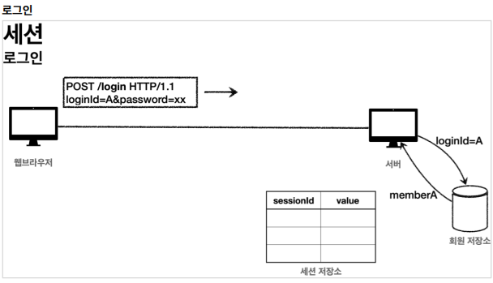
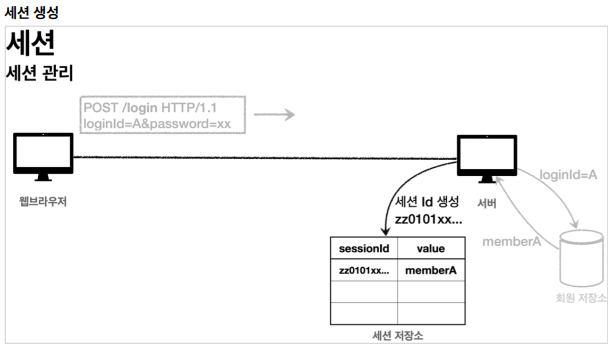
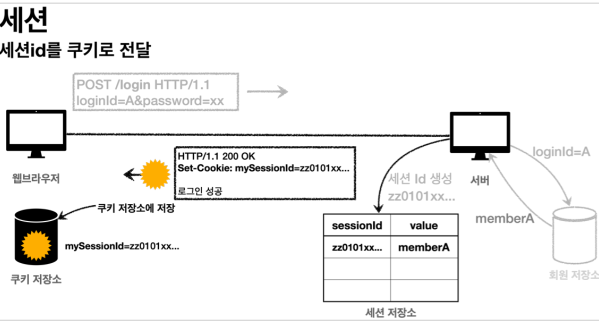
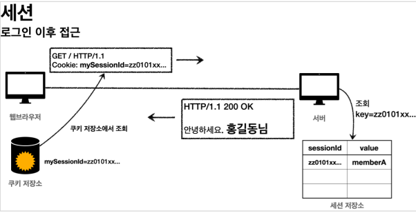

# Spring MVC 2편

<details>
<summary>Section 06 login - cookies, session</summary>
<div markdown="1">

## 로그인 요구 사항
- 
- 
- 

## 프로젝트 생성
- 도메인이 가장 중요하다!
- 도메인 = 화면, UI, 기술 인프라 등등의 영역을 제외한 시스템이 구현해야 하는 핵심 비즈니스 업무 영역을 말한다.
- 향후 web을 다른 기술로 바꾸어도 (api로 바꾸더라도, ssr로 바꾸더라도) 도메인은 그대로 유지될 수 있어야 한다.
- 그러기 위해서 중요한 것은 단방향 의존관계 설정이다. (단방향으로 흘러가도록 설계해야 잘 설계한 것)
- web은 domain을 알고있지만 domain은 web을 모르도록 설계해야 한다. 
- 이것을 web은 domain을 의존하지만 domain은 web을 의존하지 않는다고 표현한다.

## 홈화면 개발 및 회원 가입 개발
#### HomeController - home()수정
```java
@GetMapping("/")
public String home() {
 return "home";
}
```

#### templates/home.html
```html
<!DOCTYPE HTML>
<html xmlns:th="http://www.thymeleaf.org">
<head>
    <meta charset="utf-8">
    <link th:href="@{/css/bootstrap.min.css}"
          href="css/bootstrap.min.css" rel="stylesheet">
</head>
<body>
<div class="container" style="max-width: 600px">
    <div class="py-5 text-center">
        <h2>홈 화면</h2>
    </div>
    <div class="row">
        <div class="col">
            <button class="w-100 btn btn-secondary btn-lg" type="button"
                    th:onclick="|location.href='@{/members/add}'|">
                회원 가입
            </button>
        </div>
        <div class="col">
            <button class="w-100 btn btn-dark btn-lg"
                    onclick="location.href='items.html'"
                    th:onclick="|location.href='@{/login}'|" type="button">
                로그인
            </button>
        </div>
    </div>
    <hr class="my-4">
</div> <!-- /container -->
</body>
</html>

```

#### Member
```java
package hello.login.domain.member;
import lombok.Data;
import javax.validation.constraints.NotEmpty;
@Data
public class Member {
    private Long id;
    @NotEmpty
    private String loginId; //로그인 ID
    @NotEmpty
    private String name; //사용자 이름
    @NotEmpty
    private String password;
}
```
#### MemberRepository
```java
package hello.login.domain.member;
import lombok.extern.slf4j.Slf4j;
import org.springframework.stereotype.Repository;
import java.util.*;
/**
 * 동시성 문제가 고려되어 있지 않음, 실무에서는 ConcurrentHashMap, AtomicLong 사용 고려
 */
@Slf4j
@Repository
public class MemberRepository {
    private static Map<Long, Member> store = new HashMap<>(); //static 사용
    private static long sequence = 0L; //static 사용
    public Member save(Member member) {
        member.setId(++sequence);
        log.info("save: member={}", member);
        store.put(member.getId(), member);
        return member;
    }
    public Member findById(Long id) {
        return store.get(id);
    }
    public Optional<Member> findByLoginId(String loginId) {
        return findAll().stream()
                .filter(m -> m.getLoginId().equals(loginId))
                .findFirst();
    }
    public List<Member> findAll() {
        return new ArrayList<>(store.values());
    }
    public void clearStore() {
        store.clear();
    }
}
```

#### MemberController
```java
package hello.login.web.member;
import hello.login.domain.member.Member;
import hello.login.domain.member.MemberRepository;
import lombok.RequiredArgsConstructor;
import org.springframework.stereotype.Controller;
import org.springframework.validation.BindingResult;
import org.springframework.web.bind.annotation.GetMapping;
import org.springframework.web.bind.annotation.ModelAttribute;
import org.springframework.web.bind.annotation.PostMapping;
import org.springframework.web.bind.annotation.RequestMapping;
import javax.validation.Valid;
@Controller
@RequiredArgsConstructor
@RequestMapping("/members")
public class MemberController {
    private final MemberRepository memberRepository;
    @GetMapping("/add")
    public String addForm(@ModelAttribute("member") Member member) {
        return "members/addMemberForm";
    }
    @PostMapping("/add")
    public String save(@Valid @ModelAttribute Member member, BindingResult
            result) {
        if (result.hasErrors()) {
            return "members/addMemberForm";
        }
        memberRepository.save(member);
        return "redirect:/";
    }
}
```

#### 회원 가입 뷰 템플릿

```html
<!DOCTYPE HTML>
<html xmlns:th="http://www.thymeleaf.org">
<head>
    <meta charset="utf-8">
    <link th:href="@{/css/bootstrap.min.css}"
          href="../css/bootstrap.min.css" rel="stylesheet">
    <style>
 .container {
 max-width: 560px;
 }
 .field-error {
 border-color: #dc3545;
 color: #dc3545;
 }
 </style>
</head>
<body>
<div class="container">
    <div class="py-5 text-center">
        <h2>회원 가입</h2>
    </div>
    <h4 class="mb-3">회원 정보 입력</h4>
    <form action="" th:action th:object="${member}" method="post">
        <div th:if="${#fields.hasGlobalErrors()}">
            <p class="field-error" th:each="err : ${#fields.globalErrors()}"
               th:text="${err}">전체 오류 메시지</p>
        </div>
        <div>
            <label for="loginId">로그인 ID</label>
            <input type="text" id="loginId" th:field="*{loginId}" class="formcontrol"
                   th:errorclass="field-error">
            <div class="field-error" th:errors="*{loginId}" />
        </div>
        <div>
            <label for="password">비밀번호</label>
            <input type="password" id="password" th:field="*{password}"
                   class="form-control"
                   th:errorclass="field-error">
            <div class="field-error" th:errors="*{password}" />
        </div>
        <div>
            <label for="name">이름</label>
            <input type="text" id="name" th:field="*{name}" class="formcontrol"
                   th:errorclass="field-error">
            <div class="field-error" th:errors="*{name}" />
        </div>
        <hr class="my-4">
        <div class="row">
            <div class="col">
                <button class="w-100 btn btn-primary btn-lg" type="submit">회원
                    가입</button>
            </div>
            <div class="col">
                <button class="w-100 btn btn-secondary btn-lg"
                        onclick="location.href='items.html'"
                        th:onclick="|location.href='@{/}'|"
                        type="button">취소</button>
            </div>
        </div>
    </form>
</div> <!-- /container -->
</body>
</html>

```

## 로그인 개발

#### LoginService
```java
package hello.login.domain.login;

import hello.login.domain.member.Member;
import hello.login.domain.member.MemberRepository;
import lombok.RequiredArgsConstructor;
import org.springframework.stereotype.Service;

import java.util.Optional;

@Service
@RequiredArgsConstructor
public class LoginService {

    private final MemberRepository memberRepository;

    /**
     *
     * @param loginId
     * @param password
     * @return null -> 로그인 실패
     */
    public Member login(String loginId, String password) {
        return memberRepository.findByLoginId(loginId)
                .filter(m -> m.getPassword().equals(password))
                .orElse(null);
    }
}

```

#### LoginForm
```java
package hello.login.web.login;

import lombok.Data;

import javax.validation.constraints.NotEmpty;

@Data
public class LoginForm {

    @NotEmpty
    private String loginId;

    @NotEmpty
    private String password;

}

```
#### LoginController

```java
package hello.login.web.login;

import hello.login.domain.login.LoginService;
import hello.login.domain.member.Member;
import lombok.RequiredArgsConstructor;
import lombok.extern.slf4j.Slf4j;
import org.springframework.stereotype.Controller;
import org.springframework.validation.BindingResult;
import org.springframework.web.bind.annotation.GetMapping;
import org.springframework.web.bind.annotation.ModelAttribute;
import org.springframework.web.bind.annotation.PostMapping;

import javax.validation.Valid;

@Slf4j
@Controller
@RequiredArgsConstructor
public class LoginController {

    private final LoginService loginService;

    @GetMapping("/login")
    public String loginForm(@ModelAttribute("loginForm") LoginForm form) {
        return "login/loginForm";
    }

    @PostMapping("/login")
    public String login(@Valid @ModelAttribute LoginForm form, BindingResult bindingResult) {
        if (bindingResult.hasErrors()) {
            return "login/loginForm";
        }
        Member loginMember = loginService.login(form.getLoginId(), form.getPassword());

        if (loginMember == null) {
            bindingResult.reject("loginFail", "아이디 또는 비밀번호가 맞지 않습니다.");
            return "login/loginForm";
        }

        //로그인 성공 처리 TODO
        return "redirect:/";
    }

}

```

#### 로그인 폼 뷰 템플릿
```html
<!DOCTYPE HTML>
<html xmlns:th="http://www.thymeleaf.org">
<head>
    <meta charset="utf-8">
    <link th:href="@{/css/bootstrap.min.css}"
          href="../css/bootstrap.min.css" rel="stylesheet">
    <style>
 .container {
 max-width: 560px;
 }
 .field-error {
 border-color: #dc3545;
 color: #dc3545;
 }
 </style>
</head>
<body>
<div class="container">
    <div class="py-5 text-center">
        <h2>로그인</h2>
    </div>
    <form action="item.html" th:action th:object="${loginForm}" method="post">
        <div th:if="${#fields.hasGlobalErrors()}">
            <p class="field-error" th:each="err : ${#fields.globalErrors()}"
               th:text="${err}">전체 오류 메시지</p>
        </div>
        <div>
            <label for="loginId">로그인 ID</label>
            <input type="text" id="loginId" th:field="*{loginId}" class="formcontrol"
                   th:errorclass="field-error">
            <div class="field-error" th:errors="*{loginId}" />
        </div>
        <div>
            <label for="password">비밀번호</label>
            <input type="password" id="password" th:field="*{password}"
                   class="form-control"
                   th:errorclass="field-error">
            <div class="field-error" th:errors="*{password}" />
        </div>
        <hr class="my-4">
        <div class="row">
            <div class="col">
                <button class="w-100 btn btn-primary btn-lg" type="submit">
                    로그인</button>
            </div>
            <div class="col">
                <button class="w-100 btn btn-secondary btn-lg"
                        onclick="location.href='items.html'"
                        th:onclick="|location.href='@{/}'|"
                        type="button">취소</button>
            </div>
        </div>
    </form>
</div> <!-- /container -->
</body>
</html>
```

## 로그인 처리하기 - 쿠키 사용
- 쿠키를 사용해서 로그인, 로그아웃 기능을 구현해보자
- 로그인의 상태를 어떻게 유지할 수 있을까?
- 쿼리 파라미터를 계속 유지하면서 보낼 수도 있겠지만 매우 어렵고 번거로운 작업이다.
- 쿠키를 사용해보자

### 쿠키
- 서버에서 로그인에 성공하면 HTTP 응답에 쿠키를 담아서 브라우저에 전달하자.
- 그러면 브라우저는 앞으로 해당 쿠키를 지속해서 보내준다.
- 
- 
- 쿠키에는 영속 쿠키와 세션 쿠키가 있다.
  - 영속 쿠기: 만료 날짜를 입력하면 해당 날짜까지 유지
  - 세션 쿠키: 만료 날짜를 생략하면 브라우저 종료시 까지만 유지
- 우리는 브라우저 종료 시 로그아웃이 되길 기대함으로, 우리에게 필요한 것은 세션 쿠키이다.

#### LoginController - login()
- 로그인 성공 시 세션 쿠키를 생성하자.
```java
@PostMapping("/login")
public String login(@Valid @ModelAttribute LoginForm form, BindingResult
        bindingResult, HttpServletResponse response) {
        if (bindingResult.hasErrors()) {
            return "login/loginForm";
        }
        Member loginMember = loginService.login(form.getLoginId(),
        form.getPassword());
        log.info("login? {}", loginMember);
        if (loginMember == null) {
            bindingResult.reject("loginFail", "아이디 또는 비밀번호가 맞지 않습니다.");
            return "login/loginForm";
        }
        //로그인 성공 처리
        //쿠키에 시간 정보를 주지 않으면 세션 쿠키(브라우저 종료시 모두 종료)
        Cookie idCookie = new Cookie("memberId",
        String.valueOf(loginMember.getId()));
        response.addCookie(idCookie);
        return "redirect:/";
}

```
- 로그인에 성공하면 쿠키를 생성하고 HttpServletResponse에 싣는다.
- 쿠키 이름은 memberId이고, 값은 회원의 id를 담아둔다. 
- 웹 브라우저는 종료 전까지 회원의 id를 서버에 계속 보내줄 것이다.

#### 홈 - 로그인 처리
```java
package hello.login.web;
import hello.login.domain.member.Member;
import hello.login.domain.member.MemberRepository;
import lombok.RequiredArgsConstructor;
import lombok.extern.slf4j.Slf4j;
import org.springframework.stereotype.Controller;
import org.springframework.ui.Model;
import org.springframework.web.bind.annotation.CookieValue;
import org.springframework.web.bind.annotation.GetMapping;
@Slf4j
@Controller
@RequiredArgsConstructor
public class HomeController {

  private final MemberRepository memberRepository;
  // @GetMapping("/")
  public String home() {
    return "home";
  }
  @GetMapping("/")
  public String homeLogin(
          @CookieValue(name = "memberId", required = false) Long memberId,
          Model model) {
    if (memberId == null) {
      return "home";
    }
    //로그인
    Member loginMember = memberRepository.findById(memberId);
    if (loginMember == null) {
      return "home";
    }
    model.addAttribute("member", loginMember);
    return "loginHome";
  }
}
```
- @CookieValue를 사용하여 편리하게 쿠키를 조회할 수 있다.
- 로그인 하지 않은 사용자도 홈에 접근할 수 있기 때문에 required = false를 적용
- 로그인 쿠키가 없는 사용자는 기존 home으로 보낸다.
- 추가로 로그인 쿠키가 있어도 회원이 없으면 home으로 보낸다.
- 로그인 쿠키(memberId)가 있는 사용자는 로그인 사용자 전용 홈 화면인 loginHome으로 보낸다.
- 추가로 홈 화면에 회원 관련 정보도 출력해야 해서 member 데이터도 모델에 담아서 전달한다.

#### 홈 - 로그인 사용자 전용
```html
<!DOCTYPE HTML>
<html xmlns:th="http://www.thymeleaf.org">
<head>
  <meta charset="utf-8">
  <link th:href="@{/css/bootstrap.min.css}"
        href="../css/bootstrap.min.css" rel="stylesheet">
</head>
<body>
<div class="container" style="max-width: 600px">
  <div class="py-5 text-center">
    <h2>홈 화면</h2>
  </div>
  <h4 class="mb-3" th:text="|로그인: ${member.name}|">로그인 사용자 이름</h4>
  <hr class="my-4">
  <div class="row">
    <div class="col">
      <button class="w-100 btn btn-secondary btn-lg" type="button"
              th:onclick="|location.href='@{/items}'|">
        상품 관리
      </button>
    </div>
    <div class="col">
      <form th:action="@{/logout}" method="post">
        <button class="w-100 btn btn-dark btn-lg" type="submit">
          로그아웃
        </button>
      </form>
    </div>
  </div>
  <hr class="my-4">
</div> <!-- /container -->
</body>
</html>
```
- 로그인에 성공한 사용자 이름을 출력한다.
- 상품 관리, 로그아웃 버튼을 노출한다.

## 로그아웃 기능
- 이번에는 로그아웃 기능을 만들어보자.
- 로그아웃 방법은 다음과 같다.
- 세션 쿠키 임으로 웹 브라우저 종료
- 서버에서 해당 쿠키의 종료 날짜를 0으로 지정

#### LoginController - logout 기능 추가

```java
@PostMapping("/logout")
public String logout(HttpServletResponse response) {
 expireCookie(response, "memberId");
 return "redirect:/";
}
private void expireCookie(HttpServletResponse response, String cookieName) {
 Cookie cookie = new Cookie(cookieName, null);
 cookie.setMaxAge(0);
 response.addCookie(cookie);
}
```
- 로그아웃도 응답 쿠키를 생성하는데 Max-Age=0임을 확인할 수 있다.
- 해당 쿠키는 즉시 종료된다.

## 쿠키와 보안 문제
- 쿠키를 사용해서 로그인 ID를 전달해 로그인을 유지할 수 있었다.
- 그런데 여기에는 심각한 보안 문제가 있다.
  - 쿠키 값은 임의로 변경할 수 있다.
    - 클라이언트가 쿠키를 강제로 변경하면 다른 사용자가 된다.
    - 실제 웹 브라우저 개발자 모드 Cookie 변경을 할 수있음
  - 쿠키에 보관된 정보는 훔쳐갈 수 있다.
    - 만약 쿠키에 개인정보나, 신용카드 정보가 있다면?
    - 이 정보가 웹 브라우저에도 보관되고, 네트워크 요청마다 계속 클라이언트에서 서버로 전달된다.
    - 쿠키의 정보는 로컬 PC에서 털릴 수도 있고, 네트워크 전송 구간에서 털릴 수도 있다.
  - 해커가 쿠키를 한번 훔쳐가면 평생 사용할 수 있다.
    - 훔쳐간 쿠키로 악의적인 요청을 계속 시도할 수 있다.

## 대안
- 쿠키에 중요한 값을 노출하지 않고, 사용자 별로 예측 불가능한 임의의 토큰(랜덤 값)을 노출하고 서버에서 토큰과 사용자 id를 매핑해서 인식한다.
- 그리고 서버에서 토큰을 관리한다.
- 토큰은 해커가 임의의 값을 넣어도 찾을 수 없도록 예상 불가능 해야 한다.
- 해커가 토큰을 털어가도 시간이 지나면 사용할 수 없도록 서버에서 해당 토큰의 만료시간을 짧게 (예: 30분) 유지한다.
- 또는 해킹이 의심되는 경우 서버에서 해당 토큰을 강제로 제거하면 된다.

## 로그인 처리하기 - 세션 동작 방식
- 목표
  - 앞서 쿠키에 중요한 정보를 보관하는 방법은 여러가지 보안 이슈가 있었다.
  - 이 문제를 해결하려면 결국 중요한 정보를 모두 서버에 저장해야 한다.
  - 그리고 클라이언트와 서버는 추정 불가능한 임의의 식별자 값으로 연결해야 한다.
  - 이렇게 서버에 중요한 정보를 보관하고 연결을 유지하는 방법을 세션이라 한다.

#### 세션의 동작 방식

#### 로그인
- 
- 사용자가 loginId, password 정보를 전달하면 서버에서 해당 사용자가 맞는지 확인한다.
#### 세션 생성
- 
- 세션 ID를 생성하는데, 추정 불가능해야 한다.
  - UUID는 추정이 불가능하다.
    - Cookie: mySessionId=zz0101xx-bab9-4b92-9b32-dadb280f4b61
  - 생성된 세션 ID와 세션에 보관할 값 memberA를 서버의 세션 저장소에 보관한다.
#### 세션 ID를 응답 쿠키로 전달
- 
- 클라이언트와 서버는 결국 쿠키로 연결 된다.
- 서버는 클라이언트에 mySessionId라는 이름으로 세션 ID만 쿠키에 담아 전달한다.
- 클라이언트는 쿠키 저장소에 mySessionId 쿠키를 보관한다.
#### 중요
- 여기서 중요한 포인트는 회원과 관련된 정보는 전혀 클라이언트에게 전달하지 않는다는 것이다.
- 오직 추정 불가능한 세션 ID만 쿠키를 통해 클라이언트에 전달한다.
#### 클라이언트 요청
- 
- 클라이언트는 요청시 항상 mySessionId 쿠키를 전달한다.
- 서버에서는 클라이언트가 전달한 mySessionId 쿠키 정보로 세션 저장소를 조회해서 로그인 시 보관한 세션 정보를 사용한다.

## 정리
- 세션을 사용해서 서버에서 중요한 정보를 관리하게 되었다. 
- 덕분에 다음과 같은 보안 문제들을 해결할 수 있다.
  - 쿠키 값을 변조 -> 예상 불가능한 복잡한 세션 ID를 사용한다.
  - 쿠키에 보관하는 정보는 클라이언트 해킹 시 털릴 가능성이 있다. -> 세션 Id가 털려도 여기에는 중요한 정보가 없다.
  - 쿠키 탈취 후 사용 -> 해커가 토큰을 털어가도 시간이 지나면 사용할 수 없도록 서버에서 세션의 만료 시간을 짧게 유지한다.
    - 또는 해킹이 의심되는 경우 서버에서 해당 세션을 강제로 제거할 수 있다

## 로그인 처리하기 - 세션 직접 만들기
- 세션을 직접 개발해서 적용해보자
- 세션 관리는 크게 다음 3가지 기능을 제공하면 된다.
  - 세션 생성
    - sessionId 생성(임의의 추정 불가능한 랜덤 값)
    - 세션 저장소에 sessionId와 보관할 값 저장
    - sessionId로 응답 쿠키를 생성해서 클라이언트에 전달
  - 세션 조회
    - 클라이언트가 요청한 sessionId 쿠키의 값으로, 세션 저장소에 보관한 값 조회
  - 세션 만료
    - 클라이언트가 요청한 sessionId 쿠키의 값으로 세션 저장소에 보관한 sessionId와 값 제거

#### SessionManager - 세션 관리
```java
package hello.login.web.session;
import org.springframework.stereotype.Component;
import javax.servlet.http.Cookie;
import javax.servlet.http.HttpServletRequest;
import javax.servlet.http.HttpServletResponse;
import java.util.Arrays;
import java.util.Map;
import java.util.UUID;
import java.util.concurrent.ConcurrentHashMap;
/**
 * 세션 관리
 */
@Component
public class SessionManager {
  public static final String SESSION_COOKIE_NAME = "mySessionId";
  private Map<String, Object> sessionStore = new ConcurrentHashMap<>();
  /**
   * 세션 생성
   */
  public void createSession(Object value, HttpServletResponse response) {
    //세션 id를 생성하고, 값을 세션에 저장
    String sessionId = UUID.randomUUID().toString();
    sessionStore.put(sessionId, value);
    //쿠키 생성
    Cookie mySessionCookie = new Cookie(SESSION_COOKIE_NAME, sessionId);
    response.addCookie(mySessionCookie);
  }
  /**
   * 세션 조회
   */
  public Object getSession(HttpServletRequest request) {
    Cookie sessionCookie = findCookie(request, SESSION_COOKIE_NAME);
    if (sessionCookie == null) {
      return null;
    }
    return sessionStore.get(sessionCookie.getValue());
  }
  /**
   * 세션 만료
   */
  public void expire(HttpServletRequest request) {
    Cookie sessionCookie = findCookie(request, SESSION_COOKIE_NAME);
    if (sessionCookie != null) {
      sessionStore.remove(sessionCookie.getValue());
    }
  }
  private Cookie findCookie(HttpServletRequest request, String cookieName) {
    if (request.getCookies() == null) {
      return null;
    }
    return Arrays.stream(request.getCookies())
            .filter(cookie -> cookie.getName().equals(cookieName))
            .findAny()
            .orElse(null);
  }
}
```


#### SessionManagerTest - 테스트

```java
package hello.login.web.session;
import hello.login.domain.member.Member;
import org.junit.jupiter.api.Test;
import org.springframework.mock.web.MockHttpServletRequest;
import org.springframework.mock.web.MockHttpServletResponse;
import static org.assertj.core.api.Assertions.assertThat;
class SessionManagerTest {
  SessionManager sessionManager = new SessionManager();
  @Test
  void sessionTest() {
    //세션 생성
    MockHttpServletResponse response = new MockHttpServletResponse();
    Member member = new Member();
    sessionManager.createSession(member, response);
    //요청에 응답 쿠키 저장
    MockHttpServletRequest request = new MockHttpServletRequest();
    request.setCookies(response.getCookies());
    //세션 조회
    Object result = sessionManager.getSession(request);
    assertThat(result).isEqualTo(member);
    //세션 만료
    sessionManager.expire(request);
    Object expired = sessionManager.getSession(request);
    assertThat(expired).isNull();
  }
}
```

## 로그인 처리하기 - 직접 만든 세션 적용
- 지금까지 개발한 세션 관리 기능을 실제 웹 애플리케이션에 적용해보자

#### LoginController - loginV2()
```java
@PostMapping("/login")
public String loginV2(@Valid @ModelAttribute LoginForm form, BindingResult 
bindingResult, HttpServletResponse response) {
    if (bindingResult.hasErrors()) {
        return "login/loginForm";
    }
    Member loginMember = loginService.login(form.getLoginId(),
    form.getPassword());
    log.info("login? {}", loginMember);
    if (loginMember == null) {
        bindingResult.reject("loginFail", "아이디 또는 비밀번호가 맞지 않습니다.");
        return "login/loginForm";
    }
    //로그인 성공 처리
    //세션 관리자를 통해 세션을 생성하고, 회원 데이터 보관
    sessionManager.createSession(loginMember, response);
    return "redirect:/";
}
```

#### HomeController - homeLoginV2()
```java
@GetMapping("/")
public String homeLoginV2(HttpServletRequest request, Model model) {
 //세션 관리자에 저장된 회원 정보 조회
 Member member = (Member)sessionManager.getSession(request);
 if (member == null) {
 return "home";
 }
 //로그인
 model.addAttribute("member", member);
 return "loginHome";
}
```
- 세션 관리자에서 저장된 회원 정보를 조회하도록 했다.
- 만약 회원 정보가 없으면, 쿠키나 세션이 없는 것임으로 로그인 되지 않은 것으로 처리하도록 했다.

### 정리
- 이번 시간에는 세션과 쿠키의 개념을 명확하게 이해하기 위해서 직접 만들어보았다.
- 사실 세션이라는 것이 뭔가 특별한 것이 아니라 단지 쿠키를 사용하는데, 서버에서 데이터를 유지하는 방법일 뿐이라는 것을 이해했을 것이다.
- 그런데 프로젝트마다 이러한 세션 개념을 직접 개발하는 것은 상당히 불편할 것이다. 
- 그래서 서블릿도 세션 개념을 지원한다.
- 이제 직접 만드는 세션 말고, 서블릿이 공식 지원하는 세션을 알아보자.
- 서블릿이 공식 지원한느 세션은 우리가 직접 만든 세션과 동작 방식이 거의 같다.
- 추가로 세션을 일정시간 사용하지 않으면 해당 세션을 삭제하는 기능도 제공한다.

## 로그인 처리하기 - 서블릿 HTTP 세션 1
- 세션이라는 개념은 대부분의 웹 어플리케이션에 필요한 것
- 어쩌면 웹이 등장하면서 부터 나온 문제
- 서블릿은 세션을 위해 HttpSession이라는 기능을 제공하는데, 지금까지 나온 문제들을 해결해준다.
- 우리가 직접 구현한 세션의 개념이 이미 구현되어 있고, 더 잘 구현되어 있다.

### HttpSession 소개
- 서블릿이 제공하는 HttpSession도 결국 우리가 직접 만든 SessionManager와 같은 방식으로 동작한다.
- 서블릿을 통해 HttpSession을 생성하면 다음과 같은 쿠키를 생성한다.
- 쿠키 이름이 JSESSIONID이고, 값은 추정 불가능한 랜덤 값이다.

### HttpSession 사용
- 서블릿이 제공하는 HttpSession을 사용하도록 개발해보자

#### SessionConst
```java
package hello.login.web;
public class SessionConst {
 public static final String LOGIN_MEMBER = "loginMember";
}
```
- HttpSessino에 데이터를 보관하고 조회할 때 같은 이름이 중복 되어 사용됨으로, 상수를 하나 정의했다.

#### LoginController - loginV3()
```java
@PostMapping("/login")
public String loginV3(@Valid @ModelAttribute LoginForm form, BindingResult 
bindingResult, HttpServletRequest request) {
 if (bindingResult.hasErrors()) {
    return "login/loginForm";
 }
 Member loginMember = loginService.login(form.getLoginId(),form.getPassword());
 log.info("login? {}", loginMember);
 if (loginMember == null) {
    bindingResult.reject("loginFail", "아이디 또는 비밀번호가 맞지 않습니다.");
    return "login/loginForm";
 }
 //로그인 성공 처리
 //세션이 있으면 있는 세션 반환, 없으면 신규 세션 생성
 HttpSession session = request.getSession();
 //세션에 로그인 회원 정보 보관
 session.setAttribute(SessionConst.LOGIN_MEMBER, loginMember);
 return "redirect:/";
}
```
- 세션 생성
  - 세션을 생성하려면 request.getSession(create: true)를 사용하면 된다.
  - create 옵션은 default가 true -> 세션이 있으면 기존 세션 반환 없으면 생성 반환
  - create false -> 세션이 있으면 기존 세션 반환 없으면 null 반환
- 세션에 로그인 회원 정보 보관
  - ```session.setAttribute(SessionConst.LOGIN_MEMBER, loginMember);```
  - 세션에 데이터를 보관하는 방법은 request.setAttribute와 유사
  - 하나의 세션에 여러 값을 저장할 수 있다. 

#### LoginController - logoutV3()
```java
@PostMapping("/logout")
public String logoutV3(HttpServletRequest request) {
 //세션을 삭제한다.
 HttpSession session = request.getSession(false);
 if (session != null) {
    session.invalidate();
 }
 return "redirect:/";
}
```
- ```session.invalidate```: 세션을 제거 

#### HomeController - homeLoginV3()
```java
@GetMapping("/")
public String homeLoginV3(HttpServletRequest request, Model model) {
 //세션이 없으면 home
 HttpSession session = request.getSession(false);
 if (session == null) {
    return "home";
 }
 Member loginMember = (Member)
session.getAttribute(SessionConst.LOGIN_MEMBER);
 //세션에 회원 데이터가 없으면 home
 if (loginMember == null) {
    return "home";
 }
 //세션이 유지되면 로그인으로 이동
 model.addAttribute("member", loginMember);
 return "loginHome";
}
```
- ```request.getSession(false)``` false 옵션으로 세션을 생성하지 않도록 하며 조회
- ```session.getAttribute(SessionConst.LOGIN_MEMBER``` 로그인 시점에서 세션에 보관한 회원 객체를 찾는다.

## 로그인 처리하기 - 서블릿 HTTP 세션 2
- @SessionAttribute
  - 스프링은 세션을 더 편리하게 사용할 수 있도록 애노테이션을 지원한다.
  - 이미 로그인 된 사용자를 찾을 때는 다음과 같이 사용하면 된다.
  - 참고로 이 기능은 세션을 생성하지 않는다.

#### HomeController - homeLoginV3Spring())
```java
@GetMapping("/")
public String homeLoginV3Spring(
 @SessionAttribute(name = SessionConst.LOGIN_MEMBER, required = false) Member loginMember,
 Model model) {
 //세션에 회원 데이터가 없으면 home
 if (loginMember == null) {
    return "home";
 }
 //세션이 유지되면 로그인으로 이동
 model.addAttribute("member", loginMember);
 return "loginHome";
}
```
- 세션을 찾고, 세션에 들어있는 데이터를 찾는 번거로운 과정을  스프링이 한번에 편리하게 처리해주는 것을 확인할 수 있다.

## TrackingModes
- 로그인을 처음 시도하면 URL이 다음과 같이 jsessionid를 포함하고 있는 것을 확인할 수 있다
- http://localhost:8080/;jsessionid=F59911518B921DF62D09F0DF8F83F872
- 이것은 웹 브라우저가 쿠키를 지원하지 않을 때 쿠키 대신 URL을 통해 세션을 유지하는 방법이다.
- 이 방법을 사용하려면 URL에 이 값을 계속 포함해서 전달해야 하는데 잘 사용되지 않는 방법이다.
- 타임리프 같은 템플릿 엔진을 통해서 링크를 걸면 jsessionid를 URL에 자동으로 포함해줄 수 있다.
- 서버 입장에서 웹 브라우저가 쿠키를 지원하는지 않느지 최초에는 판단하지 못함으로 쿠키 값도 전달하고, URL에 jsessionid도 함께 전달하도록 유도하는 것이다.
- URL 전달 방식을 끄고 항상 쿠키를 통해서만 세션을 유지하고 싶으면 다음 옵션을 넣어주면 된다. 이렇게 하면 url에 jsessionid가 노출되지 않는다.


## 세션 정보와 타임아웃 설정
- 세션이 제공하는 정보들을 확인해보자

#### SessionInfoController
```java
package hello.login.web.session;
import lombok.extern.slf4j.Slf4j;
import org.springframework.web.bind.annotation.GetMapping;
import org.springframework.web.bind.annotation.RestController;
import javax.servlet.http.HttpServletRequest;
import javax.servlet.http.HttpSession;
import java.util.Date;
@Slf4j
@RestController
public class SessionInfoController {
  @GetMapping("/session-info")
  public String sessionInfo(HttpServletRequest request) {
    HttpSession session = request.getSession(false);
    if (session == null) {
      return "세션이 없습니다.";
    }
    //세션 데이터 출력
    session.getAttributeNames().asIterator()
            .forEachRemaining(name -> log.info("session name={}, value={}",
                    name, session.getAttribute(name)));
    log.info("sessionId={}", session.getId());
    log.info("maxInactiveInterval={}", session.getMaxInactiveInterval());
    log.info("creationTime={}", new Date(session.getCreationTime()));
    log.info("lastAccessedTime={}", new
            Date(session.getLastAccessedTime()));
    log.info("isNew={}", session.isNew());
    return "세션 출력";
  }
}
```

- sessionId: 세션 id, JSESSIONID의 값이다.
- maxInactiveInterval: 세션의 유효 시간 
- creationTime: 세션 생성일시
- lastAccessedtime: 세션과 연결된 사용자가 최근에 서버에 접근한 시간, 클라이언트에서 서버로 sessionId를 요청한 경우 갱신된다.
- isNew: 새로 생성된 세션이지, 아니면 이미 과거에 만들어졌는지 여부를 판단

### 세션 타임아웃 설정
- 세션은 사용자가 로그아웃을 직접 호출해서 session.invalidate()가 호출 되는 경우에 삭제된다.
- 그런데 대부분의 사용자는 로그아웃을 선택하지 않고, 그냥 웹 브라우저를 종료한다.
- 문제는 HTTP의 비 연결성 때문에 서버 입장에서는 해당 사용자가 웹 브라우저를 종료했는지 인식할 수 없다.
- 따라서 서버에서 세션 데이터를 언제 삭제해야 하는지 판단하기가 어렵다.
- 이 경우 남아있는 세션을 무한정 보관한다면 다음과 같은 문제들이 발생할 수 있다.
  - 세션과 관련된 쿠키를 탈취 당했을 경우 오랜 시간이 지나도 해당 쿠키로 악의적인 요청을 할 수 있다.
  - 세션은 기본적으로 메모리에 생성됨으로 메모리가 터져 장애가 날 수 있다.

### 세션의 종료 시점
- 세션의 종료 시점을 정해야 한다.
- 보통 30분 정도로 많이 잡는다.
- 그런데 문제는 30분이 지나면 세션이 삭제되기 때문에 열심히 사이트를 돌아다니다가 또 로그인을 해서 세션을 생성해야 한다.
- 더 나은 대안은 세션 생성 시점이 아니라 사용자가 서버에 최근에 요청한 시간을 기준으로 30분 정도를 유지해주는 것이다.
- 이렇게 하면 사용자가 서비스를 사용하고 있으면, 세션의 생존 시간이 30분으로 계속 새로고침 되게 된다.
- Http 세션은 이 방식을 사용한다.

### 세션 타임아웃 설정
- 스프링 부트 글로벌 설정
  - ```server.servlet.session.timeout=60```
- 특정 세션 단위로 시간 설정
  - ```session.setMaxInactiveInterval(1800); //1800초```
- LastAccessedTime이후로 timeout 시간이 지나면 WAS가 내부에서 해당 세션을 제거한다.

</div>
</details>


<details>
<summary>Section 07 login - filter, interceptor</summary>
<div markdown="1">

## 공통 관심 사항
- 요구사항을 보면 로그인 한 사용자만 상품 관리 페이지에 들어갈 수 있어야 한다.
- 로그인을 하지 않은 사용자에게는 상품 관리 버튼이 보이지 않지만 URL을 직접 호출함으로써 접근할 수 있기에 인가 로직이 필요하다
- 컨트롤러 api 마다 로그인 여부를 체크하는 로직을 하나하나 작성함으로써 해결가능하겠지만 모든 컨트롤러 로직에 공통으로 로그인 여부를 확인해야 한다.
- 추후 로그인 관련 로직 변경 시 작성한 모든 로직을 수정하려면 유지보수가 힘듦으로 공통 관심사항 (로그인)을 분리하는 것이 올바른 접근이다.
- 공통 관심사는 스프링의 AOP로도 해결할 수 있지만, 웹과 관련된 공통 관심사는 서블릿 필터 또는 스프링 인터셉터를 사용하는 것이 좋다.

## 서블릿 필터
- 필터는 서블릿이 지원하는 수문장이다.
- 필터 흐름은 다음과 같다.
  - ```HTTP 요청 -> WAS -> 필터 -> 서블릿 -> 컨트롤러 ```
  - 필터를 적용하면 필터가 호출 된 다음에 서블릿이 호출된다.
  - 그래서 모든 고객의 요청 로그를 남기는 요구사항이 있다면 필터를 사용하여 구현할 수 있다.
  - 참고로 필터는 특정 URL 패턴에 적용 가능하다.
  - 필터에서 적절하지 않은 요청이라고 판단하여 거기에서 끝을 낼 수도 있다.
  - 그래서 로그인 여부를 체크하기에 딱 좋다.
  - 필터는 체인으로 구성되기에 중간에 필터를 자유롭게 추가할 수 있다.

### 필터 인터페이스

```java
public interface Filter {
 public default void init(FilterConfig filterConfig) throws ServletException {
     
 }
 public void doFilter(ServletRequest request, ServletResponse response, FilterChain chain) throws IOException, ServletException;
 public default void destroy() {
     
 }
}
```
- 필터 인터페이스를 구현하고 등록하면 서블릿 컨테이너가 필터를 싱글톤 객체로 생성하고, 관리한다.
  - init(): 필터 초기화 메서드, 서블릿 컨테이너가 생성될 때 호출된다.
  - doFilter(): 고객의 요청이 올 때마다 해당 메서드가 호출된다. 필터의 로직을 구현하면 된다. 
  - destroy(): 필터 종료 메서드, 서블릿 컨테이너가 종료될 때 호출된다. 

### 서블릿 필터 - 요청 로그
- 필터가 정말 수문장 역할을 잘 하는지 확인하기 위해 가장 단순한 필터인 모든 요청을 로그로 남기는 필터를 개발하고 적용해보자

#### LogFilter - 로그 필터
```java
package hello.login.web.filter;
import lombok.extern.slf4j.Slf4j;
import javax.servlet.*;
import javax.servlet.http.HttpServletRequest;
import java.io.IOException;
import java.util.UUID;
@Slf4j
public class LogFilter implements Filter {
    @Override
    public void init(FilterConfig filterConfig) throws ServletException {
        log.info("log filter init");
    }

    @Override
    public void doFilter(ServletRequest request, ServletResponse response,
                         FilterChain chain) throws IOException, ServletException {
        HttpServletRequest httpRequest = (HttpServletRequest) request;
        String requestURI = httpRequest.getRequestURI();
        String uuid = UUID.randomUUID().toString();
        try {
            log.info("REQUEST [{}][{}]", uuid, requestURI);
            chain.doFilter(request, response);
        } catch (Exception e) {
            throw e;
        } finally {
            log.info("RESPONSE [{}][{}]", uuid, requestURI);
        }
        
    }
    @Override
    public void destroy() {
      log.info("log filter destroy");
    }
    
}
```

- ```public class LogFilter implemnets Filter {}```
  - 필터를 사용하려면 필터 인터페이스를 구현해야 한다.
- ```doFilter(ServletRequest request, ServletResponse response, FilterChain chain)```
  - HTTP 요청이 오면 doFilter가 호출된다.
  - ServletRequest request는 HTTP 요청이 아닌 경우까지 고려해서 정의된 스펙이다.
  - HTTP를 사용하면 HttpServletRequest로 다운 캐스팅 하면 된다.
- ```String uuid = UUID.randomUUID().toString();```
  - HTTP 요청을 구분하기 위해 요청당 임의의 uuid를 생성해둔다.
- ```log.info("REQUEST [{}][{}]", uuid, requestURI);```
  - uuid와 requestURI를 출력한다.
- ```chain.doFilter(request, response);```
  - 다음 필터가 있으면 필터를 호출하고 필터가 없으면 서블릿을 호출한다.
  - 이 로직을 호출하지 않으면 다음 단계로 진행되지 않는다.

#### WebConfig - 필터 설정
```java
package hello.login;

import hello.login.web.filter.LogFilter;
import org.springframework.boot.web.servlet.FilterRegistrationBean;
import org.springframework.context.annotation.Bean;
import org.springframework.context.annotation.Configuration;

import javax.servlet.Filter;

@Configuration
public class WebConfig {

    @Bean
    public FilterRegistrationBean logFilter() {
        FilterRegistrationBean<Filter> filterRegistrationBean = new FilterRegistrationBean<Filter>();
        filterRegistrationBean.setFilter(new LogFilter());
        filterRegistrationBean.setOrder(1);
        filterRegistrationBean.addUrlPatterns("/*");

        return filterRegistrationBean;
    }
}

```
- 필터를 등록하는 방법은 여러가지가 있지만, 스프링 부트를 사용한다면 FilterRegistrationBean을 사용해서 등록하면 된다.
- ```setFilter(new LogFilter)```: 등록할 필터를 지정한다.
- ```setOrder(1)```: 체인으로 동작하는 필터의 순서를 지정한다. (낮을 수록 먼저 동작)
- ```addUrlPatterns("/*")```: 필터를 적용할 URL 패턴을 지정한다. 한번에 여러 패턴을 지정할 수 있다.

## 서블릿 필터 - 인증 체크
- 이제 로그가 아닌 인증 체크 필터를 개발해보자
- 로그인 되지 않은 사용자는 상품 관리 뿐만 아니라 미래에 개발될 페이지에도 접근하지 못하도록 하자.

#### LoginCheckFilter - 인증 체크 필터
```java
package hello.login.web.filter;

import hello.login.web.SessionConst;
import lombok.extern.slf4j.Slf4j;
import org.springframework.util.PatternMatchUtils;

import javax.servlet.*;
import javax.servlet.http.HttpServletRequest;
import javax.servlet.http.HttpServletResponse;
import javax.servlet.http.HttpSession;
import java.io.IOException;
import java.net.http.HttpResponse;

@Slf4j
public class LoginCheckFilter implements Filter {

  private static final String[] whiteList = {"/", "/members/add", "/login", "/logout", "/css/*"};

  @Override
  public void doFilter(ServletRequest request, ServletResponse response, FilterChain chain) throws IOException, ServletException {
    HttpServletRequest httpRequest = (HttpServletRequest) request;
    HttpServletResponse httpResponse = (HttpServletResponse) response;
    String requestURI = httpRequest.getRequestURI();

    try {
      log.info("인증 체크 필터 시작 {}", requestURI);

      if (isLoginCheckPath(requestURI)) {
        log.info("인증 체크 로직 실행 {}", requestURI);
        HttpSession session = httpRequest.getSession();
        if (session == null || session.getAttribute(SessionConst.LOGIN_MEMBER) == null) {
          log.info("미인증 사용자 요청 {}", requestURI);
          //로그인으로 redirect
          httpResponse.sendRedirect(("/login?redirectURL=" + requestURI));
          return;
        }
      }
    } catch (Exception e) {
      throw e;
    } finally {
      log.info("인증 체크 필터 종료 {}", requestURI);
    }
  }

  private boolean isLoginCheckPath(String requestURI) {
    return !PatternMatchUtils.simpleMatch(whiteList, requestURI);
  }
}

```
- ```whitelist = {"/", "/members/add", "/login", "/logout","/css/*"};```
  - 인증 필터를 적용해도 홈, 회원가입, 로그인 화면, css 같은 리소스에는 접근할 수 있어야 한다.
  - 이렇게 화이트 리스트 경로는 인증과 무관하게 항상 허용한다.
  - 화이트 리스트를 제외한 나머지 모든 경로에는 인증 체크 로직을 적용한다.
- ```isLoginCheckPath(requestURI)```
  - 화이트 리스트를 제외한 모든 경우에 인증 체크 로직을 적용한다.
- ```httpResponse.sendRedirect("/login?redirectURL=" + requestURI);```
  - 미인증 사용자는 로그인 화면으로 리다이렉트 한다. 
  - 로그인 이후에 홈이 아닌 원래 요청했던 URI로 이동하는 편의성을 제공하기 위하여 requestURI를 param으로 추가한다.
- ```return```
  - 필터를 더는 진행하지 않고 종료한다.
  - 서블릿, 컨트롤러가 더는 호출되지 않고 종료한다.
  - 앞서 redirect를 사용했기 때문에 redirect가 응답으로 적용되고 요청이 끝난다.

#### WebConfig - loginCheckFilter() 추가
```java
    @Bean
    public FilterRegistrationBean loginCheckFilter() {
        FilterRegistrationBean<Filter> filterRegistrationBean = new FilterRegistrationBean<>();
        filterRegistrationBean.setFilter(new LoginCheckFilter());
        filterRegistrationBean.setOrder(2);
        filterRegistrationBean.addUrlPatterns("/*");
        return filterRegistrationBean;
    }
```

## 정리
- 서블릿 필터를 잘 사용한 덕분에 로그인 하지 않은 사용자는 나머지 경로에 들어갈 수 없게 되었다.
- 공통 관심사를 서블릿 필터를 사용해서 해결한 덕분에 향후 로그인 관련 정책이 변경되어도 이 부분만 변경하면 된다.


## 스프링 인터셉터 - 소개
스프링 인터셉터도 서블릿 필터와 같이 웹과 관련된 공통 관심 사항을 효과적으로 해결할 수 있는 기술이다.
서블릿 필터가 서블릿이 제공하는 기술이라면, 스프링 인터셉터는 스프링 MVC가 제공하는 기술이다.
둘다 웹과 관련된 공통 관심 사항을 처리하지만, 적용되는 순서와 범위 그리고 사용방법이 다르다.

#### 스프링 인터셉터 흐름
> HTTP요청 -> WAS -> 필터 -> 서블릿 -> 스프링 인터셉터 -> 컨트롤러

- 스프링 인터셉터는 디스패처 서블릿과 컨트롤러 사이에서 컨트롤러 호출 직전에 호출된다.
- 스프링 인터셉터는 스프링 MVC가 제공하는 기능이기 때문에 결국 디스패쳐 서블릿 이후에 등장하게 된다. 스프링 MVC의 시작점이 디스패처 서블릿이라고 생각해보면 이해가 됨
- 스프링 인터셉터에도 URL 패턴을 적용할 수 있는데, 서블릿 URL 패턴과는 다르고 매우 정밀하게 설정할 수 있다.
- 스프링 인터셉터 역시 체인으로 구성되는데, 중간에 인터셉터를 자유롭게 추가할 수 있다. 예를 들어서 로그를 남기는 인터셉터를 먼저 적용하고, 그 다음에 로그인 여부를 체크하는 인터셉터를 만들 수 있다.

## 스프링 인터셉터 인터페이스

- 스프링의 인터셉터를 사용하면 서블릿 필터보다 편리하게 더 정교하고 다양한 기능을 이용할 수 있다.

```java
 public interface HandlerInterceptor {
  default boolean preHandle(HttpServletRequest request, HttpServletResponse response, Object handler) throws Exception {}
  default void postHandle(HttpServletRequest request, HttpServletResponse response,
                          Object handler, @Nullable ModelAndView modelAndView)
          throws Exception {}
  default void afterCompletion(HttpServletRequest request, HttpServletResponse
          response,
                               Object handler, @Nullable Exception ex) throws
          Exception {}
}
```
- 서블릿 필터의 경우 단순하게 doFilter()하나가 제공되는 반면 인터셉터는 컨트롤러 호출 전, 호출 후, 요청 완료 이후와 같이 단계적으로 잘 세분화되어있다.
- 서블릿 필터의 경우 단순히 request, response만 제공했지만, 인터셉터는 어떤 컨트롤러가 호출되는지 호출 정보도 받을 수 있다.
- 그리고 어떤 modelAndView가 반환되는지 응답 정보도 받을 수 있다.
- afterCompletion은 예외와 무관하게 호출된다.

</div>
</details>
