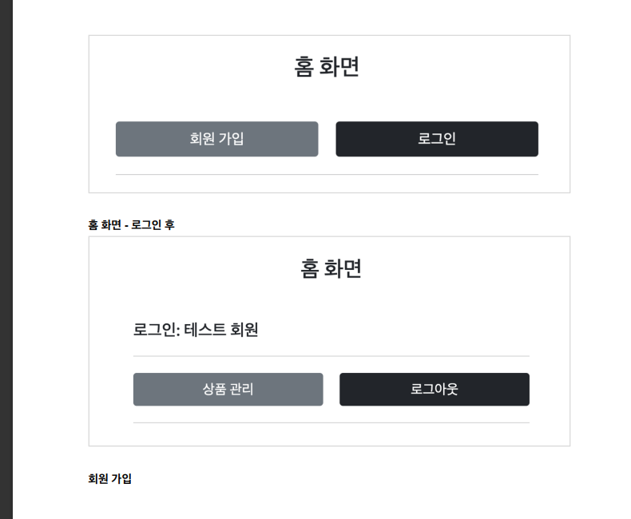

# Spring MVC 2편

<details>
<summary>Section 06 login - cookies, session</summary>
<div markdown="1">

## 로그인 요구 사항
- 
- 
- 

## 프로젝트 생성
- 도메인이 가장 중요하다!
- 도메인 = 화면, UI, 기술 인프라 등등의 영역을 제외한 시스템이 구현해야 하는 핵심 비즈니스 업무 영역을 말한다.
- 향후 web을 다른 기술로 바꾸어도 (api로 바꾸더라도, ssr로 바꾸더라도) 도메인은 그대로 유지될 수 있어야 한다.
- 그러기 위해서 중요한 것은 단방향 의존관계 설정이다. (단방향으로 흘러가도록 설계해야 잘 설계한 것)
- web은 domain을 알고있지만 domain은 web을 모르도록 설계해야 한다. 
- 이것을 web은 domain을 의존하지만 domain은 web을 의존하지 않는다고 표현한다.

## 홈화면 개발 및 회원 가입 개발
#### HomeController - home()수정
```java
@GetMapping("/")
public String home() {
 return "home";
}
```

#### templates/home.html
```html
<!DOCTYPE HTML>
<html xmlns:th="http://www.thymeleaf.org">
<head>
    <meta charset="utf-8">
    <link th:href="@{/css/bootstrap.min.css}"
          href="css/bootstrap.min.css" rel="stylesheet">
</head>
<body>
<div class="container" style="max-width: 600px">
    <div class="py-5 text-center">
        <h2>홈 화면</h2>
    </div>
    <div class="row">
        <div class="col">
            <button class="w-100 btn btn-secondary btn-lg" type="button"
                    th:onclick="|location.href='@{/members/add}'|">
                회원 가입
            </button>
        </div>
        <div class="col">
            <button class="w-100 btn btn-dark btn-lg"
                    onclick="location.href='items.html'"
                    th:onclick="|location.href='@{/login}'|" type="button">
                로그인
            </button>
        </div>
    </div>
    <hr class="my-4">
</div> <!-- /container -->
</body>
</html>

```

#### Member
```java
package hello.login.domain.member;
import lombok.Data;
import javax.validation.constraints.NotEmpty;
@Data
public class Member {
    private Long id;
    @NotEmpty
    private String loginId; //로그인 ID
    @NotEmpty
    private String name; //사용자 이름
    @NotEmpty
    private String password;
}
```
#### MemberRepository
```java
package hello.login.domain.member;
import lombok.extern.slf4j.Slf4j;
import org.springframework.stereotype.Repository;
import java.util.*;
/**
 * 동시성 문제가 고려되어 있지 않음, 실무에서는 ConcurrentHashMap, AtomicLong 사용 고려
 */
@Slf4j
@Repository
public class MemberRepository {
    private static Map<Long, Member> store = new HashMap<>(); //static 사용
    private static long sequence = 0L; //static 사용
    public Member save(Member member) {
        member.setId(++sequence);
        log.info("save: member={}", member);
        store.put(member.getId(), member);
        return member;
    }
    public Member findById(Long id) {
        return store.get(id);
    }
    public Optional<Member> findByLoginId(String loginId) {
        return findAll().stream()
                .filter(m -> m.getLoginId().equals(loginId))
                .findFirst();
    }
    public List<Member> findAll() {
        return new ArrayList<>(store.values());
    }
    public void clearStore() {
        store.clear();
    }
}
```

#### MemberController
```java
package hello.login.web.member;
import hello.login.domain.member.Member;
import hello.login.domain.member.MemberRepository;
import lombok.RequiredArgsConstructor;
import org.springframework.stereotype.Controller;
import org.springframework.validation.BindingResult;
import org.springframework.web.bind.annotation.GetMapping;
import org.springframework.web.bind.annotation.ModelAttribute;
import org.springframework.web.bind.annotation.PostMapping;
import org.springframework.web.bind.annotation.RequestMapping;
import javax.validation.Valid;
@Controller
@RequiredArgsConstructor
@RequestMapping("/members")
public class MemberController {
    private final MemberRepository memberRepository;
    @GetMapping("/add")
    public String addForm(@ModelAttribute("member") Member member) {
        return "members/addMemberForm";
    }
    @PostMapping("/add")
    public String save(@Valid @ModelAttribute Member member, BindingResult
            result) {
        if (result.hasErrors()) {
            return "members/addMemberForm";
        }
        memberRepository.save(member);
        return "redirect:/";
    }
}
```

#### 회원 가입 뷰 템플릿

```html
<!DOCTYPE HTML>
<html xmlns:th="http://www.thymeleaf.org">
<head>
    <meta charset="utf-8">
    <link th:href="@{/css/bootstrap.min.css}"
          href="../css/bootstrap.min.css" rel="stylesheet">
    <style>
 .container {
 max-width: 560px;
 }
 .field-error {
 border-color: #dc3545;
 color: #dc3545;
 }
 </style>
</head>
<body>
<div class="container">
    <div class="py-5 text-center">
        <h2>회원 가입</h2>
    </div>
    <h4 class="mb-3">회원 정보 입력</h4>
    <form action="" th:action th:object="${member}" method="post">
        <div th:if="${#fields.hasGlobalErrors()}">
            <p class="field-error" th:each="err : ${#fields.globalErrors()}"
               th:text="${err}">전체 오류 메시지</p>
        </div>
        <div>
            <label for="loginId">로그인 ID</label>
            <input type="text" id="loginId" th:field="*{loginId}" class="formcontrol"
                   th:errorclass="field-error">
            <div class="field-error" th:errors="*{loginId}" />
        </div>
        <div>
            <label for="password">비밀번호</label>
            <input type="password" id="password" th:field="*{password}"
                   class="form-control"
                   th:errorclass="field-error">
            <div class="field-error" th:errors="*{password}" />
        </div>
        <div>
            <label for="name">이름</label>
            <input type="text" id="name" th:field="*{name}" class="formcontrol"
                   th:errorclass="field-error">
            <div class="field-error" th:errors="*{name}" />
        </div>
        <hr class="my-4">
        <div class="row">
            <div class="col">
                <button class="w-100 btn btn-primary btn-lg" type="submit">회원
                    가입</button>
            </div>
            <div class="col">
                <button class="w-100 btn btn-secondary btn-lg"
                        onclick="location.href='items.html'"
                        th:onclick="|location.href='@{/}'|"
                        type="button">취소</button>
            </div>
        </div>
    </form>
</div> <!-- /container -->
</body>
</html>

```

## 로그인 개발

#### LoginService
```java
package hello.login.domain.login;

import hello.login.domain.member.Member;
import hello.login.domain.member.MemberRepository;
import lombok.RequiredArgsConstructor;
import org.springframework.stereotype.Service;

import java.util.Optional;

@Service
@RequiredArgsConstructor
public class LoginService {

    private final MemberRepository memberRepository;

    /**
     *
     * @param loginId
     * @param password
     * @return null -> 로그인 실패
     */
    public Member login(String loginId, String password) {
        return memberRepository.findByLoginId(loginId)
                .filter(m -> m.getPassword().equals(password))
                .orElse(null);
    }
}

```

#### LoginForm
```java
package hello.login.web.login;

import lombok.Data;

import javax.validation.constraints.NotEmpty;

@Data
public class LoginForm {

    @NotEmpty
    private String loginId;

    @NotEmpty
    private String password;

}

```
#### LoginController

```java
package hello.login.web.login;

import hello.login.domain.login.LoginService;
import hello.login.domain.member.Member;
import lombok.RequiredArgsConstructor;
import lombok.extern.slf4j.Slf4j;
import org.springframework.stereotype.Controller;
import org.springframework.validation.BindingResult;
import org.springframework.web.bind.annotation.GetMapping;
import org.springframework.web.bind.annotation.ModelAttribute;
import org.springframework.web.bind.annotation.PostMapping;

import javax.validation.Valid;

@Slf4j
@Controller
@RequiredArgsConstructor
public class LoginController {

    private final LoginService loginService;

    @GetMapping("/login")
    public String loginForm(@ModelAttribute("loginForm") LoginForm form) {
        return "login/loginForm";
    }

    @PostMapping("/login")
    public String login(@Valid @ModelAttribute LoginForm form, BindingResult bindingResult) {
        if (bindingResult.hasErrors()) {
            return "login/loginForm";
        }
        Member loginMember = loginService.login(form.getLoginId(), form.getPassword());

        if (loginMember == null) {
            bindingResult.reject("loginFail", "아이디 또는 비밀번호가 맞지 않습니다.");
            return "login/loginForm";
        }

        //로그인 성공 처리 TODO
        return "redirect:/";
    }

}

```

#### 로그인 폼 뷰 템플릿
```html
<!DOCTYPE HTML>
<html xmlns:th="http://www.thymeleaf.org">
<head>
    <meta charset="utf-8">
    <link th:href="@{/css/bootstrap.min.css}"
          href="../css/bootstrap.min.css" rel="stylesheet">
    <style>
 .container {
 max-width: 560px;
 }
 .field-error {
 border-color: #dc3545;
 color: #dc3545;
 }
 </style>
</head>
<body>
<div class="container">
    <div class="py-5 text-center">
        <h2>로그인</h2>
    </div>
    <form action="item.html" th:action th:object="${loginForm}" method="post">
        <div th:if="${#fields.hasGlobalErrors()}">
            <p class="field-error" th:each="err : ${#fields.globalErrors()}"
               th:text="${err}">전체 오류 메시지</p>
        </div>
        <div>
            <label for="loginId">로그인 ID</label>
            <input type="text" id="loginId" th:field="*{loginId}" class="formcontrol"
                   th:errorclass="field-error">
            <div class="field-error" th:errors="*{loginId}" />
        </div>
        <div>
            <label for="password">비밀번호</label>
            <input type="password" id="password" th:field="*{password}"
                   class="form-control"
                   th:errorclass="field-error">
            <div class="field-error" th:errors="*{password}" />
        </div>
        <hr class="my-4">
        <div class="row">
            <div class="col">
                <button class="w-100 btn btn-primary btn-lg" type="submit">
                    로그인</button>
            </div>
            <div class="col">
                <button class="w-100 btn btn-secondary btn-lg"
                        onclick="location.href='items.html'"
                        th:onclick="|location.href='@{/}'|"
                        type="button">취소</button>
            </div>
        </div>
    </form>
</div> <!-- /container -->
</body>
</html>
```

## 로그인 처리하기 - 쿠키 사용
- 쿠키를 사용해서 로그인, 로그아웃 기능을 구현해보자
- 로그인의 상태를 어떻게 유지할 수 있을까?
- 쿼리 파라미터를 계속 유지하면서 보낼 수도 있겠지만 매우 어렵고 번거로운 작업이다.
- 쿠키를 사용해보자

### 쿠키
- 서버에서 로그인에 성공하면 HTTP 응답에 쿠키를 담아서 브라우저에 전달하자.
- 그러면 브라우저는 앞으로 해당 쿠키를 지속해서 보내준다.
- 
- 
- 쿠키에는 영속 쿠키와 세션 쿠키가 있다.
  - 영속 쿠기: 만료 날짜를 입력하면 해당 날짜까지 유지
  - 세션 쿠키: 만료 날짜를 생략하면 브라우저 종료시 까지만 유지
- 우리는 브라우저 종료 시 로그아웃이 되길 기대함으로, 우리에게 필요한 것은 세션 쿠키이다.

#### LoginController - login()
- 로그인 성공 시 세션 쿠키를 생성하자.
```java
@PostMapping("/login")
public String login(@Valid @ModelAttribute LoginForm form, BindingResult
        bindingResult, HttpServletResponse response) {
        if (bindingResult.hasErrors()) {
            return "login/loginForm";
        }
        Member loginMember = loginService.login(form.getLoginId(),
        form.getPassword());
        log.info("login? {}", loginMember);
        if (loginMember == null) {
            bindingResult.reject("loginFail", "아이디 또는 비밀번호가 맞지 않습니다.");
            return "login/loginForm";
        }
        //로그인 성공 처리
        //쿠키에 시간 정보를 주지 않으면 세션 쿠키(브라우저 종료시 모두 종료)
        Cookie idCookie = new Cookie("memberId",
        String.valueOf(loginMember.getId()));
        response.addCookie(idCookie);
        return "redirect:/";
}

```
- 로그인에 성공하면 쿠키를 생성하고 HttpServletResponse에 싣는다.
- 쿠키 이름은 memberId이고, 값은 회원의 id를 담아둔다. 
- 웹 브라우저는 종료 전까지 회원의 id를 서버에 계속 보내줄 것이다.

#### 홈 - 로그인 처리
```java
package hello.login.web;
import hello.login.domain.member.Member;
import hello.login.domain.member.MemberRepository;
import lombok.RequiredArgsConstructor;
import lombok.extern.slf4j.Slf4j;
import org.springframework.stereotype.Controller;
import org.springframework.ui.Model;
import org.springframework.web.bind.annotation.CookieValue;
import org.springframework.web.bind.annotation.GetMapping;
@Slf4j
@Controller
@RequiredArgsConstructor
public class HomeController {

  private final MemberRepository memberRepository;
  // @GetMapping("/")
  public String home() {
    return "home";
  }
  @GetMapping("/")
  public String homeLogin(
          @CookieValue(name = "memberId", required = false) Long memberId,
          Model model) {
    if (memberId == null) {
      return "home";
    }
    //로그인
    Member loginMember = memberRepository.findById(memberId);
    if (loginMember == null) {
      return "home";
    }
    model.addAttribute("member", loginMember);
    return "loginHome";
  }
}
```
- @CookieValue를 사용하여 편리하게 쿠키를 조회할 수 있다.
- 로그인 하지 않은 사용자도 홈에 접근할 수 있기 때문에 required = false를 적용
- 로그인 쿠키가 없는 사용자는 기존 home으로 보낸다.
- 추가로 로그인 쿠키가 있어도 회원이 없으면 home으로 보낸다.
- 로그인 쿠키(memberId)가 있는 사용자는 로그인 사용자 전용 홈 화면인 loginHome으로 보낸다.
- 추가로 홈 화면에 회원 관련 정보도 출력해야 해서 member 데이터도 모델에 담아서 전달한다.

#### 홈 - 로그인 사용자 전용
```html
<!DOCTYPE HTML>
<html xmlns:th="http://www.thymeleaf.org">
<head>
  <meta charset="utf-8">
  <link th:href="@{/css/bootstrap.min.css}"
        href="../css/bootstrap.min.css" rel="stylesheet">
</head>
<body>
<div class="container" style="max-width: 600px">
  <div class="py-5 text-center">
    <h2>홈 화면</h2>
  </div>
  <h4 class="mb-3" th:text="|로그인: ${member.name}|">로그인 사용자 이름</h4>
  <hr class="my-4">
  <div class="row">
    <div class="col">
      <button class="w-100 btn btn-secondary btn-lg" type="button"
              th:onclick="|location.href='@{/items}'|">
        상품 관리
      </button>
    </div>
    <div class="col">
      <form th:action="@{/logout}" method="post">
        <button class="w-100 btn btn-dark btn-lg" type="submit">
          로그아웃
        </button>
      </form>
    </div>
  </div>
  <hr class="my-4">
</div> <!-- /container -->
</body>
</html>
```
- 로그인에 성공한 사용자 이름을 출력한다.
- 상품 관리, 로그아웃 버튼을 노출한다.

## 로그아웃 기능
- 이번에는 로그아웃 기능을 만들어보자.
- 로그아웃 방법은 다음과 같다.
- 세션 쿠키 임으로 웹 브라우저 종료
- 서버에서 해당 쿠키의 종료 날짜를 0으로 지정

#### LoginController - logout 기능 추가

```java
@PostMapping("/logout")
public String logout(HttpServletResponse response) {
 expireCookie(response, "memberId");
 return "redirect:/";
}
private void expireCookie(HttpServletResponse response, String cookieName) {
 Cookie cookie = new Cookie(cookieName, null);
 cookie.setMaxAge(0);
 response.addCookie(cookie);
}
```
- 로그아웃도 응답 쿠키를 생성하는데 Max-Age=0임을 확인할 수 있다.
- 해당 쿠키는 즉시 종료된다.

## 쿠키와 보안 문제
- 쿠키를 사용해서 로그인 ID를 전달해 로그인을 유지할 수 있었다.
- 그런데 여기에는 심각한 보안 문제가 있다.
  - 쿠키 값은 임의로 변경할 수 있다.
    - 클라이언트가 쿠키를 강제로 변경하면 다른 사용자가 된다.
    - 실제 웹 브라우저 개발자 모드 Cookie 변경을 할 수있음
  - 쿠키에 보관된 정보는 훔쳐갈 수 있다.
    - 만약 쿠키에 개인정보나, 신용카드 정보가 있다면?
    - 이 정보가 웹 브라우저에도 보관되고, 네트워크 요청마다 계속 클라이언트에서 서버로 전달된다.
    - 쿠키의 정보는 로컬 PC에서 털릴 수도 있고, 네트워크 전송 구간에서 털릴 수도 있다.
  - 해커가 쿠키를 한번 훔쳐가면 평생 사용할 수 있다.
    - 훔쳐간 쿠키로 악의적인 요청을 계속 시도할 수 있다.

</div>
</details>