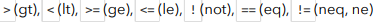
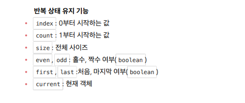

# Spring MVC2

<details>
<summary>Section 01 타임리프 - 기본기능</summary></summary>
<div markdown="1">

## 타임리프 소개
-  타임리프 특징 
  - 서버 사이드 HTML 렌더링 (SSR)
  - 네츄럴 템플릿
  - 스프링 통합 지원

### 네츄럴 템플릿
- 타임리프는 순수 HTML을 최대한 유지하는 특징이 있다.
- 타임리프로 작성한 파일은 HTML을 유지하기 때문에 웹 브라우저에서 파일을 직접 열어도 내용을 확인할 수 있고, 서버를 통해 뷰 템플릿을 거치면 동적으로 변경된 결과를 확인할 수 있다.
- JSP를 포함한 다른 뷰 템플릿들은 해당 파일을 열면 소스코드와 HTML이 뒤죽박죽 섞여 웹 브라우저에서 정상적인 HTML 결과를 확인할 수 없다.
- 오직 서버를 통해서 렌더링되어야만 화면을 확인할 수 있는 것이다.
- 반면 타임리프는 그렇지 않다. 이렇게 순수 HTML을 그대로 유지하면서 뷰 템플릿도 사용할 수 있는 타임리프의 특징을 네츄럴 템플릿이라 한다.

### 스프링 통합 지원
- 타임리프는 스프링과 자연스럽게 통합되고, 스프링의 다양한 기능을 편리하게 사용할 수 있게 지원한다.

## 타임리프 기본 기능
- 타임리프 사용 선언
  - ```<html xmlns:th="http://www.thymeleaf.org">```
- 기본 표현식
  - 
- https://www.thymeleaf.org/doc/tutorials/3.0/usingthymeleaf.html#standard-expression-syntax

### 텍스트 - text, utext
- 타임리프의 가장 기본 기능인 텍스트를 출력하는 기능을 먼저 알아보자 
- 타임리프는 기본적으로 HTML 태그의 속성에 기능을 정의해서 동작한다.
- HTML의 콘텐츠에 데이터를 출력할 때는 다음과 같이 ```th:text```를 사용하면 된다.
  - ```<span th:text="${data}">```
- HTML 태그의 속성이 아니라 HTML 콘텐츠 영역안에서 직접 데이터를 출력하고 싶으면 다음과 같이 [[...]]를 사용하면 된다.
  - ```[[$data]]```

#### Basic Controller
```java
package hello.thymeleaf.basic;
import org.springframework.stereotype.Controller;
import org.springframework.ui.Model;
import org.springframework.web.bind.annotation.GetMapping;
import org.springframework.web.bind.annotation.RequestMapping;
@Controller
@RequestMapping("/basic")
public class BasicController {
    @GetMapping("/text-basic")
    public String textBasic(Model model) {
        model.addAttribute("data", "Hello Spring!");
        return "basic/text-basic";
    }
}
```
#### /resources/templates/basic/text-basic.html
```html
<!DOCTYPE html>
<html xmlns:th="http://www.thymeleaf.org">
<head>
    <meta charset="UTF-8">
    <title>Title</title>
</head>
<body>
<h1>컨텐츠에 데이터 출력하기</h1>
<ul>
    <li>th:text 사용 <span th:text="${data}"></span></li>
    <li>컨텐츠 안에서 직접 출력하기 = [[${data}]]</li>
</ul>
</body>
</html>
```

### Escape
- HTML 문서는 ```<,>``` 같은 특수 문자를 기반으로 정의된다.
- 따라서 뷰 템플릿으로 HTML 화면을 생성할 때는 출력하는 데이터에 이러한 특수 문자가 있는 것을 주의해서 사용해야 한다.
  - "Hello Spring!" 에서 Hello <b>Spring!</b>으로 ```<b> </b>```태그를 이용해 단어가 진하게 나오도록 해보자
  - 웹브라우저에서 실행해보면 ```Hello <b>Spring!</b>```로 해당 부분을 강조하지 않고 그대로 나오는 것을 확인할 수 있다.
  - 소스보기를 해보면 <부분이 &lt로 변경된 것을 확인할 수 있다. 
### HTML Entity
- 웹 브라우저는 <를 HTML 태그의 시작으로 인식한다. 따라서 <를 태그의 시작이 아니라 문자로 표현할 수 있는 방법이 필요하다
- 이것을 HMTL 엔티티라 한다. 
- HTML에서 사용하는 특수 문자를 HTML 엔티티로 변경하는 것을 이스케이프라 한다.
- 그리고 타임리프가 제공하는 th:text, [[...]]는 기본적으로 이스케이프를 제공한다. 
- 

### Unescape
- ```<```를 ```&lt```로 인식하지 않도록 이스케이프 기능을 사용하지 않으려면 어떻게 해야할까?
- 타임리프는 다음 두가지 기능을 제공한다.
  - th:text -> th:utext
  - [[...]] -> [(...)]
- 

### 변수 - SpringEL
- 타임리프에서 변수를 사용할 때는 변수 표현식을 사용한다.
- 변수 표현식 : ```${...}```
- 그리고 이 변수 표현식에는 스프링 EL이라는 스프링이 제공하는 표현식을 사용할 수 있다.
#### 스프링 EL 다양한 표현식
- Object
  - user.username : user의 username을 프로퍼티 접근 user.getUsername()
  - user['username'] : 위와 같음 user.getUsername() (동적으로 갈아낄 수 있음)
  - user.getUsername() : user의 getUsername() 을 직접 호출
- List
  - users[0].username : List에서 첫 번째 회원을 찾고 username 프로퍼티 접근
  - list.get(0).getUsername()
  - users[0]['username'] : 위와 같음
  - users[0].getUsername() : List에서 첫 번째 회원을 찾고 메서드 직접 호출
- Map
  - userMap['userA'].username : Map에서 userA를 찾고, username 프로퍼티 접근
  - map.get("userA").getUsername()
  - userMap['userA']['username'] : 위와 같음
  - userMap['userA'].getUsername() : Map에서 userA를 찾고 메서드 직접 호출

#### 지역 변수 선언
- th:with를 사용하면 지역 변수를 선언해서 사용할 수 있다. 
- 지역 변수는 선언한 태그 안에서만 사용할 수 있다. 

```html
<h1>지역 변수 - (th:with)</h1>
<div th:with="first=${users[0]}">
  <p>처음 사람의 이름은 <span th:text="${first.username}"></span></p>
</div>
```

### 기본 객체들
- 타임리프는 기본 객체들을 제공한다.
- 
- 또한 param 같은 편의 객체들도 제공한다.
- 
- 주의! 스프링 부트 3.0부터는 지원하지 않는다.
- 3.0이라면 직접 model에 해당 객체를 추가해서 사용하도록 하자

### 유틸리티 객체와 날짜
- 타임리프는 문자, 숫자, 날짜, URI등을 편리하게 다루는 다양한 유틸리티 객체들을 제공한다.
- 타임리프 유틸리티 객체들
- 
- 필요할때 레퍼런스를 참고해서 사용하도록 하자

### URL 링크
- 타임리프에서 URL을 생성할 때는 ```@{...}```문법을 사용하면 된다.

```html
<!DOCTYPE html>
<html xmlns:th="http://www.thymeleaf.org">
<head>
  <meta charset="UTF-8">
  <title>Title</title>
</head>
<body>
<h1>URL 링크</h1>
<ul>
  <li><a th:href="@{/hello}">basic url</a></li>
  <li><a th:href="@{/hello(param1=${param1}, param2=${param2})}">hello query
    param</a></li>
  <li><a th:href="@{/hello/{param1}/{param2}(param1=${param1}, param2=$
{param2})}">path variable</a></li>
  <li><a th:href="@{/hello/{param1}(param1=${param1}, param2=$
{param2})}">path variable + query parameter</a></li>
</ul>
</body>
</html>
```
- 단순한 URL
  - ```@{/hello} -> /hello```
- 쿼리파라미터 
  - ```@{/hello(param1=${param1}, param2=${param2})}```
  - ()에 있는 부분은 쿼리파라미터로 처리된다. 
- 경로 변수
  - ```@{/hello/{param1}/{param2}(param1=${param1}, param2=${param2})}```
  - URL 경로상에 변수가 있으면 ()부분은 경로 변수로 처리된다. 
- 경로 변수 + 쿼리 파라미터 
  - ```@{/hello/{param1}(param1=${param1}, param2=${param2})}```
  - 경로 변수와 쿼리파라미터를 함께 사용할 수 있다. 

### 리터럴
- 리터럴은 소스 코드상에 고정된 값을 말하는 용어이다.
- 타임리프는 다음과 같은 리터럴이 있다
  - 문자: 'hello'
  - 숫자: 10
  - 불린: true, false
  - null: null

- 타임리프에서 문자 리터럴은 항상 작은 따옴표로 감싸야 한다
  - ```<span th:text="'hello'">```
- 그런데 문자를 항상 감싸는 것은 귀찮은 일이다
- 공백 없이 쭉 이어진다면 하나의 의미있는 토큰으로 인지하기에 작은 따옴표를 생략해도 괜찮다

### 연산
- 타임리프 연산은 자바와 크게 다르지 않다. 
- HTML안에서 사용하기 때문에 HTML 엔티티를 사용하는 부분만 주의하자

```html
<!DOCTYPE html>
<html xmlns:th="http://www.thymeleaf.org">
<head>
  <meta charset="UTF-8">
  <title>Title</title>
</head>
<body>
<ul>
  <li>산술 연산
    <ul>
      <li>10 + 2 = <span th:text="10 + 2"></span></li>
      <li>10 % 2 == 0 = <span th:text="10 % 2 == 0"></span></li>
    </ul>
  </li>
  <li>비교 연산
    <ul>
      <li>1 > 10 = <span th:text="1 &gt; 10"></span></li>
      <li>1 gt 10 = <span th:text="1 gt 10"></span></li>
      <li>1 >= 10 = <span th:text="1 >= 10"></span></li>
      <li>1 ge 10 = <span th:text="1 ge 10"></span></li>
      <li>1 == 10 = <span th:text="1 == 10"></span></li>
      <li>1 != 10 = <span th:text="1 != 10"></span></li>
    </ul>
  </li>
  <li>조건식
    <ul>
      <li>(10 % 2 == 0)? '짝수':'홀수' = <span th:text="(10 % 2 == 0)? 
'짝수':'홀수'"></span></li>
    </ul>
  </li>
  <li>Elvis 연산자
    <ul>
      <li>${data}?: '데이터가 없습니다.' = <span th:text="${data}?: '데이터가
없습니다.'"></span></li>
      <li>${nullData}?: '데이터가 없습니다.' = <span th:text="${nullData}?: 
'데이터가 없습니다.'"></span></li>
    </ul>
  </li>
  <li>No-Operation
    <ul>
      <li>${data}?: _ = <span th:text="${data}?: _">데이터가 없습니다.</
        span></li>
      <li>${nullData}?: _ = <span th:text="${nullData}?: _">데이터가
없습니다.</span></li>
    </ul>
  </li>
</ul>
</body>
</html>
```
- 비교연산: HTML 엔티티를 사용해야 하는 부분을 주의하자
  - 
- 조건식: 자바의 조건식과 유사
- Elvis 연산자: 조건식의 편의 버전
- No-Operation: _인 경우 마치 타임리프가 실행되지 않는 것처럼 동작한다 이것을 잘 사용하면 HTML의 내용 그대로 활용할 수 있다

### 속성 값 설정
- 타임리프는 주로 HTML 태그에 th:* 속성을 지정하는 방식으로 동작한다.
- 이를 통해 기존 속성을 대체하도록 할 수 있다.
- ```th:attrappend```를 통하면 속성 값의 뒤에 값을 추가할 수도 있고
- ```th:attrprepend```를 통하면 속성 값의 앞에 값을 추가할 수도 있다
- ```th:classappend```를 이용하면 class 속성에 자연스럽게 추가한다


### 반복 
- 타임리프에서 반복은 th:each를 사용한다.
- 추가로 반복에서 사용할 수 있는 여러 상태 값을 지원한다

#### 반복 기능
- ```<tr th:each="user : ${users}">```
  - 반복시 오른쪽 컬렉션의 값을 하나씩 꺼내서 왼쪽 변수에 담아 태크를 반복 실행한다
  - tr:each는 List뿐만 아니라 Iterable, Enumertation을 구현한 모든 객체에 사용할 수 있다

#### 반복 상태 유지
- 반복의 두번째 파라미터를 설정해서 반복의 상태를 확인할 수 있다
- ```<tr th:each="user, userStat : ${users}">```
- 두번째 파라미터는 생략가능한데 생략하면 지정한 변수명 + Stat으로 사용하면 된다
- 

### 조건부 평가
- 타임리프의 조건식 : if, unless
- 타임리프는 해당 조건이 맞지 않으면 태그 자체를 렌더링 하지 않는다
- 만약 다음 조건이 false인 경우 ```<span th:text="'미성년자'" th:if="${user.age lt 20}"></span>``` 부분 자체가 렌더링 되지 않고 사라진다.

### 주석
- 표준 HTML 주석
  - 자바스크립트의 표준 HTML 주석은 타임리프가 렌더링 하지 않고, 그대로 남겨둔다.
- 타임리프 파서 주석
  - 타임리프 파서 주석은 타임리프의 진짜 주석이다. 렌더링에서 주석 부분을 삭제한다.
- 타임피르 프로토타입 주석
  - HTML 주석에 약간의 구문을 더한 형태
  - HTML 파일을 웹 브라우저에서 그대로 열어보면 HTML 주석이기 때문에 웹 브라우저가 렌더링 되지 않음
  - 다만 타임리프 렌터링을 거치면 이 부분이 정상 렌더링 된다.

### 블록
- ```<th:block>```은 타임리프의 유일한 자체 태그
- 타임리프 특성상 HTML 태그안에 속성으로 기능을 정의해서 사용하는데, 예를 들어 div 태그 두개를 반복문을 돌리고 싶다고 가정해보자
- ```<div th:each>```로 진행하게 되면 태그 하나만 반복문의 영향을 받을 것
- 이럴 경우에 블록으로 원하는 만큼 감싸서 속성을 먹일 수 있는 것이다

### 자바스크립트 인라인
- 타임리프는 자바스크립트에서 타임리프를 편리하게 사용할 수 있는 자바스크립트 인라인 기능을 제공한다.
- 자바스크립트 인라인 기능은 다음과 같이 적용
- ```<script th:inline="javascript">```

#### 자바스크립트 인라인 사용 전과 사용 후 비교
- 텍스트 렌더링
  - ```var username = [[${user.username}]];```
  - 인라인 사용 전 ->  var username = userA;
  - 인라인 사용 후 ->  var username = "userA";
    - 인라인 사용 전 렌더링 결과를 보면 userA라는 변수 이름이 그대로 남아있다. 
    - 타임리프 입장에서는 정확하게 렌더링 한 것이지만 개발자가 기대한 것은 userA라는 문자
    - 결과적으로 userA가 변수명으로 인식되어 자바스크립트 오류가 발생한다.
    - 인라인 사용 후 렌더링 결과를 보면 문자 타입인 경우 ""를 포함해준다
    - 추가로 자바스크립트에서 문제가 될 수 있는 문자가 포함되어 있으면 이스케이프 처리도 해준다.
#### 자바스크립트 내추럴 템플릿
- 타임리프는 HTML을 직접 열어도 동작하는 내추럴 템플릿의 성질을 가지고 있다.
- 자바스크립트 인라인 기능을 사용하면 주석을 활용해서 이 기능을 사용할 수 있다.
- ```var username2 = /*[[${user.username}]]*/ "test username";```
  - 인라인 사용 전 -> ``` var username2 = /*userA*/ "test username";```
  - 인라인 사용 후 -> ```var username2 = "userA";```
    - 인라인 사용 전 결과를 보면 순수하게 그대로 해석한 것을 확인할 수 있다. 
    - 따라서 내추럴 템플릿 기능이 동작하지 않고 렌더링 된 부분이 주석처리 된것을 확인할 수 있다.
    - 인라인 사용 후 결과를 보면 주석 부분이 제거되고 기대한 "userA"가 정확하게 적용된다.

### 템플릿 조각
- 웹 페이지를 개발할 때는 공통 영역이 많이 있다.
- 예를 들어서 상단 영역이나 하단 영역, 좌측 카테고리 등등 여러 페이지에서 함께 사용하는 영역들이 있다.
- 이런 부분을 코드를 복사해서 사용한다면 변경 시 여러 페이지를 다 수정해야 함으로 상당히 비효율 적이다.
- 타임리프는 이런 문제를 해결하기 위해 템플릿 조각과 레이아웃 기능을 지원한다.

#### footer.html
```html
<!DOCTYPE html>
<html xmlns:th="http://www.thymeleaf.org">
<body>
<footer th:fragment="copy">
    푸터 자리 입니다.
</footer>
<footer th:fragment="copyParam (param1, param2)">
    <p>파라미터 자리 입니다.</p>
    <p th:text="${param1}"></p>
    <p th:text="${param2}"></p>
</footer>
</body>
</html>
```

#### fragmentMain.html

```html
<!DOCTYPE html>
<html xmlns:th="http://www.thymeleaf.org">
<head>
    <meta charset="UTF-8">
    <title>Title</title>
</head>
<body>
<h1>부분 포함</h1>
<h2>부분 포함 insert</h2>
<div th:insert="~{template/fragment/footer :: copy}"></div>
<h2>부분 포함 replace</h2>
<div th:replace="~{template/fragment/footer :: copy}"></div>
<h2>부분 포함 단순 표현식</h2>
<div th:replace="template/fragment/footer :: copy"></div>
<h1>파라미터 사용</h1>
<div th:replace="~{template/fragment/footer :: copyParam ('데이터1', '데이터
2')}"></div>
</body>
</html>
```

- ```template/fragment/footer :: copy```
  - template/fragment/footer.html 템플릿에 있는 th:fragmnet="copy" 부분을 조각으로 가져와서 사용한다는 의미


-  부분 포함 insert
  - ```<div th:insert="~{template/fragment/footer :: copy}"></div>```
  - th:insert를 사용하면 현재 태그 (div) 내부에 추가한다.
- 부분 포함 replace
  - ```<div th:replace="~{template/fragment/footer :: copy}"></div>```
  - th:replace를 사용하면 현재 태그 (div)를 대체한다.
- 부분 포함 단순 표현식
  - ```<div th:replace="template/fragment/footer :: copy"></div>```
  - 템플릿 조각을 사용하는 코드가 단순하면 중괄호 부분을 생략할 수 있다.
- 파라미터 사용
  - 다음과 같이 파라미터를 전달해서 동적으로 조각을 렌더링 할 수도 있다.
  - ```<div th:replace="~{template/fragment/footer :: copyParam ('데이터1', '데이터2')}"></div>```

### 템플릿 레이아웃1
- 이전에는 일부 코드 조각을 가지고와서 사용했다면, 이번에는 개념을 더 확장해서 코드 조각을 레이아웃에 넘겨서 사용하는 방법에 대해서 알아보자
- 예를 들어서 ```<head>```에 공통으로 사용하는 css, javascript 같은 정보들을 모아놓고 각 페이지마다 필요한 정보를 더 추가해서 사용하고 싶은 경우 템플릿 레이아웃을 사용할 수 있다.

#### base.html
```html

<html xmlns:th="http://www.thymeleaf.org">
<head th:fragment="common_header(title,links)">
    <title th:replace="${title}">레이아웃 타이틀</title>
    <!-- 공통 -->
    <link rel="stylesheet" type="text/css" media="all" th:href="@{/css/awesomeapp.css}">
    <link rel="shortcut icon" th:href="@{/images/favicon.ico}">
    <script type="text/javascript" th:src="@{/sh/scripts/codebase.js}"></script>
 <!-- 추가 -->
 <th:block th:replace="${links}" />
</head>
```

#### layoutMain.html
```html
<!DOCTYPE html>
<html xmlns:th="http://www.thymeleaf.org">
<head th:replace="template/layout/base :: common_header(~{::title},~{::link})">
    <title>메인 타이틀</title>
    <link rel="stylesheet" th:href="@{/css/bootstrap.min.css}">
    <link rel="stylesheet" th:href="@{/themes/smoothness/jquery-ui.css}">
</head>
<body>
메인 컨텐츠
</body>
</html>

```

#### 결과
```html
<!DOCTYPE html>
<html>
<head>
<title>메인 타이틀</title>
<!-- 공통 -->
<link rel="stylesheet" type="text/css" media="all" href="/css/awesomeapp.css">
<link rel="shortcut icon" href="/images/favicon.ico">
<script type="text/javascript" src="/sh/scripts/codebase.js"></script>
<!-- 추가 -->
<link rel="stylesheet" href="/css/bootstrap.min.css">
<link rel="stylesheet" href="/themes/smoothness/jquery-ui.css">
</head>
<body>
메인 컨텐츠
</body>
</html>
```
- ```common_header(~{::title},~{::link})```  이 부분이 핵심이다.
- ::title은 현재 페이지의 title 태그들을 전달한다.
- ::link는 현재 페이지의 link 태그들을 전달한다.
- 결과를 보면 메인 타이틀이 전달한 부분으로 교체되었다.
- 공통 부분은 그대로 유지되고 추가 부분에 전달한 link 태그들이 포함된 것을 확인할 수 있다.


</div>
</details>