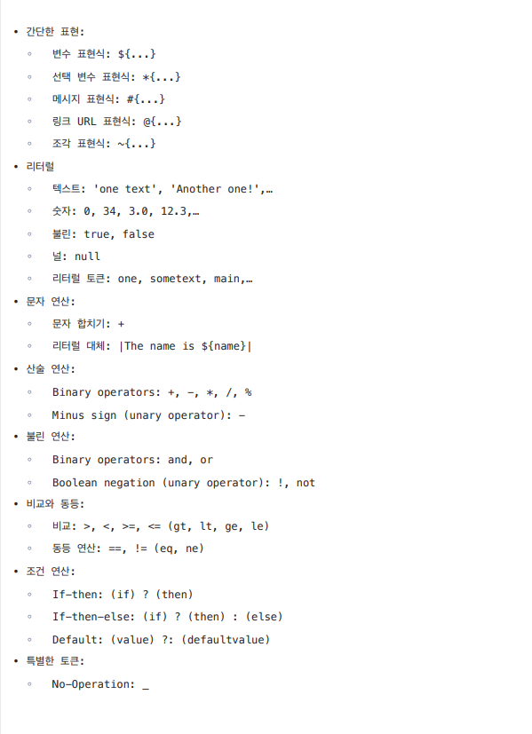
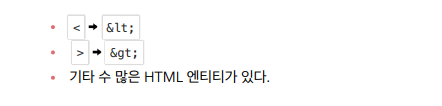
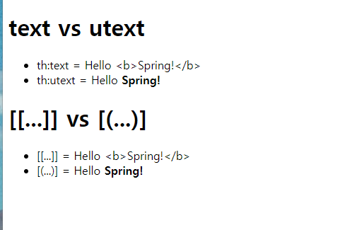
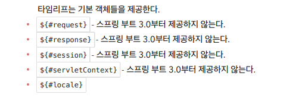
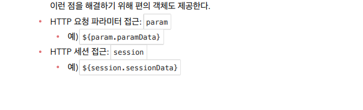
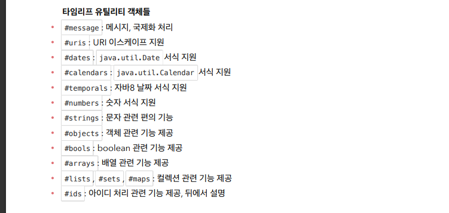

# Spring MVC2

<details>
<summary>Section 01 타임리프 - 기본기능</summary></summary>
<div markdown="1">

## 타임리프 소개
-  타임리프 특징 
  - 서버 사이드 HTML 렌더링 (SSR)
  - 네츄럴 템플릿
  - 스프링 통합 지원

### 네츄럴 템플릿
- 타임리프는 순수 HTML을 최대한 유지하는 특징이 있다.
- 타임리프로 작성한 파일은 HTML을 유지하기 때문에 웹 브라우저에서 파일을 직접 열어도 내용을 확인할 수 있고, 서버를 통해 뷰 템플릿을 거치면 동적으로 변경된 결과를 확인할 수 있다.
- JSP를 포함한 다른 뷰 템플릿들은 해당 파일을 열면 소스코드와 HTML이 뒤죽박죽 섞여 웹 브라우저에서 정상적인 HTML 결과를 확인할 수 없다.
- 오직 서버를 통해서 렌더링되어야만 화면을 확인할 수 있는 것이다.
- 반면 타임리프는 그렇지 않다. 이렇게 순수 HTML을 그대로 유지하면서 뷰 템플릿도 사용할 수 있는 타임리프의 특징을 네츄럴 템플릿이라 한다.

### 스프링 통합 지원
- 타임리프는 스프링과 자연스럽게 통합되고, 스프링의 다양한 기능을 편리하게 사용할 수 있게 지원한다.

## 타임리프 기본 기능
- 타임리프 사용 선언
  - ```<html xmlns:th="http://www.thymeleaf.org">```
- 기본 표현식
  - 
- https://www.thymeleaf.org/doc/tutorials/3.0/usingthymeleaf.html#standard-expression-syntax

### 텍스트 - text, utext
- 타임리프의 가장 기본 기능인 텍스트를 출력하는 기능을 먼저 알아보자 
- 타임리프는 기본적으로 HTML 태그의 속성에 기능을 정의해서 동작한다.
- HTML의 콘텐츠에 데이터를 출력할 때는 다음과 같이 ```th:text```를 사용하면 된다.
  - ```<span th:text="${data}">```
- HTML 태그의 속성이 아니라 HTML 콘텐츠 영역안에서 직접 데이터를 출력하고 싶으면 다음과 같이 [[...]]를 사용하면 된다.
  - ```[[$data]]```

#### Basic Controller
```java
package hello.thymeleaf.basic;
import org.springframework.stereotype.Controller;
import org.springframework.ui.Model;
import org.springframework.web.bind.annotation.GetMapping;
import org.springframework.web.bind.annotation.RequestMapping;
@Controller
@RequestMapping("/basic")
public class BasicController {
    @GetMapping("/text-basic")
    public String textBasic(Model model) {
        model.addAttribute("data", "Hello Spring!");
        return "basic/text-basic";
    }
}
```
#### /resources/templates/basic/text-basic.html
```html
<!DOCTYPE html>
<html xmlns:th="http://www.thymeleaf.org">
<head>
    <meta charset="UTF-8">
    <title>Title</title>
</head>
<body>
<h1>컨텐츠에 데이터 출력하기</h1>
<ul>
    <li>th:text 사용 <span th:text="${data}"></span></li>
    <li>컨텐츠 안에서 직접 출력하기 = [[${data}]]</li>
</ul>
</body>
</html>
```

### Escape
- HTML 문서는 ```<,>``` 같은 특수 문자를 기반으로 정의된다.
- 따라서 뷰 템플릿으로 HTML 화면을 생성할 때는 출력하는 데이터에 이러한 특수 문자가 있는 것을 주의해서 사용해야 한다.
  - "Hello Spring!" 에서 Hello <b>Spring!</b>으로 ```<b> </b>```태그를 이용해 단어가 진하게 나오도록 해보자
  - 웹브라우저에서 실행해보면 ```Hello <b>Spring!</b>```로 해당 부분을 강조하지 않고 그대로 나오는 것을 확인할 수 있다.
  - 소스보기를 해보면 <부분이 &lt로 변경된 것을 확인할 수 있다. 
### HTML Entity
- 웹 브라우저는 <를 HTML 태그의 시작으로 인식한다. 따라서 <를 태그의 시작이 아니라 문자로 표현할 수 있는 방법이 필요하다
- 이것을 HMTL 엔티티라 한다. 
- HTML에서 사용하는 특수 문자를 HTML 엔티티로 변경하는 것을 이스케이프라 한다.
- 그리고 타임리프가 제공하는 th:text, [[...]]는 기본적으로 이스케이프를 제공한다. 
- 

### Unescape
- ```<```를 ```&lt```로 인식하지 않도록 이스케이프 기능을 사용하지 않으려면 어떻게 해야할까?
- 타임리프는 다음 두가지 기능을 제공한다.
  - th:text -> th:utext
  - [[...]] -> [(...)]
- 

### 변수 - SpringEL
- 타임리프에서 변수를 사용할 때는 변수 표현식을 사용한다.
- 변수 표현식 : ```${...}```
- 그리고 이 변수 표현식에는 스프링 EL이라는 스프링이 제공하는 표현식을 사용할 수 있다.
#### 스프링 EL 다양한 표현식
- Object
  - user.username : user의 username을 프로퍼티 접근 user.getUsername()
  - user['username'] : 위와 같음 user.getUsername() (동적으로 갈아낄 수 있음)
  - user.getUsername() : user의 getUsername() 을 직접 호출
- List
  - users[0].username : List에서 첫 번째 회원을 찾고 username 프로퍼티 접근
  - list.get(0).getUsername()
  - users[0]['username'] : 위와 같음
  - users[0].getUsername() : List에서 첫 번째 회원을 찾고 메서드 직접 호출
- Map
  - userMap['userA'].username : Map에서 userA를 찾고, username 프로퍼티 접근
  - map.get("userA").getUsername()
  - userMap['userA']['username'] : 위와 같음
  - userMap['userA'].getUsername() : Map에서 userA를 찾고 메서드 직접 호출

#### 지역 변수 선언
- th:with를 사용하면 지역 변수를 선언해서 사용할 수 있다. 
- 지역 변수는 선언한 태그 안에서만 사용할 수 있다. 

```html
<h1>지역 변수 - (th:with)</h1>
<div th:with="first=${users[0]}">
  <p>처음 사람의 이름은 <span th:text="${first.username}"></span></p>
</div>
```

### 기본 객체들
- 타임리프는 기본 객체들을 제공한다.
- 
- 또한 param 같은 편의 객체들도 제공한다.
- 
- 주의! 스프링 부트 3.0부터는 지원하지 않는다.
- 3.0이라면 직접 model에 해당 객체를 추가해서 사용하도록 하자

### 유틸리티 객체와 날짜
- 타임리프는 문자, 숫자, 날짜, URI등을 편리하게 다루는 다양한 유틸리티 객체들을 제공한다.
- 타임리프 유틸리티 객체들
- 
- 필요할때 레퍼런스를 참고해서 사용하도록 하자
</div>
</details>